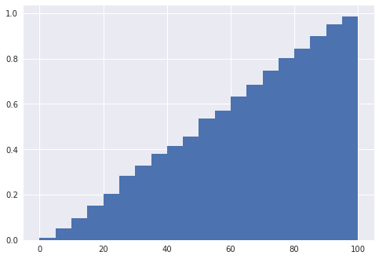
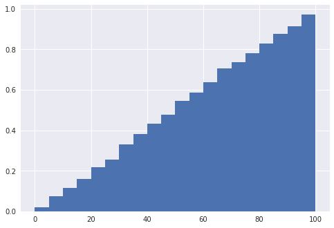
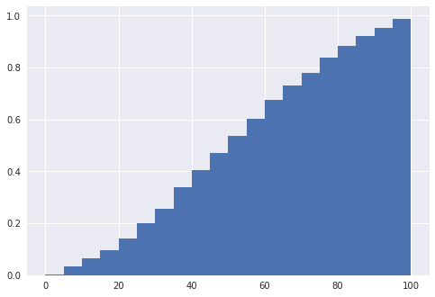
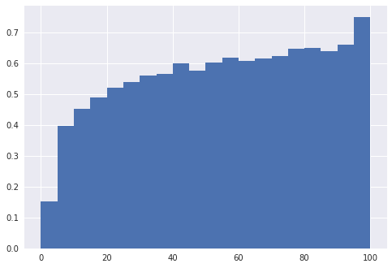

## Contents
{:.no_toc}
*  
{: toc}


```python
import pandas as pd
import numpy as np
import math
import requests
from bs4 import BeautifulSoup
from bs4 import Comment
from time import sleep
import matplotlib.pyplot as plt
import seaborn as sns
from sklearn.cluster import AgglomerativeClustering
from sklearn.cluster import KMeans
from sklearn.ensemble import RandomForestClassifier as RandomForest
from sklearn.ensemble import AdaBoostClassifier
from sklearn.tree import DecisionTreeClassifier
from sklearn.model_selection import cross_val_score
from sklearn.linear_model import LogisticRegression
from sklearn.discriminant_analysis import LinearDiscriminantAnalysis, QuadraticDiscriminantAnalysis
from sklearn.neighbors import KNeighborsClassifier
import sklearn.metrics as metrics
from sklearn.model_selection import KFold
import statsmodels.api as sm
from statsmodels.api import OLS
from sklearn.preprocessing import PolynomialFeatures
kf = KFold(n_splits=5)
pd.set_option('display.max_columns', None)
```


    /opt/anaconda3/lib/python3.6/site-packages/statsmodels/compat/pandas.py:56: FutureWarning: The pandas.core.datetools module is deprecated and will be removed in a future version. Please use the pandas.tseries module instead.
      from pandas.core import datetools


```python
plays.columns = ['gameID', 'date', 'stadium', 'attendance', 'inning', 'starting_pitcher', 
                 'is_starting_pitcher', 'is_away', 'batting_position', 'score', 'num_outs',
                 'runners_on_base', 'pitch_details', 'run_out_result', 'team_at_bat', 
                 'batter', 'pitcher', 'WEC%', 'wWE%', 'play_description', 'team_won']
```


```python
plays_raw = plays.copy()
```


```python
plays["is_single"] = ['Single' in play for play in plays['play_description']]
plays["is_double"] = ['Double' in play for play in plays['play_description']]
plays["is_triple"] = ['Triple' in play for play in plays['play_description']]
plays["is_homerun"] = ['Home Run' in play for play in plays['play_description']]
plays["is_strikeout"] = ['Strikeout' in play for play in plays['play_description']]
plays["is_groundout"] = ['Groundout' in play for play in plays['play_description']]
plays["is_walk"] = ['Walk' in play for play in plays['play_description']]
plays["is_steal"] = [('Steal' or 'Steals' or 'steal' or 'steals') in play for play in plays['play_description']]
```


```python
plays['runner_on_first']= [0 if runner[0]=='-' else 1 for runner in plays['runners_on_base']]
plays['runner_on_second']= [0 if runner[1]=='-' else 1 for runner in plays['runners_on_base']]
plays['runner_on_third']= [0 if runner[2]=='-' else 1 for runner in plays['runners_on_base']]
```


```python
plays['runs_in_atbat'] = [0 if type(row)==float else row.count('R') for row in plays['run_out_result']]
plays['outs_in_atbat'] = [0 if type(row)==float else row.count('O') for row in plays['run_out_result']]
```


```python
plays['batting_team_runs'] = [score.split('-')[0] for score in plays['score']]
plays['fielding_team_runs'] = [score.split('-')[1] for score in plays['score']]
```


```python
plays["pitch_count"] = [pitch.split(',')[0] if isinstance(pitch,str) else None for pitch in plays['pitch_details']]
plays["ball_count"] = [pitch.split('(')[1].split('-')[0] if isinstance(pitch,str) else None for pitch in plays['pitch_details']]
plays["strike_count"] = [pitch.split('(')[1].split('-')[1].split(')')[0] if isinstance(pitch,str) else None for pitch in plays['pitch_details']]
```


```python
plays['date'] = pd.to_datetime(plays['date'])
```


```python
plays['home_team_won'] = np.where(plays['team_won'] == plays['is_away'], 0, 1)
```


```python
```


```python
plays.head()
```


<div>
<style>
    .dataframe thead tr:only-child th {
        text-align: right;
    }

    .dataframe thead th {
        text-align: left;
    }

    .dataframe tbody tr th {
        vertical-align: top;
    }
</style>
<table border="1" class="dataframe">
  <thead>
    <tr style="text-align: right;">
      <th></th>
      <th>gameID</th>
      <th>date</th>
      <th>stadium</th>
      <th>attendance</th>
      <th>inning</th>
      <th>starting_pitcher</th>
      <th>is_starting_pitcher</th>
      <th>is_away</th>
      <th>batting_position</th>
      <th>score</th>
      <th>num_outs</th>
      <th>runners_on_base</th>
      <th>pitch_details</th>
      <th>run_out_result</th>
      <th>team_at_bat</th>
      <th>batter</th>
      <th>pitcher</th>
      <th>WEC%</th>
      <th>wWE%</th>
      <th>play_description</th>
      <th>team_won</th>
      <th>is_single</th>
      <th>is_double</th>
      <th>is_triple</th>
      <th>is_homerun</th>
      <th>is_strikeout</th>
      <th>is_groundout</th>
      <th>is_walk</th>
      <th>is_steal</th>
      <th>runner_on_first</th>
      <th>runner_on_second</th>
      <th>runner_on_third</th>
      <th>runs_in_atbat</th>
      <th>outs_in_atbat</th>
      <th>batting_team_runs</th>
      <th>fielding_team_runs</th>
      <th>pitch_count</th>
      <th>ball_count</th>
      <th>strike_count</th>
      <th>home_team_won</th>
    </tr>
  </thead>
  <tbody>
    <tr>
      <th>0</th>
      <td>1</td>
      <td>2006-09-08</td>
      <td>Angel Stadium of Anaheim</td>
      <td>42,259</td>
      <td>1</td>
      <td>Joe Saunders</td>
      <td>1</td>
      <td>1</td>
      <td>1</td>
      <td>0-0</td>
      <td>0</td>
      <td>---</td>
      <td>5,(1-2) CFBFX</td>
      <td>NaN</td>
      <td>TOR</td>
      <td>Reed Johnson</td>
      <td>Joe Saunders</td>
      <td>-6%</td>
      <td>44%</td>
      <td>Double to CF (Fly Ball to Deep CF)</td>
      <td>0</td>
      <td>False</td>
      <td>True</td>
      <td>False</td>
      <td>False</td>
      <td>False</td>
      <td>False</td>
      <td>False</td>
      <td>False</td>
      <td>0</td>
      <td>0</td>
      <td>0</td>
      <td>0</td>
      <td>0</td>
      <td>0</td>
      <td>0</td>
      <td>5</td>
      <td>1</td>
      <td>2</td>
      <td>1</td>
    </tr>
    <tr>
      <th>1</th>
      <td>1</td>
      <td>2006-09-08</td>
      <td>Angel Stadium of Anaheim</td>
      <td>42,259</td>
      <td>1</td>
      <td>Joe Saunders</td>
      <td>1</td>
      <td>1</td>
      <td>2</td>
      <td>0-0</td>
      <td>0</td>
      <td>-2-</td>
      <td>6,(3-2) FBFBBX</td>
      <td>O</td>
      <td>TOR</td>
      <td>Aaron Hill</td>
      <td>Joe Saunders</td>
      <td>4%</td>
      <td>48%</td>
      <td>Lineout: 3B</td>
      <td>0</td>
      <td>False</td>
      <td>False</td>
      <td>False</td>
      <td>False</td>
      <td>False</td>
      <td>False</td>
      <td>False</td>
      <td>False</td>
      <td>0</td>
      <td>1</td>
      <td>0</td>
      <td>0</td>
      <td>1</td>
      <td>0</td>
      <td>0</td>
      <td>6</td>
      <td>3</td>
      <td>2</td>
      <td>1</td>
    </tr>
    <tr>
      <th>2</th>
      <td>1</td>
      <td>2006-09-08</td>
      <td>Angel Stadium of Anaheim</td>
      <td>42,259</td>
      <td>1</td>
      <td>Joe Saunders</td>
      <td>1</td>
      <td>1</td>
      <td>3</td>
      <td>0-0</td>
      <td>1</td>
      <td>-2-</td>
      <td>2,(1-0) *BX</td>
      <td>RO</td>
      <td>TOR</td>
      <td>Vernon Wells</td>
      <td>Joe Saunders</td>
      <td>-4%</td>
      <td>44%</td>
      <td>Single to RF (Line Drive); Johnson Scores; out...</td>
      <td>0</td>
      <td>True</td>
      <td>False</td>
      <td>False</td>
      <td>False</td>
      <td>False</td>
      <td>False</td>
      <td>False</td>
      <td>False</td>
      <td>0</td>
      <td>1</td>
      <td>0</td>
      <td>1</td>
      <td>1</td>
      <td>0</td>
      <td>0</td>
      <td>2</td>
      <td>1</td>
      <td>0</td>
      <td>1</td>
    </tr>
    <tr>
      <th>3</th>
      <td>1</td>
      <td>2006-09-08</td>
      <td>Angel Stadium of Anaheim</td>
      <td>42,259</td>
      <td>1</td>
      <td>Joe Saunders</td>
      <td>1</td>
      <td>1</td>
      <td>4</td>
      <td>1-0</td>
      <td>2</td>
      <td>---</td>
      <td>2,(0-1) CX</td>
      <td>O</td>
      <td>TOR</td>
      <td>Troy Glaus</td>
      <td>Joe Saunders</td>
      <td>1%</td>
      <td>45%</td>
      <td>Lineout: 3B-1B</td>
      <td>0</td>
      <td>False</td>
      <td>False</td>
      <td>False</td>
      <td>False</td>
      <td>False</td>
      <td>False</td>
      <td>False</td>
      <td>False</td>
      <td>0</td>
      <td>0</td>
      <td>0</td>
      <td>0</td>
      <td>1</td>
      <td>1</td>
      <td>0</td>
      <td>2</td>
      <td>0</td>
      <td>1</td>
      <td>1</td>
    </tr>
    <tr>
      <th>4</th>
      <td>1</td>
      <td>2006-09-08</td>
      <td>Angel Stadium of Anaheim</td>
      <td>42,259</td>
      <td>1</td>
      <td>A.J. Burnett</td>
      <td>1</td>
      <td>0</td>
      <td>1</td>
      <td>0-1</td>
      <td>0</td>
      <td>---</td>
      <td>4,(1-2) BCCX</td>
      <td>NaN</td>
      <td>LAA</td>
      <td>Maicer Izturis</td>
      <td>A.J. Burnett</td>
      <td>4%</td>
      <td>49%</td>
      <td>Single to 1B (Ground Ball)</td>
      <td>1</td>
      <td>True</td>
      <td>False</td>
      <td>False</td>
      <td>False</td>
      <td>False</td>
      <td>False</td>
      <td>False</td>
      <td>False</td>
      <td>0</td>
      <td>0</td>
      <td>0</td>
      <td>0</td>
      <td>0</td>
      <td>0</td>
      <td>1</td>
      <td>4</td>
      <td>1</td>
      <td>2</td>
      <td>1</td>
    </tr>
  </tbody>
</table>
</div>


```python
plays_first_play = plays.drop_duplicates(subset='gameID', keep='first')
plays_last_play = plays.drop_duplicates(subset='gameID', keep='last')
```


```python
plays_last_play
```


<div>
<style>
    .dataframe thead tr:only-child th {
        text-align: right;
    }

    .dataframe thead th {
        text-align: left;
    }

    .dataframe tbody tr th {
        vertical-align: top;
    }
</style>
<table border="1" class="dataframe">
  <thead>
    <tr style="text-align: right;">
      <th></th>
      <th>gameID</th>
      <th>date</th>
      <th>stadium</th>
      <th>attendance</th>
      <th>inning</th>
      <th>starting_pitcher</th>
      <th>is_starting_pitcher</th>
      <th>is_away</th>
      <th>batting_position</th>
      <th>score</th>
      <th>num_outs</th>
      <th>runners_on_base</th>
      <th>pitch_details</th>
      <th>run_out_result</th>
      <th>team_at_bat</th>
      <th>batter</th>
      <th>pitcher</th>
      <th>WEC%</th>
      <th>wWE%</th>
      <th>play_description</th>
      <th>team_won</th>
      <th>is_single</th>
      <th>is_double</th>
      <th>is_triple</th>
      <th>is_homerun</th>
      <th>is_strikeout</th>
      <th>is_groundout</th>
      <th>is_walk</th>
      <th>is_steal</th>
      <th>runner_on_first</th>
      <th>runner_on_second</th>
      <th>runner_on_third</th>
      <th>runs_in_atbat</th>
      <th>outs_in_atbat</th>
      <th>batting_team_runs</th>
      <th>fielding_team_runs</th>
      <th>pitch_count</th>
      <th>ball_count</th>
      <th>strike_count</th>
      <th>home_team_won</th>
    </tr>
  </thead>
  <tbody>
    <tr>
      <th>63</th>
      <td>1</td>
      <td>2006-09-08</td>
      <td>Angel Stadium of Anaheim</td>
      <td>42,259</td>
      <td>9</td>
      <td>Joe Saunders</td>
      <td>0</td>
      <td>1</td>
      <td>4</td>
      <td>1-4</td>
      <td>2</td>
      <td>---</td>
      <td>4,(2-1) CBBX</td>
      <td>O</td>
      <td>TOR</td>
      <td>Troy Glaus</td>
      <td>Francisco Rodriguez</td>
      <td>0%</td>
      <td>100%</td>
      <td>Popfly: 1B</td>
      <td>0</td>
      <td>False</td>
      <td>False</td>
      <td>False</td>
      <td>False</td>
      <td>False</td>
      <td>False</td>
      <td>False</td>
      <td>False</td>
      <td>0</td>
      <td>0</td>
      <td>0</td>
      <td>0</td>
      <td>1</td>
      <td>1</td>
      <td>4</td>
      <td>4</td>
      <td>2</td>
      <td>1</td>
      <td>1</td>
    </tr>
    <tr>
      <th>141</th>
      <td>2</td>
      <td>2006-09-08</td>
      <td>Chase Field</td>
      <td>25,299</td>
      <td>9</td>
      <td>Livan Hernandez</td>
      <td>0</td>
      <td>1</td>
      <td>6</td>
      <td>1-13</td>
      <td>2</td>
      <td>---</td>
      <td>1,(0-0) X</td>
      <td>O</td>
      <td>STL</td>
      <td>Mike Rose</td>
      <td>Randy Choate</td>
      <td>0%</td>
      <td>100%</td>
      <td>Lineout: 1B</td>
      <td>0</td>
      <td>False</td>
      <td>False</td>
      <td>False</td>
      <td>False</td>
      <td>False</td>
      <td>False</td>
      <td>False</td>
      <td>False</td>
      <td>0</td>
      <td>0</td>
      <td>0</td>
      <td>0</td>
      <td>1</td>
      <td>1</td>
      <td>13</td>
      <td>1</td>
      <td>0</td>
      <td>0</td>
      <td>1</td>
    </tr>
    <tr>
      <th>217</th>
      <td>3</td>
      <td>2006-09-08</td>
      <td>Turner Field</td>
      <td>30,977</td>
      <td>9</td>
      <td>Tim Hudson</td>
      <td>0</td>
      <td>1</td>
      <td>9</td>
      <td>4-8</td>
      <td>2</td>
      <td>---</td>
      <td>3,(0-2) .CCX</td>
      <td>O</td>
      <td>CHC</td>
      <td>Freddie Bynum</td>
      <td>Bob Wickman</td>
      <td>0%</td>
      <td>100%</td>
      <td>Groundout: 2B-1B</td>
      <td>0</td>
      <td>False</td>
      <td>False</td>
      <td>False</td>
      <td>False</td>
      <td>False</td>
      <td>True</td>
      <td>False</td>
      <td>False</td>
      <td>0</td>
      <td>0</td>
      <td>0</td>
      <td>0</td>
      <td>1</td>
      <td>4</td>
      <td>8</td>
      <td>3</td>
      <td>0</td>
      <td>2</td>
      <td>1</td>
    </tr>
    <tr>
      <th>292</th>
      <td>4</td>
      <td>2006-09-08</td>
      <td>Oriole Park at Camden Yards</td>
      <td>36,214</td>
      <td>9</td>
      <td>Erik Bedard</td>
      <td>0</td>
      <td>1</td>
      <td>1</td>
      <td>4-9</td>
      <td>2</td>
      <td>1--</td>
      <td>1,(0-0) .X</td>
      <td>O</td>
      <td>NYY</td>
      <td>Kevin Thompson</td>
      <td>Julio Manon</td>
      <td>0%</td>
      <td>100%</td>
      <td>Lineout: LF</td>
      <td>0</td>
      <td>False</td>
      <td>False</td>
      <td>False</td>
      <td>False</td>
      <td>False</td>
      <td>False</td>
      <td>False</td>
      <td>False</td>
      <td>1</td>
      <td>0</td>
      <td>0</td>
      <td>0</td>
      <td>1</td>
      <td>4</td>
      <td>9</td>
      <td>1</td>
      <td>0</td>
      <td>0</td>
      <td>1</td>
    </tr>
    <tr>
      <th>383</th>
      <td>5</td>
      <td>2006-09-08</td>
      <td>Fenway Park</td>
      <td>36,531</td>
      <td>9</td>
      <td>Odalis Perez</td>
      <td>0</td>
      <td>0</td>
      <td>9</td>
      <td>9-10</td>
      <td>2</td>
      <td>---</td>
      <td>6,(3-2) .BBCBFX</td>
      <td>O</td>
      <td>BOS</td>
      <td>Trot Nixon</td>
      <td>Joe Nelson</td>
      <td>5%</td>
      <td>100%</td>
      <td>Flyball: RF</td>
      <td>0</td>
      <td>False</td>
      <td>False</td>
      <td>False</td>
      <td>False</td>
      <td>False</td>
      <td>False</td>
      <td>False</td>
      <td>False</td>
      <td>0</td>
      <td>0</td>
      <td>0</td>
      <td>0</td>
      <td>1</td>
      <td>9</td>
      <td>10</td>
      <td>6</td>
      <td>3</td>
      <td>2</td>
      <td>0</td>
    </tr>
    <tr>
      <th>473</th>
      <td>6</td>
      <td>2006-09-08</td>
      <td>U.S. Cellular Field</td>
      <td>37,188</td>
      <td>9</td>
      <td>Paul Byrd</td>
      <td>0</td>
      <td>0</td>
      <td>1</td>
      <td>5-6</td>
      <td>0</td>
      <td>1--</td>
      <td>4,(0-2) .MSFX</td>
      <td>RR</td>
      <td>CHW</td>
      <td>A.J. Pierzynski</td>
      <td>Tom Mastny</td>
      <td>64%</td>
      <td>100%</td>
      <td>Home Run (Fly Ball); Iguchi Scores</td>
      <td>1</td>
      <td>False</td>
      <td>False</td>
      <td>False</td>
      <td>True</td>
      <td>False</td>
      <td>False</td>
      <td>False</td>
      <td>False</td>
      <td>1</td>
      <td>0</td>
      <td>0</td>
      <td>2</td>
      <td>0</td>
      <td>5</td>
      <td>6</td>
      <td>4</td>
      <td>0</td>
      <td>2</td>
      <td>1</td>
    </tr>
    <tr>
      <th>554</th>
      <td>7</td>
      <td>2006-09-08</td>
      <td>Great American Ball Park</td>
      <td>17,631</td>
      <td>9</td>
      <td>Kyle Lohse</td>
      <td>0</td>
      <td>1</td>
      <td>1</td>
      <td>1-9</td>
      <td>2</td>
      <td>12-</td>
      <td>2,(1-0) .BX</td>
      <td>O</td>
      <td>PIT</td>
      <td>Rajai Davis</td>
      <td>Gary Majewski</td>
      <td>0%</td>
      <td>100%</td>
      <td>Groundout: 2B-1B</td>
      <td>0</td>
      <td>False</td>
      <td>False</td>
      <td>False</td>
      <td>False</td>
      <td>False</td>
      <td>True</td>
      <td>False</td>
      <td>False</td>
      <td>1</td>
      <td>1</td>
      <td>0</td>
      <td>0</td>
      <td>1</td>
      <td>1</td>
      <td>9</td>
      <td>2</td>
      <td>1</td>
      <td>0</td>
      <td>1</td>
    </tr>
    <tr>
      <th>644</th>
      <td>8</td>
      <td>2006-09-08</td>
      <td>Coors Field</td>
      <td>22,214</td>
      <td>9</td>
      <td>Byung-Hyun Kim</td>
      <td>0</td>
      <td>1</td>
      <td>8</td>
      <td>8-11</td>
      <td>2</td>
      <td>-23</td>
      <td>2,(0-1) CX</td>
      <td>O</td>
      <td>WSN</td>
      <td>Jose Vidro</td>
      <td>Brian Fuentes</td>
      <td>5%</td>
      <td>100%</td>
      <td>Groundout: 2B-1B</td>
      <td>0</td>
      <td>False</td>
      <td>False</td>
      <td>False</td>
      <td>False</td>
      <td>False</td>
      <td>True</td>
      <td>False</td>
      <td>False</td>
      <td>0</td>
      <td>1</td>
      <td>1</td>
      <td>0</td>
      <td>1</td>
      <td>8</td>
      <td>11</td>
      <td>2</td>
      <td>0</td>
      <td>1</td>
      <td>1</td>
    </tr>
    <tr>
      <th>714</th>
      <td>9</td>
      <td>2006-09-08</td>
      <td>Dolphins Stadium</td>
      <td>21,432</td>
      <td>9</td>
      <td>Jamie Moyer</td>
      <td>0</td>
      <td>0</td>
      <td>6</td>
      <td>2-3</td>
      <td>2</td>
      <td>---</td>
      <td>4,(1-2) CBCS</td>
      <td>O</td>
      <td>FLA</td>
      <td>Joe Borchard</td>
      <td>Tom Gordon</td>
      <td>5%</td>
      <td>100%</td>
      <td>Strikeout Swinging</td>
      <td>0</td>
      <td>False</td>
      <td>False</td>
      <td>False</td>
      <td>False</td>
      <td>True</td>
      <td>False</td>
      <td>False</td>
      <td>False</td>
      <td>0</td>
      <td>0</td>
      <td>0</td>
      <td>0</td>
      <td>1</td>
      <td>2</td>
      <td>3</td>
      <td>4</td>
      <td>1</td>
      <td>2</td>
      <td>0</td>
    </tr>
    <tr>
      <th>787</th>
      <td>10</td>
      <td>2006-09-08</td>
      <td>Miller Park</td>
      <td>19,677</td>
      <td>9</td>
      <td>Roy Oswalt</td>
      <td>0</td>
      <td>0</td>
      <td>7</td>
      <td>3-4</td>
      <td>2</td>
      <td>1--</td>
      <td>5,(2-2) .SBCBS</td>
      <td>O</td>
      <td>MIL</td>
      <td>Gabe Gross</td>
      <td>Brad Lidge</td>
      <td>10%</td>
      <td>100%</td>
      <td>Strikeout Swinging</td>
      <td>0</td>
      <td>False</td>
      <td>False</td>
      <td>False</td>
      <td>False</td>
      <td>True</td>
      <td>False</td>
      <td>False</td>
      <td>False</td>
      <td>1</td>
      <td>0</td>
      <td>0</td>
      <td>0</td>
      <td>1</td>
      <td>3</td>
      <td>4</td>
      <td>5</td>
      <td>2</td>
      <td>2</td>
      <td>0</td>
    </tr>
    <tr>
      <th>873</th>
      <td>11</td>
      <td>2006-09-08</td>
      <td>Hubert H. Humphrey Metrodome</td>
      <td>29,042</td>
      <td>9</td>
      <td>Matt Garza</td>
      <td>0</td>
      <td>1</td>
      <td>6</td>
      <td>5-9</td>
      <td>2</td>
      <td>1--</td>
      <td>3,(0-2) F&gt;F&gt;S</td>
      <td>O</td>
      <td>DET</td>
      <td>Sean Casey</td>
      <td>Juan Rincon</td>
      <td>0%</td>
      <td>100%</td>
      <td>Strikeout Swinging</td>
      <td>0</td>
      <td>False</td>
      <td>False</td>
      <td>False</td>
      <td>False</td>
      <td>True</td>
      <td>False</td>
      <td>False</td>
      <td>False</td>
      <td>1</td>
      <td>0</td>
      <td>0</td>
      <td>0</td>
      <td>1</td>
      <td>5</td>
      <td>9</td>
      <td>3</td>
      <td>0</td>
      <td>2</td>
      <td>1</td>
    </tr>
    <tr>
      <th>946</th>
      <td>12</td>
      <td>2006-09-08</td>
      <td>Shea Stadium</td>
      <td>52,077</td>
      <td>9</td>
      <td>Hung-Chih Kuo</td>
      <td>0</td>
      <td>0</td>
      <td>5</td>
      <td>0-5</td>
      <td>2</td>
      <td>---</td>
      <td>7,(3-2) CBBFBFC</td>
      <td>O</td>
      <td>NYM</td>
      <td>Carlos Delgado</td>
      <td>Takashi Saito</td>
      <td>0%</td>
      <td>100%</td>
      <td>Strikeout Looking</td>
      <td>0</td>
      <td>False</td>
      <td>False</td>
      <td>False</td>
      <td>False</td>
      <td>True</td>
      <td>False</td>
      <td>False</td>
      <td>False</td>
      <td>0</td>
      <td>0</td>
      <td>0</td>
      <td>0</td>
      <td>1</td>
      <td>0</td>
      <td>5</td>
      <td>7</td>
      <td>3</td>
      <td>2</td>
      <td>0</td>
    </tr>
    <tr>
      <th>1014</th>
      <td>13</td>
      <td>2006-09-08</td>
      <td>Safeco Field</td>
      <td>28,646</td>
      <td>9</td>
      <td>Cha-Seung Baek</td>
      <td>0</td>
      <td>1</td>
      <td>6</td>
      <td>2-7</td>
      <td>2</td>
      <td>1--</td>
      <td>4,(1-2) CFBX</td>
      <td>O</td>
      <td>TEX</td>
      <td>Mark DeRosa</td>
      <td>Joel Pineiro</td>
      <td>0%</td>
      <td>100%</td>
      <td>Flyball: LF (Deep LF-CF)</td>
      <td>0</td>
      <td>False</td>
      <td>False</td>
      <td>False</td>
      <td>False</td>
      <td>False</td>
      <td>False</td>
      <td>False</td>
      <td>False</td>
      <td>1</td>
      <td>0</td>
      <td>0</td>
      <td>0</td>
      <td>1</td>
      <td>2</td>
      <td>7</td>
      <td>4</td>
      <td>1</td>
      <td>2</td>
      <td>1</td>
    </tr>
    <tr>
      <th>1084</th>
      <td>14</td>
      <td>2006-09-08</td>
      <td>AT&amp;T; Park</td>
      <td>38,988</td>
      <td>9</td>
      <td>Matt Cain</td>
      <td>0</td>
      <td>1</td>
      <td>7</td>
      <td>0-4</td>
      <td>2</td>
      <td>-2-</td>
      <td>5,(2-2) C&gt;F&gt;B.*BS</td>
      <td>O</td>
      <td>SDP</td>
      <td>Mike Cameron</td>
      <td>Mike Stanton</td>
      <td>0%</td>
      <td>100%</td>
      <td>Strikeout Swinging</td>
      <td>0</td>
      <td>False</td>
      <td>False</td>
      <td>False</td>
      <td>False</td>
      <td>True</td>
      <td>False</td>
      <td>False</td>
      <td>False</td>
      <td>0</td>
      <td>1</td>
      <td>0</td>
      <td>0</td>
      <td>1</td>
      <td>0</td>
      <td>4</td>
      <td>5</td>
      <td>2</td>
      <td>2</td>
      <td>1</td>
    </tr>
    <tr>
      <th>1174</th>
      <td>15</td>
      <td>2006-09-08</td>
      <td>Tropicana Field</td>
      <td>12,821</td>
      <td>9</td>
      <td>Dan Haren</td>
      <td>0</td>
      <td>0</td>
      <td>8</td>
      <td>6-8</td>
      <td>2</td>
      <td>1-3</td>
      <td>4,(1-2) .CBSS</td>
      <td>O</td>
      <td>TBD</td>
      <td>Ty Wigginton</td>
      <td>Huston Street</td>
      <td>10%</td>
      <td>100%</td>
      <td>Strikeout Swinging</td>
      <td>0</td>
      <td>False</td>
      <td>False</td>
      <td>False</td>
      <td>False</td>
      <td>True</td>
      <td>False</td>
      <td>False</td>
      <td>False</td>
      <td>1</td>
      <td>0</td>
      <td>1</td>
      <td>0</td>
      <td>1</td>
      <td>6</td>
      <td>8</td>
      <td>4</td>
      <td>1</td>
      <td>2</td>
      <td>0</td>
    </tr>
    <tr>
      <th>1250</th>
      <td>16</td>
      <td>2006-09-09</td>
      <td>Angel Stadium of Anaheim</td>
      <td>44,007</td>
      <td>9</td>
      <td>Gustavo Chacin</td>
      <td>0</td>
      <td>0</td>
      <td>1</td>
      <td>1-2</td>
      <td>2</td>
      <td>12-</td>
      <td>1,(0-0) X</td>
      <td>O</td>
      <td>LAA</td>
      <td>Orlando Cabrera</td>
      <td>B.J. Ryan</td>
      <td>18%</td>
      <td>100%</td>
      <td>Groundout: 2B-1B</td>
      <td>0</td>
      <td>False</td>
      <td>False</td>
      <td>False</td>
      <td>False</td>
      <td>False</td>
      <td>True</td>
      <td>False</td>
      <td>False</td>
      <td>1</td>
      <td>1</td>
      <td>0</td>
      <td>0</td>
      <td>1</td>
      <td>1</td>
      <td>2</td>
      <td>1</td>
      <td>0</td>
      <td>0</td>
      <td>0</td>
    </tr>
    <tr>
      <th>1312</th>
      <td>17</td>
      <td>2006-09-09</td>
      <td>Chase Field</td>
      <td>33,619</td>
      <td>9</td>
      <td>Brandon Webb</td>
      <td>1</td>
      <td>1</td>
      <td>4</td>
      <td>0-3</td>
      <td>2</td>
      <td>---</td>
      <td>1,(0-0) X</td>
      <td>O</td>
      <td>STL</td>
      <td>Albert Pujols</td>
      <td>Brandon Webb</td>
      <td>0%</td>
      <td>100%</td>
      <td>Groundout: P-1B</td>
      <td>0</td>
      <td>False</td>
      <td>False</td>
      <td>False</td>
      <td>False</td>
      <td>False</td>
      <td>True</td>
      <td>False</td>
      <td>False</td>
      <td>0</td>
      <td>0</td>
      <td>0</td>
      <td>0</td>
      <td>1</td>
      <td>0</td>
      <td>3</td>
      <td>1</td>
      <td>0</td>
      <td>0</td>
      <td>1</td>
    </tr>
    <tr>
      <th>1389</th>
      <td>18</td>
      <td>2006-09-09</td>
      <td>Turner Field</td>
      <td>40,584</td>
      <td>9</td>
      <td>Chuck James</td>
      <td>0</td>
      <td>1</td>
      <td>1</td>
      <td>3-7</td>
      <td>1</td>
      <td>1--</td>
      <td>5,(2-2) BCCBX</td>
      <td>OO</td>
      <td>CHC</td>
      <td>Henry Blanco</td>
      <td>Bob Wickman</td>
      <td>2%</td>
      <td>100%</td>
      <td>Ground Ball Double Play: P-2B-1B</td>
      <td>0</td>
      <td>False</td>
      <td>True</td>
      <td>False</td>
      <td>False</td>
      <td>False</td>
      <td>False</td>
      <td>False</td>
      <td>False</td>
      <td>1</td>
      <td>0</td>
      <td>0</td>
      <td>0</td>
      <td>2</td>
      <td>3</td>
      <td>7</td>
      <td>5</td>
      <td>2</td>
      <td>2</td>
      <td>1</td>
    </tr>
    <tr>
      <th>1461</th>
      <td>19</td>
      <td>2006-09-09</td>
      <td>Oriole Park at Camden Yards</td>
      <td>45,827</td>
      <td>9</td>
      <td>Chien-Ming Wang</td>
      <td>0</td>
      <td>0</td>
      <td>9</td>
      <td>2-3</td>
      <td>2</td>
      <td>---</td>
      <td>3,(2-0) .BBX</td>
      <td>O</td>
      <td>BAL</td>
      <td>Ramon Hernandez</td>
      <td>Kyle Farnsworth</td>
      <td>5%</td>
      <td>100%</td>
      <td>Groundout: SS-1B</td>
      <td>0</td>
      <td>False</td>
      <td>False</td>
      <td>False</td>
      <td>False</td>
      <td>False</td>
      <td>True</td>
      <td>False</td>
      <td>False</td>
      <td>0</td>
      <td>0</td>
      <td>0</td>
      <td>0</td>
      <td>1</td>
      <td>2</td>
      <td>3</td>
      <td>3</td>
      <td>2</td>
      <td>0</td>
      <td>0</td>
    </tr>
    <tr>
      <th>1569</th>
      <td>20</td>
      <td>2006-09-09</td>
      <td>Fenway Park</td>
      <td>36,402</td>
      <td>12</td>
      <td>Luke Hudson</td>
      <td>0</td>
      <td>0</td>
      <td>7</td>
      <td>4-10</td>
      <td>2</td>
      <td>12-</td>
      <td>3,(0-2) CFX</td>
      <td>O</td>
      <td>BOS</td>
      <td>Gabe Kapler</td>
      <td>Ambiorix Burgos</td>
      <td>0%</td>
      <td>100%</td>
      <td>Groundout: 3B unassisted/Forceout at 3B; Ortiz...</td>
      <td>0</td>
      <td>False</td>
      <td>False</td>
      <td>False</td>
      <td>False</td>
      <td>False</td>
      <td>True</td>
      <td>False</td>
      <td>False</td>
      <td>1</td>
      <td>1</td>
      <td>0</td>
      <td>0</td>
      <td>1</td>
      <td>4</td>
      <td>10</td>
      <td>3</td>
      <td>0</td>
      <td>2</td>
      <td>0</td>
    </tr>
    <tr>
      <th>1657</th>
      <td>21</td>
      <td>2006-09-09</td>
      <td>U.S. Cellular Field</td>
      <td>38,422</td>
      <td>9</td>
      <td>Jon Garland</td>
      <td>0</td>
      <td>1</td>
      <td>5</td>
      <td>8-10</td>
      <td>2</td>
      <td>---</td>
      <td>5,(1-2) ..CCBFT</td>
      <td>O</td>
      <td>CLE</td>
      <td>Jason Michaels</td>
      <td>Matt Thornton</td>
      <td>1%</td>
      <td>100%</td>
      <td>Strikeout Swinging</td>
      <td>0</td>
      <td>False</td>
      <td>False</td>
      <td>False</td>
      <td>False</td>
      <td>True</td>
      <td>False</td>
      <td>False</td>
      <td>False</td>
      <td>0</td>
      <td>0</td>
      <td>0</td>
      <td>0</td>
      <td>1</td>
      <td>8</td>
      <td>10</td>
      <td>5</td>
      <td>1</td>
      <td>2</td>
      <td>1</td>
    </tr>
    <tr>
      <th>1738</th>
      <td>22</td>
      <td>2006-09-09</td>
      <td>Great American Ball Park</td>
      <td>25,038</td>
      <td>9</td>
      <td>Paul Maholm</td>
      <td>0</td>
      <td>0</td>
      <td>2</td>
      <td>4-7</td>
      <td>2</td>
      <td>---</td>
      <td>3,(1-1) CBX</td>
      <td>O</td>
      <td>CIN</td>
      <td>Royce Clayton</td>
      <td>Salomon Torres</td>
      <td>1%</td>
      <td>100%</td>
      <td>Flyball: CF (Deep CF)</td>
      <td>0</td>
      <td>False</td>
      <td>False</td>
      <td>False</td>
      <td>False</td>
      <td>False</td>
      <td>False</td>
      <td>False</td>
      <td>False</td>
      <td>0</td>
      <td>0</td>
      <td>0</td>
      <td>0</td>
      <td>1</td>
      <td>4</td>
      <td>7</td>
      <td>3</td>
      <td>1</td>
      <td>1</td>
      <td>0</td>
    </tr>
    <tr>
      <th>1821</th>
      <td>23</td>
      <td>2006-09-09</td>
      <td>Coors Field</td>
      <td>22,735</td>
      <td>9</td>
      <td>Josh Fogg</td>
      <td>0</td>
      <td>1</td>
      <td>6</td>
      <td>5-9</td>
      <td>2</td>
      <td>---</td>
      <td>4,(1-2) CFBS</td>
      <td>O</td>
      <td>WSN</td>
      <td>Austin Kearns</td>
      <td>Jose Mesa</td>
      <td>0%</td>
      <td>100%</td>
      <td>Strikeout Swinging</td>
      <td>0</td>
      <td>False</td>
      <td>False</td>
      <td>False</td>
      <td>False</td>
      <td>True</td>
      <td>False</td>
      <td>False</td>
      <td>False</td>
      <td>0</td>
      <td>0</td>
      <td>0</td>
      <td>0</td>
      <td>1</td>
      <td>5</td>
      <td>9</td>
      <td>4</td>
      <td>1</td>
      <td>2</td>
      <td>1</td>
    </tr>
    <tr>
      <th>1921</th>
      <td>24</td>
      <td>2006-09-09</td>
      <td>Dolphins Stadium</td>
      <td>27,444</td>
      <td>10</td>
      <td>Brett Myers</td>
      <td>0</td>
      <td>0</td>
      <td>5</td>
      <td>3-3</td>
      <td>1</td>
      <td>123</td>
      <td>3,(1-1) BSX</td>
      <td>R</td>
      <td>FLA</td>
      <td>Cody Ross</td>
      <td>Brian Sanches</td>
      <td>17%</td>
      <td>100%</td>
      <td>Single to CF (Line Drive); Reed Scores; Olivo ...</td>
      <td>1</td>
      <td>True</td>
      <td>False</td>
      <td>False</td>
      <td>False</td>
      <td>False</td>
      <td>False</td>
      <td>False</td>
      <td>False</td>
      <td>1</td>
      <td>1</td>
      <td>1</td>
      <td>1</td>
      <td>0</td>
      <td>3</td>
      <td>3</td>
      <td>3</td>
      <td>1</td>
      <td>1</td>
      <td>1</td>
    </tr>
    <tr>
      <th>2010</th>
      <td>25</td>
      <td>2006-09-09</td>
      <td>Miller Park</td>
      <td>31,216</td>
      <td>9</td>
      <td>Jason Hirsh</td>
      <td>0</td>
      <td>0</td>
      <td>4</td>
      <td>4-10</td>
      <td>2</td>
      <td>-2-</td>
      <td>4,(1-2) BFCS</td>
      <td>O</td>
      <td>MIL</td>
      <td>Corey Hart</td>
      <td>Fernando Nieve</td>
      <td>0%</td>
      <td>100%</td>
      <td>Strikeout Swinging</td>
      <td>0</td>
      <td>False</td>
      <td>False</td>
      <td>False</td>
      <td>False</td>
      <td>True</td>
      <td>False</td>
      <td>False</td>
      <td>False</td>
      <td>0</td>
      <td>1</td>
      <td>0</td>
      <td>0</td>
      <td>1</td>
      <td>4</td>
      <td>10</td>
      <td>4</td>
      <td>1</td>
      <td>2</td>
      <td>0</td>
    </tr>
    <tr>
      <th>2079</th>
      <td>26</td>
      <td>2006-09-09</td>
      <td>Hubert H. Humphrey Metrodome</td>
      <td>39,160</td>
      <td>9</td>
      <td>Boof Bonser</td>
      <td>0</td>
      <td>1</td>
      <td>7</td>
      <td>1-2</td>
      <td>2</td>
      <td>---</td>
      <td>8,(3-2) FBSFBBFX</td>
      <td>O</td>
      <td>DET</td>
      <td>Marcus Thames</td>
      <td>Joe Nathan</td>
      <td>4%</td>
      <td>100%</td>
      <td>Groundout: 3B-1B</td>
      <td>0</td>
      <td>False</td>
      <td>False</td>
      <td>False</td>
      <td>False</td>
      <td>False</td>
      <td>True</td>
      <td>False</td>
      <td>False</td>
      <td>0</td>
      <td>0</td>
      <td>0</td>
      <td>0</td>
      <td>1</td>
      <td>1</td>
      <td>2</td>
      <td>8</td>
      <td>3</td>
      <td>2</td>
      <td>1</td>
    </tr>
    <tr>
      <th>2145</th>
      <td>27</td>
      <td>2006-09-09</td>
      <td>Shea Stadium</td>
      <td>47,062</td>
      <td>9</td>
      <td>Orlando Hernandez</td>
      <td>0</td>
      <td>1</td>
      <td>6</td>
      <td>2-3</td>
      <td>1</td>
      <td>1--</td>
      <td>7,(3-2) ..FB1BFFB&gt;S</td>
      <td>OO</td>
      <td>LAD</td>
      <td>Olmedo Saenz</td>
      <td>Billy Wagner</td>
      <td>18%</td>
      <td>100%</td>
      <td>Double Play: Strikeout Swinging, Repko Caught ...</td>
      <td>0</td>
      <td>False</td>
      <td>True</td>
      <td>False</td>
      <td>False</td>
      <td>True</td>
      <td>False</td>
      <td>False</td>
      <td>True</td>
      <td>1</td>
      <td>0</td>
      <td>0</td>
      <td>0</td>
      <td>2</td>
      <td>2</td>
      <td>3</td>
      <td>7</td>
      <td>3</td>
      <td>2</td>
      <td>1</td>
    </tr>
    <tr>
      <th>2252</th>
      <td>28</td>
      <td>2006-09-09</td>
      <td>Safeco Field</td>
      <td>33,454</td>
      <td>13</td>
      <td>Rob Tejeda</td>
      <td>0</td>
      <td>0</td>
      <td>2</td>
      <td>2-2</td>
      <td>1</td>
      <td>123</td>
      <td>4,(2-1) *BBCX</td>
      <td>R</td>
      <td>SEA</td>
      <td>Jose Lopez</td>
      <td>Josh Rupe</td>
      <td>16%</td>
      <td>100%</td>
      <td>Single to CF (Fly Ball to Deep LF-CF); Ibanez ...</td>
      <td>1</td>
      <td>True</td>
      <td>False</td>
      <td>False</td>
      <td>False</td>
      <td>False</td>
      <td>False</td>
      <td>False</td>
      <td>False</td>
      <td>1</td>
      <td>1</td>
      <td>1</td>
      <td>1</td>
      <td>0</td>
      <td>2</td>
      <td>2</td>
      <td>4</td>
      <td>2</td>
      <td>1</td>
      <td>1</td>
    </tr>
    <tr>
      <th>2340</th>
      <td>29</td>
      <td>2006-09-09</td>
      <td>AT&amp;T; Park</td>
      <td>38,680</td>
      <td>11</td>
      <td>David Wells</td>
      <td>0</td>
      <td>0</td>
      <td>8</td>
      <td>4-4</td>
      <td>1</td>
      <td>123</td>
      <td>4,(0-2) .SFFX</td>
      <td>R</td>
      <td>SFG</td>
      <td>Mark Sweeney</td>
      <td>Rudy Seanez</td>
      <td>16%</td>
      <td>100%</td>
      <td>Fielder's Choice 2B; Durham Scores; Alou to 3B...</td>
      <td>1</td>
      <td>False</td>
      <td>False</td>
      <td>False</td>
      <td>False</td>
      <td>False</td>
      <td>False</td>
      <td>False</td>
      <td>False</td>
      <td>1</td>
      <td>1</td>
      <td>1</td>
      <td>1</td>
      <td>0</td>
      <td>4</td>
      <td>4</td>
      <td>4</td>
      <td>0</td>
      <td>2</td>
      <td>1</td>
    </tr>
    <tr>
      <th>2426</th>
      <td>30</td>
      <td>2006-09-09</td>
      <td>Tropicana Field</td>
      <td>22,016</td>
      <td>9</td>
      <td>J.P. Howell</td>
      <td>0</td>
      <td>1</td>
      <td>6</td>
      <td>6-9</td>
      <td>2</td>
      <td>12-</td>
      <td>4,(1-2) BSFS</td>
      <td>O</td>
      <td>OAK</td>
      <td>Eric Chavez</td>
      <td>Seth McClung</td>
      <td>4%</td>
      <td>100%</td>
      <td>Strikeout Swinging</td>
      <td>0</td>
      <td>False</td>
      <td>False</td>
      <td>False</td>
      <td>False</td>
      <td>True</td>
      <td>False</td>
      <td>False</td>
      <td>False</td>
      <td>1</td>
      <td>1</td>
      <td>0</td>
      <td>0</td>
      <td>1</td>
      <td>6</td>
      <td>9</td>
      <td>4</td>
      <td>1</td>
      <td>2</td>
      <td>1</td>
    </tr>
    <tr>
      <th>...</th>
      <td>...</td>
      <td>...</td>
      <td>...</td>
      <td>...</td>
      <td>...</td>
      <td>...</td>
      <td>...</td>
      <td>...</td>
      <td>...</td>
      <td>...</td>
      <td>...</td>
      <td>...</td>
      <td>...</td>
      <td>...</td>
      <td>...</td>
      <td>...</td>
      <td>...</td>
      <td>...</td>
      <td>...</td>
      <td>...</td>
      <td>...</td>
      <td>...</td>
      <td>...</td>
      <td>...</td>
      <td>...</td>
      <td>...</td>
      <td>...</td>
      <td>...</td>
      <td>...</td>
      <td>...</td>
      <td>...</td>
      <td>...</td>
      <td>...</td>
      <td>...</td>
      <td>...</td>
      <td>...</td>
      <td>...</td>
      <td>...</td>
      <td>...</td>
      <td>...</td>
    </tr>
    <tr>
      <th>634554</th>
      <td>8023</td>
      <td>2017-09-30</td>
      <td>Angel Stadium of Anaheim</td>
      <td>38,075</td>
      <td>9</td>
      <td>Andrew Albers</td>
      <td>0</td>
      <td>0</td>
      <td>7</td>
      <td>4-6</td>
      <td>2</td>
      <td>---</td>
      <td>5,(1-2) BCCFS</td>
      <td>O</td>
      <td>LAA</td>
      <td>Kaleb Cowart</td>
      <td>Edwin Diaz</td>
      <td>2%</td>
      <td>100%</td>
      <td>Strikeout Swinging</td>
      <td>0</td>
      <td>False</td>
      <td>False</td>
      <td>False</td>
      <td>False</td>
      <td>True</td>
      <td>False</td>
      <td>False</td>
      <td>False</td>
      <td>0</td>
      <td>0</td>
      <td>0</td>
      <td>0</td>
      <td>1</td>
      <td>4</td>
      <td>6</td>
      <td>5</td>
      <td>1</td>
      <td>2</td>
      <td>0</td>
    </tr>
    <tr>
      <th>634631</th>
      <td>8024</td>
      <td>2017-09-30</td>
      <td>Fenway Park</td>
      <td>35,722</td>
      <td>9</td>
      <td>Drew Pomeranz</td>
      <td>0</td>
      <td>1</td>
      <td>2</td>
      <td>3-6</td>
      <td>2</td>
      <td>-2-</td>
      <td>4,(1-2) BCSS</td>
      <td>O</td>
      <td>HOU</td>
      <td>George Springer</td>
      <td>Craig Kimbrel</td>
      <td>1%</td>
      <td>100%</td>
      <td>Strikeout Swinging</td>
      <td>0</td>
      <td>False</td>
      <td>False</td>
      <td>False</td>
      <td>False</td>
      <td>True</td>
      <td>False</td>
      <td>False</td>
      <td>False</td>
      <td>0</td>
      <td>1</td>
      <td>0</td>
      <td>0</td>
      <td>1</td>
      <td>3</td>
      <td>6</td>
      <td>4</td>
      <td>1</td>
      <td>2</td>
      <td>1</td>
    </tr>
    <tr>
      <th>634712</th>
      <td>8025</td>
      <td>2017-09-30</td>
      <td>Wrigley Field</td>
      <td>41,493</td>
      <td>9</td>
      <td>Jon Lester</td>
      <td>0</td>
      <td>1</td>
      <td>1</td>
      <td>0-9</td>
      <td>2</td>
      <td>12-</td>
      <td>3,(0-2) FCS</td>
      <td>O</td>
      <td>CIN</td>
      <td>Stuart Turner</td>
      <td>Wade Davis</td>
      <td>0%</td>
      <td>100%</td>
      <td>Strikeout Swinging</td>
      <td>0</td>
      <td>False</td>
      <td>False</td>
      <td>False</td>
      <td>False</td>
      <td>True</td>
      <td>False</td>
      <td>False</td>
      <td>False</td>
      <td>1</td>
      <td>1</td>
      <td>0</td>
      <td>0</td>
      <td>1</td>
      <td>0</td>
      <td>9</td>
      <td>3</td>
      <td>0</td>
      <td>2</td>
      <td>1</td>
    </tr>
    <tr>
      <th>634784</th>
      <td>8026</td>
      <td>2017-09-30</td>
      <td>Progressive Field</td>
      <td>33,173</td>
      <td>9</td>
      <td>Carson Fulmer</td>
      <td>0</td>
      <td>0</td>
      <td>9</td>
      <td>1-2</td>
      <td>2</td>
      <td>---</td>
      <td>6,(3-2) SBBBCX</td>
      <td>O</td>
      <td>CLE</td>
      <td>Abraham Almonte</td>
      <td>Juan Minaya</td>
      <td>5%</td>
      <td>100%</td>
      <td>Groundout: 2B-1B (2B-1B)</td>
      <td>0</td>
      <td>False</td>
      <td>False</td>
      <td>False</td>
      <td>False</td>
      <td>False</td>
      <td>True</td>
      <td>False</td>
      <td>False</td>
      <td>0</td>
      <td>0</td>
      <td>0</td>
      <td>0</td>
      <td>1</td>
      <td>1</td>
      <td>2</td>
      <td>6</td>
      <td>3</td>
      <td>2</td>
      <td>0</td>
    </tr>
    <tr>
      <th>634863</th>
      <td>8027</td>
      <td>2017-09-30</td>
      <td>Coors Field</td>
      <td>48,103</td>
      <td>9</td>
      <td>Clayton Kershaw</td>
      <td>0</td>
      <td>0</td>
      <td>5</td>
      <td>3-5</td>
      <td>2</td>
      <td>--3</td>
      <td>1,(0-0) X</td>
      <td>O</td>
      <td>COL</td>
      <td>Raimel Tapia</td>
      <td>Kenley Jansen</td>
      <td>6%</td>
      <td>100%</td>
      <td>Lineout: 2B</td>
      <td>0</td>
      <td>False</td>
      <td>False</td>
      <td>False</td>
      <td>False</td>
      <td>False</td>
      <td>False</td>
      <td>False</td>
      <td>False</td>
      <td>0</td>
      <td>0</td>
      <td>1</td>
      <td>0</td>
      <td>1</td>
      <td>3</td>
      <td>5</td>
      <td>1</td>
      <td>0</td>
      <td>0</td>
      <td>0</td>
    </tr>
    <tr>
      <th>634937</th>
      <td>8028</td>
      <td>2017-09-30</td>
      <td>Kauffman Stadium</td>
      <td>32,727</td>
      <td>9</td>
      <td>Jakob Junis</td>
      <td>0</td>
      <td>1</td>
      <td>4</td>
      <td>3-4</td>
      <td>2</td>
      <td>-2-</td>
      <td>4,(1-2) .BCSC</td>
      <td>O</td>
      <td>ARI</td>
      <td>Brandon Drury</td>
      <td>Mike Minor</td>
      <td>12%</td>
      <td>100%</td>
      <td>Strikeout Looking</td>
      <td>0</td>
      <td>False</td>
      <td>False</td>
      <td>False</td>
      <td>False</td>
      <td>True</td>
      <td>False</td>
      <td>False</td>
      <td>False</td>
      <td>0</td>
      <td>1</td>
      <td>0</td>
      <td>0</td>
      <td>1</td>
      <td>3</td>
      <td>4</td>
      <td>4</td>
      <td>1</td>
      <td>2</td>
      <td>1</td>
    </tr>
    <tr>
      <th>635023</th>
      <td>8029</td>
      <td>2017-09-30</td>
      <td>Marlins Park</td>
      <td>25,264</td>
      <td>9</td>
      <td>Odrisamer Despaigne</td>
      <td>0</td>
      <td>1</td>
      <td>9</td>
      <td>2-10</td>
      <td>2</td>
      <td>1--</td>
      <td>5,(2-2) .BFBFS</td>
      <td>O</td>
      <td>ATL</td>
      <td>Johan Camargo</td>
      <td>Brian Ellington</td>
      <td>0%</td>
      <td>100%</td>
      <td>Strikeout Swinging</td>
      <td>0</td>
      <td>False</td>
      <td>False</td>
      <td>False</td>
      <td>False</td>
      <td>True</td>
      <td>False</td>
      <td>False</td>
      <td>False</td>
      <td>1</td>
      <td>0</td>
      <td>0</td>
      <td>0</td>
      <td>1</td>
      <td>2</td>
      <td>10</td>
      <td>5</td>
      <td>2</td>
      <td>2</td>
      <td>1</td>
    </tr>
    <tr>
      <th>635096</th>
      <td>8030</td>
      <td>2017-09-30</td>
      <td>Target Field</td>
      <td>35,515</td>
      <td>9</td>
      <td>Buck Farmer</td>
      <td>0</td>
      <td>0</td>
      <td>2</td>
      <td>2-3</td>
      <td>2</td>
      <td>---</td>
      <td>5,(2-2) BFCBX</td>
      <td>O</td>
      <td>MIN</td>
      <td>Zack Granite</td>
      <td>Shane Greene</td>
      <td>5%</td>
      <td>100%</td>
      <td>Groundout: 1B unassisted</td>
      <td>0</td>
      <td>False</td>
      <td>False</td>
      <td>False</td>
      <td>False</td>
      <td>False</td>
      <td>True</td>
      <td>False</td>
      <td>False</td>
      <td>0</td>
      <td>0</td>
      <td>0</td>
      <td>0</td>
      <td>1</td>
      <td>2</td>
      <td>3</td>
      <td>5</td>
      <td>2</td>
      <td>2</td>
      <td>0</td>
    </tr>
    <tr>
      <th>635164</th>
      <td>8031</td>
      <td>2017-09-30</td>
      <td>Yankee Stadium III</td>
      <td>39,457</td>
      <td>9</td>
      <td>CC Sabathia</td>
      <td>0</td>
      <td>1</td>
      <td>6</td>
      <td>1-2</td>
      <td>2</td>
      <td>---</td>
      <td>5,(2-2) SBCBX</td>
      <td>O</td>
      <td>TOR</td>
      <td>Darwin Barney</td>
      <td>Aroldis Chapman</td>
      <td>4%</td>
      <td>100%</td>
      <td>Lineout: 2B (Deep 2B)</td>
      <td>0</td>
      <td>False</td>
      <td>False</td>
      <td>False</td>
      <td>False</td>
      <td>False</td>
      <td>False</td>
      <td>False</td>
      <td>False</td>
      <td>0</td>
      <td>0</td>
      <td>0</td>
      <td>0</td>
      <td>1</td>
      <td>1</td>
      <td>2</td>
      <td>5</td>
      <td>2</td>
      <td>2</td>
      <td>1</td>
    </tr>
    <tr>
      <th>635262</th>
      <td>8032</td>
      <td>2017-09-30</td>
      <td>Citizens Bank Park</td>
      <td>25,138</td>
      <td>11</td>
      <td>Seth Lugo</td>
      <td>0</td>
      <td>0</td>
      <td>9</td>
      <td>4-7</td>
      <td>2</td>
      <td>---</td>
      <td>6,(2-2) BCSBFS</td>
      <td>O</td>
      <td>PHI</td>
      <td>Cameron Rupp</td>
      <td>Jeurys Familia</td>
      <td>0%</td>
      <td>100%</td>
      <td>Strikeout Swinging</td>
      <td>0</td>
      <td>False</td>
      <td>False</td>
      <td>False</td>
      <td>False</td>
      <td>True</td>
      <td>False</td>
      <td>False</td>
      <td>False</td>
      <td>0</td>
      <td>0</td>
      <td>0</td>
      <td>0</td>
      <td>1</td>
      <td>4</td>
      <td>7</td>
      <td>6</td>
      <td>2</td>
      <td>2</td>
      <td>0</td>
    </tr>
    <tr>
      <th>635337</th>
      <td>8033</td>
      <td>2017-09-30</td>
      <td>AT&amp;T; Park</td>
      <td>40,394</td>
      <td>9</td>
      <td>Jhoulys Chacin</td>
      <td>0</td>
      <td>0</td>
      <td>3</td>
      <td>2-3</td>
      <td>2</td>
      <td>---</td>
      <td>8,(3-2) BBCBFFFC</td>
      <td>O</td>
      <td>SFG</td>
      <td>Joe Panik</td>
      <td>Brad Hand</td>
      <td>5%</td>
      <td>100%</td>
      <td>Strikeout Looking</td>
      <td>0</td>
      <td>False</td>
      <td>False</td>
      <td>False</td>
      <td>False</td>
      <td>True</td>
      <td>False</td>
      <td>False</td>
      <td>False</td>
      <td>0</td>
      <td>0</td>
      <td>0</td>
      <td>0</td>
      <td>1</td>
      <td>2</td>
      <td>3</td>
      <td>8</td>
      <td>3</td>
      <td>2</td>
      <td>0</td>
    </tr>
    <tr>
      <th>635416</th>
      <td>8034</td>
      <td>2017-09-30</td>
      <td>Busch Stadium III</td>
      <td>42,246</td>
      <td>9</td>
      <td>Luke Weaver</td>
      <td>0</td>
      <td>1</td>
      <td>9</td>
      <td>6-7</td>
      <td>2</td>
      <td>-2-</td>
      <td>6,(2-2) .S1CB&gt;B.FT</td>
      <td>O</td>
      <td>MIL</td>
      <td>Brett Phillips</td>
      <td>Juan Nicasio</td>
      <td>11%</td>
      <td>100%</td>
      <td>Strikeout Swinging</td>
      <td>0</td>
      <td>False</td>
      <td>False</td>
      <td>False</td>
      <td>False</td>
      <td>True</td>
      <td>False</td>
      <td>False</td>
      <td>False</td>
      <td>0</td>
      <td>1</td>
      <td>0</td>
      <td>0</td>
      <td>1</td>
      <td>6</td>
      <td>7</td>
      <td>6</td>
      <td>2</td>
      <td>2</td>
      <td>1</td>
    </tr>
    <tr>
      <th>635492</th>
      <td>8035</td>
      <td>2017-09-30</td>
      <td>Tropicana Field</td>
      <td>15,416</td>
      <td>9</td>
      <td>Chris Archer</td>
      <td>0</td>
      <td>1</td>
      <td>1</td>
      <td>3-4</td>
      <td>2</td>
      <td>1--</td>
      <td>1,(0-0) X</td>
      <td>O</td>
      <td>BAL</td>
      <td>Jonathan Schoop</td>
      <td>Alex Colome</td>
      <td>8%</td>
      <td>100%</td>
      <td>Lineout: CF</td>
      <td>0</td>
      <td>False</td>
      <td>False</td>
      <td>False</td>
      <td>False</td>
      <td>False</td>
      <td>False</td>
      <td>False</td>
      <td>False</td>
      <td>1</td>
      <td>0</td>
      <td>0</td>
      <td>0</td>
      <td>1</td>
      <td>3</td>
      <td>4</td>
      <td>1</td>
      <td>0</td>
      <td>0</td>
      <td>1</td>
    </tr>
    <tr>
      <th>635573</th>
      <td>8036</td>
      <td>2017-09-30</td>
      <td>Globe Life Park in Arlington</td>
      <td>32,759</td>
      <td>9</td>
      <td>Andrew Cashner</td>
      <td>0</td>
      <td>1</td>
      <td>2</td>
      <td>4-8</td>
      <td>2</td>
      <td>---</td>
      <td>5,(2-2) BBFFS</td>
      <td>O</td>
      <td>OAK</td>
      <td>Renato Nunez</td>
      <td>Paolo Espino</td>
      <td>0%</td>
      <td>100%</td>
      <td>Strikeout Swinging</td>
      <td>0</td>
      <td>False</td>
      <td>False</td>
      <td>False</td>
      <td>False</td>
      <td>True</td>
      <td>False</td>
      <td>False</td>
      <td>False</td>
      <td>0</td>
      <td>0</td>
      <td>0</td>
      <td>0</td>
      <td>1</td>
      <td>4</td>
      <td>8</td>
      <td>5</td>
      <td>2</td>
      <td>2</td>
      <td>1</td>
    </tr>
    <tr>
      <th>635643</th>
      <td>8037</td>
      <td>2017-09-30</td>
      <td>Nationals Park</td>
      <td>32,240</td>
      <td>9</td>
      <td>Jameson Taillon</td>
      <td>0</td>
      <td>0</td>
      <td>6</td>
      <td>1-4</td>
      <td>2</td>
      <td>---</td>
      <td>2,(0-1) CX</td>
      <td>O</td>
      <td>WSN</td>
      <td>Adam Lind</td>
      <td>Felipe Rivero</td>
      <td>1%</td>
      <td>100%</td>
      <td>Flyball: CF (Deep CF)</td>
      <td>0</td>
      <td>False</td>
      <td>False</td>
      <td>False</td>
      <td>False</td>
      <td>False</td>
      <td>False</td>
      <td>False</td>
      <td>False</td>
      <td>0</td>
      <td>0</td>
      <td>0</td>
      <td>0</td>
      <td>1</td>
      <td>1</td>
      <td>4</td>
      <td>2</td>
      <td>0</td>
      <td>1</td>
      <td>0</td>
    </tr>
    <tr>
      <th>635713</th>
      <td>8038</td>
      <td>2017-10-01</td>
      <td>Angel Stadium of Anaheim</td>
      <td>34,940</td>
      <td>9</td>
      <td>Parker Bridwell</td>
      <td>0</td>
      <td>1</td>
      <td>7</td>
      <td>2-6</td>
      <td>2</td>
      <td>-2-</td>
      <td>1,(0-0) X</td>
      <td>O</td>
      <td>SEA</td>
      <td>Gordon Beckham</td>
      <td>Blake Wood</td>
      <td>0%</td>
      <td>100%</td>
      <td>Flyball: RF (Deep CF-RF)</td>
      <td>0</td>
      <td>False</td>
      <td>False</td>
      <td>False</td>
      <td>False</td>
      <td>False</td>
      <td>False</td>
      <td>False</td>
      <td>False</td>
      <td>0</td>
      <td>1</td>
      <td>0</td>
      <td>0</td>
      <td>1</td>
      <td>2</td>
      <td>6</td>
      <td>1</td>
      <td>0</td>
      <td>0</td>
      <td>1</td>
    </tr>
    <tr>
      <th>635790</th>
      <td>8039</td>
      <td>2017-10-01</td>
      <td>Fenway Park</td>
      <td>34,517</td>
      <td>9</td>
      <td>Collin McHugh</td>
      <td>0</td>
      <td>0</td>
      <td>1</td>
      <td>3-4</td>
      <td>2</td>
      <td>---</td>
      <td>6,(1-2) CSBFFS</td>
      <td>O</td>
      <td>BOS</td>
      <td>Blake Swihart</td>
      <td>Tyler Clippard</td>
      <td>5%</td>
      <td>100%</td>
      <td>Strikeout Swinging</td>
      <td>0</td>
      <td>False</td>
      <td>False</td>
      <td>False</td>
      <td>False</td>
      <td>True</td>
      <td>False</td>
      <td>False</td>
      <td>False</td>
      <td>0</td>
      <td>0</td>
      <td>0</td>
      <td>0</td>
      <td>1</td>
      <td>3</td>
      <td>4</td>
      <td>6</td>
      <td>1</td>
      <td>2</td>
      <td>0</td>
    </tr>
    <tr>
      <th>635860</th>
      <td>8040</td>
      <td>2017-10-01</td>
      <td>Wrigley Field</td>
      <td>40,971</td>
      <td>9</td>
      <td>Deck McGuire</td>
      <td>0</td>
      <td>0</td>
      <td>4</td>
      <td>1-3</td>
      <td>2</td>
      <td>---</td>
      <td>1,(0-0) X</td>
      <td>O</td>
      <td>CHC</td>
      <td>Ben Zobrist</td>
      <td>Raisel Iglesias</td>
      <td>2%</td>
      <td>100%</td>
      <td>Groundout: 2B-1B (Front of Home)</td>
      <td>0</td>
      <td>False</td>
      <td>False</td>
      <td>False</td>
      <td>False</td>
      <td>False</td>
      <td>True</td>
      <td>False</td>
      <td>False</td>
      <td>0</td>
      <td>0</td>
      <td>0</td>
      <td>0</td>
      <td>1</td>
      <td>1</td>
      <td>3</td>
      <td>1</td>
      <td>0</td>
      <td>0</td>
      <td>0</td>
    </tr>
    <tr>
      <th>635929</th>
      <td>8041</td>
      <td>2017-10-01</td>
      <td>Progressive Field</td>
      <td>30,036</td>
      <td>9</td>
      <td>Josh Tomlin</td>
      <td>0</td>
      <td>1</td>
      <td>6</td>
      <td>1-3</td>
      <td>2</td>
      <td>---</td>
      <td>2,(1-0) BX</td>
      <td>O</td>
      <td>CHW</td>
      <td>Tim Anderson</td>
      <td>Cody Allen</td>
      <td>1%</td>
      <td>100%</td>
      <td>Groundout: 3B-1B (SS-3B Hole)</td>
      <td>0</td>
      <td>False</td>
      <td>False</td>
      <td>False</td>
      <td>False</td>
      <td>False</td>
      <td>True</td>
      <td>False</td>
      <td>False</td>
      <td>0</td>
      <td>0</td>
      <td>0</td>
      <td>0</td>
      <td>1</td>
      <td>1</td>
      <td>3</td>
      <td>2</td>
      <td>1</td>
      <td>0</td>
      <td>1</td>
    </tr>
    <tr>
      <th>636015</th>
      <td>8042</td>
      <td>2017-10-01</td>
      <td>Coors Field</td>
      <td>32,946</td>
      <td>9</td>
      <td>Ross Stripling</td>
      <td>0</td>
      <td>0</td>
      <td>2</td>
      <td>3-6</td>
      <td>2</td>
      <td>---</td>
      <td>3,(1-1) BFX</td>
      <td>O</td>
      <td>COL</td>
      <td>Raimel Tapia</td>
      <td>Josh Fields</td>
      <td>1%</td>
      <td>100%</td>
      <td>Lineout: RF (Deep RF)</td>
      <td>0</td>
      <td>False</td>
      <td>False</td>
      <td>False</td>
      <td>False</td>
      <td>False</td>
      <td>False</td>
      <td>False</td>
      <td>False</td>
      <td>0</td>
      <td>0</td>
      <td>0</td>
      <td>0</td>
      <td>1</td>
      <td>3</td>
      <td>6</td>
      <td>3</td>
      <td>1</td>
      <td>1</td>
      <td>0</td>
    </tr>
    <tr>
      <th>636106</th>
      <td>8043</td>
      <td>2017-10-01</td>
      <td>Kauffman Stadium</td>
      <td>32,277</td>
      <td>9</td>
      <td>Robbie Ray</td>
      <td>0</td>
      <td>0</td>
      <td>1</td>
      <td>2-14</td>
      <td>2</td>
      <td>-2-</td>
      <td>1,(0-0) X</td>
      <td>O</td>
      <td>KCR</td>
      <td>Whit Merrifield</td>
      <td>Fernando Rodney</td>
      <td>0%</td>
      <td>100%</td>
      <td>Groundout: 2B-1B (2B-1B)</td>
      <td>0</td>
      <td>False</td>
      <td>False</td>
      <td>False</td>
      <td>False</td>
      <td>False</td>
      <td>True</td>
      <td>False</td>
      <td>False</td>
      <td>0</td>
      <td>1</td>
      <td>0</td>
      <td>0</td>
      <td>1</td>
      <td>2</td>
      <td>14</td>
      <td>1</td>
      <td>0</td>
      <td>0</td>
      <td>0</td>
    </tr>
    <tr>
      <th>636189</th>
      <td>8044</td>
      <td>2017-10-01</td>
      <td>Marlins Park</td>
      <td>25,222</td>
      <td>9</td>
      <td>Max Fried</td>
      <td>0</td>
      <td>0</td>
      <td>3</td>
      <td>5-8</td>
      <td>2</td>
      <td>---</td>
      <td>5,(2-2) FBBSX</td>
      <td>O</td>
      <td>MIA</td>
      <td>Christian Yelich</td>
      <td>Arodys Vizcaino</td>
      <td>0%</td>
      <td>100%</td>
      <td>Flyball: CF (Deep CF)</td>
      <td>0</td>
      <td>False</td>
      <td>False</td>
      <td>False</td>
      <td>False</td>
      <td>False</td>
      <td>False</td>
      <td>False</td>
      <td>False</td>
      <td>0</td>
      <td>0</td>
      <td>0</td>
      <td>0</td>
      <td>1</td>
      <td>5</td>
      <td>8</td>
      <td>5</td>
      <td>2</td>
      <td>2</td>
      <td>0</td>
    </tr>
    <tr>
      <th>636257</th>
      <td>8045</td>
      <td>2017-10-01</td>
      <td>Target Field</td>
      <td>28,148</td>
      <td>9</td>
      <td>Bartolo Colon</td>
      <td>0</td>
      <td>1</td>
      <td>5</td>
      <td>1-5</td>
      <td>2</td>
      <td>---</td>
      <td>2,(1-0) BX</td>
      <td>O</td>
      <td>DET</td>
      <td>Efren Navarro</td>
      <td>Gabriel Moya</td>
      <td>0%</td>
      <td>100%</td>
      <td>Lineout: LF (Deep LF)</td>
      <td>0</td>
      <td>False</td>
      <td>False</td>
      <td>False</td>
      <td>False</td>
      <td>False</td>
      <td>False</td>
      <td>False</td>
      <td>False</td>
      <td>0</td>
      <td>0</td>
      <td>0</td>
      <td>0</td>
      <td>1</td>
      <td>1</td>
      <td>5</td>
      <td>2</td>
      <td>1</td>
      <td>0</td>
      <td>1</td>
    </tr>
    <tr>
      <th>636321</th>
      <td>8046</td>
      <td>2017-10-01</td>
      <td>Yankee Stadium III</td>
      <td>37,428</td>
      <td>9</td>
      <td>Brett Anderson</td>
      <td>0</td>
      <td>0</td>
      <td>6</td>
      <td>1-2</td>
      <td>2</td>
      <td>---</td>
      <td>6,(3-2) CBBBFX</td>
      <td>O</td>
      <td>NYY</td>
      <td>Greg Bird</td>
      <td>Roberto Osuna</td>
      <td>5%</td>
      <td>100%</td>
      <td>Popfly: SS (Short LF-CF)</td>
      <td>0</td>
      <td>False</td>
      <td>False</td>
      <td>False</td>
      <td>False</td>
      <td>False</td>
      <td>False</td>
      <td>False</td>
      <td>False</td>
      <td>0</td>
      <td>0</td>
      <td>0</td>
      <td>0</td>
      <td>1</td>
      <td>1</td>
      <td>2</td>
      <td>6</td>
      <td>3</td>
      <td>2</td>
      <td>0</td>
    </tr>
    <tr>
      <th>636400</th>
      <td>8047</td>
      <td>2017-10-01</td>
      <td>Citizens Bank Park</td>
      <td>25,754</td>
      <td>9</td>
      <td>Nick Pivetta</td>
      <td>0</td>
      <td>1</td>
      <td>9</td>
      <td>0-11</td>
      <td>2</td>
      <td>---</td>
      <td>1,(0-0) X</td>
      <td>O</td>
      <td>NYM</td>
      <td>Gavin Cecchini</td>
      <td>Yacksel Rios</td>
      <td>0%</td>
      <td>100%</td>
      <td>Groundout: SS-1B</td>
      <td>0</td>
      <td>False</td>
      <td>False</td>
      <td>False</td>
      <td>False</td>
      <td>False</td>
      <td>True</td>
      <td>False</td>
      <td>False</td>
      <td>0</td>
      <td>0</td>
      <td>0</td>
      <td>0</td>
      <td>1</td>
      <td>0</td>
      <td>11</td>
      <td>1</td>
      <td>0</td>
      <td>0</td>
      <td>1</td>
    </tr>
    <tr>
      <th>636476</th>
      <td>8048</td>
      <td>2017-10-01</td>
      <td>AT&amp;T; Park</td>
      <td>38,847</td>
      <td>9</td>
      <td>Luis Perdomo</td>
      <td>0</td>
      <td>0</td>
      <td>9</td>
      <td>4-4</td>
      <td>1</td>
      <td>---</td>
      <td>6,(3-2) CSBBBX</td>
      <td>R</td>
      <td>SFG</td>
      <td>Pablo Sandoval</td>
      <td>Phil Maton</td>
      <td>42%</td>
      <td>100%</td>
      <td>Home Run (Fly Ball to Deep RF)</td>
      <td>1</td>
      <td>False</td>
      <td>False</td>
      <td>False</td>
      <td>True</td>
      <td>False</td>
      <td>False</td>
      <td>False</td>
      <td>False</td>
      <td>0</td>
      <td>0</td>
      <td>0</td>
      <td>1</td>
      <td>0</td>
      <td>4</td>
      <td>4</td>
      <td>6</td>
      <td>3</td>
      <td>2</td>
      <td>1</td>
    </tr>
    <tr>
      <th>636546</th>
      <td>8049</td>
      <td>2017-10-01</td>
      <td>Busch Stadium III</td>
      <td>44,787</td>
      <td>9</td>
      <td>Aaron Wilkerson</td>
      <td>0</td>
      <td>0</td>
      <td>7</td>
      <td>1-6</td>
      <td>2</td>
      <td>-2-</td>
      <td>1,(0-0) X</td>
      <td>O</td>
      <td>STL</td>
      <td>Greg Garcia</td>
      <td>Taylor Williams</td>
      <td>0%</td>
      <td>100%</td>
      <td>Groundout: 2B-1B (SS-2B)</td>
      <td>0</td>
      <td>False</td>
      <td>False</td>
      <td>False</td>
      <td>False</td>
      <td>False</td>
      <td>True</td>
      <td>False</td>
      <td>False</td>
      <td>0</td>
      <td>1</td>
      <td>0</td>
      <td>0</td>
      <td>1</td>
      <td>1</td>
      <td>6</td>
      <td>1</td>
      <td>0</td>
      <td>0</td>
      <td>0</td>
    </tr>
    <tr>
      <th>636615</th>
      <td>8050</td>
      <td>2017-10-01</td>
      <td>Tropicana Field</td>
      <td>16,018</td>
      <td>9</td>
      <td>Blake Snell</td>
      <td>0</td>
      <td>1</td>
      <td>5</td>
      <td>0-6</td>
      <td>2</td>
      <td>1--</td>
      <td>3,(0-2) SCS</td>
      <td>O</td>
      <td>BAL</td>
      <td>Trey Mancini</td>
      <td>Chaz Roe</td>
      <td>0%</td>
      <td>100%</td>
      <td>Strikeout Swinging</td>
      <td>0</td>
      <td>False</td>
      <td>False</td>
      <td>False</td>
      <td>False</td>
      <td>True</td>
      <td>False</td>
      <td>False</td>
      <td>False</td>
      <td>1</td>
      <td>0</td>
      <td>0</td>
      <td>0</td>
      <td>1</td>
      <td>0</td>
      <td>6</td>
      <td>3</td>
      <td>0</td>
      <td>2</td>
      <td>1</td>
    </tr>
    <tr>
      <th>636689</th>
      <td>8051</td>
      <td>2017-10-01</td>
      <td>Globe Life Park in Arlington</td>
      <td>33,961</td>
      <td>9</td>
      <td>Daniel Mengden</td>
      <td>0</td>
      <td>0</td>
      <td>8</td>
      <td>2-5</td>
      <td>2</td>
      <td>-2-</td>
      <td>1,(0-0) X</td>
      <td>O</td>
      <td>TEX</td>
      <td>Brett Nicholas</td>
      <td>Blake Treinen</td>
      <td>2%</td>
      <td>100%</td>
      <td>Lineout: LF (Deep LF)</td>
      <td>0</td>
      <td>False</td>
      <td>False</td>
      <td>False</td>
      <td>False</td>
      <td>False</td>
      <td>False</td>
      <td>False</td>
      <td>False</td>
      <td>0</td>
      <td>1</td>
      <td>0</td>
      <td>0</td>
      <td>1</td>
      <td>2</td>
      <td>5</td>
      <td>1</td>
      <td>0</td>
      <td>0</td>
      <td>0</td>
    </tr>
    <tr>
      <th>636790</th>
      <td>8052</td>
      <td>2017-10-01</td>
      <td>Nationals Park</td>
      <td>35,652</td>
      <td>9</td>
      <td>Steven Brault</td>
      <td>0</td>
      <td>0</td>
      <td>8</td>
      <td>8-11</td>
      <td>2</td>
      <td>1--</td>
      <td>4,(1-2) .CS*BS</td>
      <td>O</td>
      <td>WSN</td>
      <td>Victor Robles</td>
      <td>George Kontos</td>
      <td>2%</td>
      <td>100%</td>
      <td>Strikeout Swinging</td>
      <td>0</td>
      <td>False</td>
      <td>False</td>
      <td>False</td>
      <td>False</td>
      <td>True</td>
      <td>False</td>
      <td>False</td>
      <td>False</td>
      <td>1</td>
      <td>0</td>
      <td>0</td>
      <td>0</td>
      <td>1</td>
      <td>8</td>
      <td>11</td>
      <td>4</td>
      <td>1</td>
      <td>2</td>
      <td>0</td>
    </tr>
  </tbody>
</table>
<p>8046 rows × 40 columns</p>
</div>


```python

```


```python
```


```python
np.random.seed(9001)
msk = np.random.rand(len(plays)) < 0.75
plays_train = plays[msk]
plays_test = plays[~msk]
```


```python
plays_train = plays_train.drop(['stadium', 'starting_pitcher', 'score', 
                                'runners_on_base', 'pitch_details',
                                'play_description', 'run_out_result'],axis=1)
plays_test = plays_test.drop(['stadium', 'starting_pitcher', 'score', 
                              'runners_on_base', 'pitch_details', 
                              'play_description', 'run_out_result'],axis=1)
plays_all = plays.drop(['stadium', 'starting_pitcher', 'score', 
                              'runners_on_base', 'pitch_details', 
                              'play_description', 'run_out_result'],axis=1)
```


```python
plays_train['attendance'] = plays_train['attendance'].apply(lambda x: int(x.replace(',','')) if type(x)==str else 0)
plays_test['attendance'] = plays_test['attendance'].apply(lambda x: int(x.replace(',','')) if type(x)==str else 0)
plays_all['attendance'] = plays_all['attendance'].apply(lambda x: int(x.replace(',','')) if type(x)==str else 0)


for col in ['batting_team_runs', 'fielding_team_runs', 'pitch_count', 'strike_count', 'ball_count']:
    plays_train[col] = plays_train[col].apply(lambda x: int(float(x)) if type(x)==str and len(x) > 0 else -1)
    plays_test[col] = plays_test[col].apply(lambda x: int(float(x)) if type(x)==str and len(x) > 0 else -1)
    plays_all[col] = plays_all[col].apply(lambda x: int(float(x)) if type(x)==str and len(x) > 0 else -1)

plays_train['run_diff'] = plays_train['batting_team_runs'] - plays_train['fielding_team_runs']
plays_test['run_diff'] = plays_test['batting_team_runs'] - plays_test['fielding_team_runs']
plays_all['run_diff'] = plays_all['batting_team_runs'] - plays_all['fielding_team_runs']

plays_train['run_scored'] = plays_train['batting_team_runs'] + plays_train['fielding_team_runs']
plays_test['run_scored'] = plays_test['batting_team_runs'] + plays_test['fielding_team_runs']
plays_all['run_scored'] = plays_all['batting_team_runs'] + plays_all['fielding_team_runs']

for col in ['is_single', 'is_double', 'is_triple', 'is_homerun', 'is_strikeout', 'is_groundout',
            'is_walk', 'is_steal']:
    plays_train[col] = plays_train[col].astype(int)
    plays_test[col] = plays_test[col].astype(int)
    plays_all[col] = plays_all[col].astype(int)
```


```python
plays_train.columns
```


    Index(['gameID', 'date', 'attendance', 'inning', 'is_starting_pitcher',
           'is_away', 'batting_position', 'num_outs', 'team_at_bat', 'batter',
           'pitcher', 'WEC%', 'wWE%', 'team_won', 'is_single', 'is_double',
           'is_triple', 'is_homerun', 'is_strikeout', 'is_groundout', 'is_walk',
           'is_steal', 'runner_on_first', 'runner_on_second', 'runner_on_third',
           'runs_in_atbat', 'outs_in_atbat', 'batting_team_runs',
           'fielding_team_runs', 'pitch_count', 'ball_count', 'strike_count',
           'home_team_won', 'run_diff', 'run_scored'],
          dtype='object')


```python
X_train = plays_train.drop(['gameID', 'home_team_won', 'team_won', 'WEC%', 'wWE%', 'team_at_bat', 'batter', 'pitcher', 'date', 'pitch_count'], axis=1).values
X_test = plays_test.drop(['gameID', 'home_team_won', 'team_won', 'WEC%', 'wWE%', 'team_at_bat', 'batter', 'pitcher', 'date', 'pitch_count'], axis=1).values
X_all = plays_all.drop(['gameID', 'home_team_won', 'team_won', 'WEC%', 'wWE%', 'team_at_bat', 'batter', 'pitcher', 'date', 'pitch_count'], axis=1).values
y_train = plays_train['team_won'].values
y_test = plays_test['team_won'].values
y_all = plays_all['team_won'].values
```


```python
plays_train.head()
```


<div>
<style>
    .dataframe thead tr:only-child th {
        text-align: right;
    }

    .dataframe thead th {
        text-align: left;
    }

    .dataframe tbody tr th {
        vertical-align: top;
    }
</style>
<table border="1" class="dataframe">
  <thead>
    <tr style="text-align: right;">
      <th></th>
      <th>gameID</th>
      <th>date</th>
      <th>attendance</th>
      <th>inning</th>
      <th>is_starting_pitcher</th>
      <th>is_away</th>
      <th>batting_position</th>
      <th>num_outs</th>
      <th>team_at_bat</th>
      <th>batter</th>
      <th>pitcher</th>
      <th>WEC%</th>
      <th>wWE%</th>
      <th>team_won</th>
      <th>is_single</th>
      <th>is_double</th>
      <th>is_triple</th>
      <th>is_homerun</th>
      <th>is_strikeout</th>
      <th>is_groundout</th>
      <th>is_walk</th>
      <th>is_steal</th>
      <th>runner_on_first</th>
      <th>runner_on_second</th>
      <th>runner_on_third</th>
      <th>runs_in_atbat</th>
      <th>outs_in_atbat</th>
      <th>batting_team_runs</th>
      <th>fielding_team_runs</th>
      <th>pitch_count</th>
      <th>ball_count</th>
      <th>strike_count</th>
      <th>home_team_won</th>
      <th>run_diff</th>
      <th>run_scored</th>
    </tr>
  </thead>
  <tbody>
    <tr>
      <th>0</th>
      <td>1</td>
      <td>2006-09-08</td>
      <td>42259</td>
      <td>1</td>
      <td>1</td>
      <td>1</td>
      <td>1</td>
      <td>0</td>
      <td>TOR</td>
      <td>Reed Johnson</td>
      <td>Joe Saunders</td>
      <td>-6%</td>
      <td>44%</td>
      <td>0</td>
      <td>0</td>
      <td>1</td>
      <td>0</td>
      <td>0</td>
      <td>0</td>
      <td>0</td>
      <td>0</td>
      <td>0</td>
      <td>0</td>
      <td>0</td>
      <td>0</td>
      <td>0</td>
      <td>0</td>
      <td>0</td>
      <td>0</td>
      <td>5</td>
      <td>1</td>
      <td>2</td>
      <td>1</td>
      <td>0</td>
      <td>0</td>
    </tr>
    <tr>
      <th>3</th>
      <td>1</td>
      <td>2006-09-08</td>
      <td>42259</td>
      <td>1</td>
      <td>1</td>
      <td>1</td>
      <td>4</td>
      <td>2</td>
      <td>TOR</td>
      <td>Troy Glaus</td>
      <td>Joe Saunders</td>
      <td>1%</td>
      <td>45%</td>
      <td>0</td>
      <td>0</td>
      <td>0</td>
      <td>0</td>
      <td>0</td>
      <td>0</td>
      <td>0</td>
      <td>0</td>
      <td>0</td>
      <td>0</td>
      <td>0</td>
      <td>0</td>
      <td>0</td>
      <td>1</td>
      <td>1</td>
      <td>0</td>
      <td>2</td>
      <td>0</td>
      <td>1</td>
      <td>1</td>
      <td>1</td>
      <td>1</td>
    </tr>
    <tr>
      <th>5</th>
      <td>1</td>
      <td>2006-09-08</td>
      <td>42259</td>
      <td>1</td>
      <td>1</td>
      <td>0</td>
      <td>2</td>
      <td>0</td>
      <td>LAA</td>
      <td>Orlando Cabrera</td>
      <td>A.J. Burnett</td>
      <td>6%</td>
      <td>55%</td>
      <td>1</td>
      <td>1</td>
      <td>0</td>
      <td>0</td>
      <td>0</td>
      <td>0</td>
      <td>0</td>
      <td>0</td>
      <td>0</td>
      <td>1</td>
      <td>0</td>
      <td>0</td>
      <td>0</td>
      <td>0</td>
      <td>0</td>
      <td>1</td>
      <td>4</td>
      <td>1</td>
      <td>2</td>
      <td>1</td>
      <td>-1</td>
      <td>1</td>
    </tr>
    <tr>
      <th>6</th>
      <td>1</td>
      <td>2006-09-08</td>
      <td>42259</td>
      <td>1</td>
      <td>1</td>
      <td>0</td>
      <td>3</td>
      <td>0</td>
      <td>LAA</td>
      <td>Vladimir Guerrero</td>
      <td>A.J. Burnett</td>
      <td>-11%</td>
      <td>44%</td>
      <td>1</td>
      <td>0</td>
      <td>1</td>
      <td>0</td>
      <td>0</td>
      <td>0</td>
      <td>0</td>
      <td>0</td>
      <td>0</td>
      <td>1</td>
      <td>1</td>
      <td>0</td>
      <td>0</td>
      <td>2</td>
      <td>0</td>
      <td>1</td>
      <td>1</td>
      <td>0</td>
      <td>0</td>
      <td>1</td>
      <td>-1</td>
      <td>1</td>
    </tr>
    <tr>
      <th>9</th>
      <td>1</td>
      <td>2006-09-08</td>
      <td>42259</td>
      <td>2</td>
      <td>1</td>
      <td>1</td>
      <td>6</td>
      <td>1</td>
      <td>TOR</td>
      <td>Alex Rios</td>
      <td>Joe Saunders</td>
      <td>-4%</td>
      <td>39%</td>
      <td>0</td>
      <td>0</td>
      <td>1</td>
      <td>0</td>
      <td>0</td>
      <td>0</td>
      <td>0</td>
      <td>0</td>
      <td>0</td>
      <td>0</td>
      <td>0</td>
      <td>0</td>
      <td>0</td>
      <td>0</td>
      <td>1</td>
      <td>0</td>
      <td>5</td>
      <td>2</td>
      <td>2</td>
      <td>1</td>
      <td>1</td>
      <td>1</td>
    </tr>
  </tbody>
</table>
</div>


```python
X_train.shape, y_train.shape, X_test.shape, y_test.shape
```


    ((477853, 25), (477853,), (158938, 25), (158938,))


```python
def bin_accuracy(n_bins, preds, actual_outcomes):
    bin_size = int(100/n_bins)
    bins = list(range(0,100,bin_size))
    for i in range(len(bins)):
        bins[i] += bin_size/2.
    bin_win_pct = []
    correct_win_pct = []
    for i in range(0,100,bin_size):
        pct = float(i)/100
        in_bin = [pred > pct and pred <= (pct + bin_size/100.) for pred in preds]
        num_in_bin = np.sum(in_bin)
        wins_in_bin = in_bin * actual_outcomes
        num_correct = np.sum(wins_in_bin)
        if num_in_bin != 0:
            bin_win_pct.append(float(num_correct)/num_in_bin)
            correct_win_pct.append(pct + bin_size/200.)
    #plt.bar(bins,bin_win_pct,width = bin_size)
    #plt.show()
    return metrics.r2_score(correct_win_pct,bin_win_pct)

def bin_accuracy_plot(n_bins, preds, actual_outcomes):
    bin_size = int(100/n_bins)
    bins = list(range(0,100,bin_size))
    for i in range(len(bins)):
        bins[i] += bin_size/2.
    bin_win_pct = []
    correct_win_pct = []
    for i in range(0,100,bin_size):
        pct = float(i)/100
        in_bin = [pred > pct and pred < (pct + bin_size/100.) for pred in preds]
        num_in_bin = np.sum(in_bin)
        wins_in_bin = in_bin * actual_outcomes
        num_correct = np.sum(wins_in_bin)
        bin_win_pct.append(float(num_correct)/num_in_bin)
        correct_win_pct.append(pct + bin_size/200.)
    print(bin_win_pct)
    plt.bar(bins,bin_win_pct,width = bin_size)
    plt.show()
    return metrics.r2_score(correct_win_pct,bin_win_pct)
```


```python
cross_val_scores = []
trees = [2**x for x in range(7)]
for md in [1,2,5,10,None]:
    for tree in trees:
        rf = RandomForest(max_depth = md, n_estimators=tree, max_features='sqrt')
        cv_scores = []
        for train_index, val_index in kf.split(X_train):
            rf.fit(X_train[train_index],y_train[train_index])
            preds = rf.predict_proba(X_train[val_index])
            acc = bin_accuracy(20, [pred[1] for pred in preds], y_train[val_index])
            cv_scores.append(acc)
        cv_score = cross_val_score(rf, X_train, y_train, cv = 5)
        cross_val_scores.append((np.mean(cv_scores), np.mean(cv_score), tree, md))
cross_val_scores
```


    [(0.98179837908244472, 0.60388409300640666, 1, 1),
     (0.05560639077927134, 0.64455611444828897, 2, 1),
     (-4.4375984417700476, 0.7052397949945145, 4, 1),
     (-6.9727408623086387, 0.70670276297606027, 8, 1),
     (-7.016827978832465, 0.73565303195664788, 16, 1),
     (-6.397031487720521, 0.73142371553220964, 32, 1),
     (-5.5402083279135912, 0.73581835407318963, 64, 1),
     (0.99453403040859423, 0.68140836324499432, 1, 2),
     (0.34346396400341306, 0.68532154177037119, 2, 2),
     (-0.42468337686022706, 0.71538532707033897, 4, 2),
     (0.20691643770329654, 0.73319828626198369, 8, 2),
     (-0.051206441954509477, 0.73024971932384974, 16, 2),
     (0.037328618649659126, 0.73602553339362264, 32, 2),
     (-0.29380479910605378, 0.73648174041393677, 64, 2),
     (0.99146454716086152, 0.72592199528961499, 1, 5),
     (0.96648792780899484, 0.73764946320937708, 2, 5),
     (0.96337895462853251, 0.73954126441533197, 4, 5),
     (0.93816235205660659, 0.74482949840044754, 8, 5),
     (0.934205398059478, 0.74588002536057485, 16, 5),
     (0.92987685218079896, 0.74514549622515447, 32, 5),
     (0.93713511312099018, 0.74578794590590314, 64, 5),
     (0.99506980404385137, 0.73904739942189179, 1, 10),
     (0.99594592761224376, 0.74783042098068486, 2, 10),
     (0.99702209169621037, 0.74900441283156538, 4, 10),
     (0.9954503097460814, 0.75028723527379859, 8, 10),
     (0.99623946374169281, 0.75142147646653346, 16, 10),
     (0.99530817547537231, 0.75133986041506273, 32, 10),
     (0.99540594773579871, 0.75153866724366702, 64, 10),
     (-4.2626441681522937, 0.68075749141028841, 1, None),
     (-1.8563982302229065, 0.674925149860646, 2, None),
     (-1.1218739400945539, 0.70075945490370373, 4, None),
     (-0.37727625577536977, 0.71659695865424278, 8, None),
     (0.76704180550349166, 0.72507864598575789, 16, None),
     (0.93573465123789412, 0.72983742971937038, 32, None),
     (0.94485846198168844, 0.73204731250112365, 64, None)]


```python
cross_val_scores
```


    [(0.98179837908244472, 0.60388409300640666, 1, 1),
     (0.05560639077927134, 0.64455611444828897, 2, 1),
     (-4.4375984417700476, 0.7052397949945145, 4, 1),
     (-6.9727408623086387, 0.70670276297606027, 8, 1),
     (-7.016827978832465, 0.73565303195664788, 16, 1),
     (-6.397031487720521, 0.73142371553220964, 32, 1),
     (-5.5402083279135912, 0.73581835407318963, 64, 1),
     (0.99453403040859423, 0.68140836324499432, 1, 2),
     (0.34346396400341306, 0.68532154177037119, 2, 2),
     (-0.42468337686022706, 0.71538532707033897, 4, 2),
     (0.20691643770329654, 0.73319828626198369, 8, 2),
     (-0.051206441954509477, 0.73024971932384974, 16, 2),
     (0.037328618649659126, 0.73602553339362264, 32, 2),
     (-0.29380479910605378, 0.73648174041393677, 64, 2),
     (0.99146454716086152, 0.72592199528961499, 1, 5),
     (0.96648792780899484, 0.73764946320937708, 2, 5),
     (0.96337895462853251, 0.73954126441533197, 4, 5),
     (0.93816235205660659, 0.74482949840044754, 8, 5),
     (0.934205398059478, 0.74588002536057485, 16, 5),
     (0.92987685218079896, 0.74514549622515447, 32, 5),
     (0.93713511312099018, 0.74578794590590314, 64, 5),
     (0.99506980404385137, 0.73904739942189179, 1, 10),
     (0.99594592761224376, 0.74783042098068486, 2, 10),
     (0.99702209169621037, 0.74900441283156538, 4, 10),
     (0.9954503097460814, 0.75028723527379859, 8, 10),
     (0.99623946374169281, 0.75142147646653346, 16, 10),
     (0.99530817547537231, 0.75133986041506273, 32, 10),
     (0.99540594773579871, 0.75153866724366702, 64, 10),
     (-4.2626441681522937, 0.68075749141028841, 1, None),
     (-1.8563982302229065, 0.674925149860646, 2, None),
     (-1.1218739400945539, 0.70075945490370373, 4, None),
     (-0.37727625577536977, 0.71659695865424278, 8, None),
     (0.76704180550349166, 0.72507864598575789, 16, None),
     (0.93573465123789412, 0.72983742971937038, 32, None),
     (0.94485846198168844, 0.73204731250112365, 64, None)]


```python
rf = RandomForest(max_depth = 10, n_estimators=10, max_features='sqrt')
rf.fit(X_train,y_train)
rf_test_preds = rf.predict_proba(X_test)
bin_accuracy_plot(20,[pred[1] for pred in rf_test_preds],y_test)
```


    [0.0093329673346143286, 0.051321727917472595, 0.09760675739089629, 0.15107438016528926, 0.20517498756012606, 0.28171364985163205, 0.32817460317460317, 0.37931828650391525, 0.41371055495103376, 0.45656747820859633, 0.53557005281143211, 0.56969082615306643, 0.63264221158958001, 0.68600773642790447, 0.74529600734281776, 0.80286021836075661, 0.84281763935380583, 0.90019774339886005, 0.95237229594619155, 0.98549323017408119]


    /opt/anaconda3/lib/python3.6/site-packages/matplotlib/font_manager.py:1297: UserWarning: findfont: Font family ['sans-serif'] not found. Falling back to DejaVu Sans
      (prop.get_family(), self.defaultFamily[fontext]))





    0.99616100298047028


```python
Cs = [10**x for x in range(6)]
cross_val_scores = []
for c in Cs:
    logit = LogisticRegression(C = c)
    cv_scores = []
    for train_index, val_index in kf.split(X_train):
        logit.fit(X_train[train_index],y_train[train_index])
        preds = logit.predict_proba(X_train[val_index])
        acc = bin_accuracy(20, [pred[1] for pred in preds], y_train[val_index])
        cv_scores.append(acc)
    cv_score = cross_val_score(logit, X_train, y_train, cv = 5)
    cross_val_scores.append((np.mean(cv_scores), np.mean(cv_score), c))
cross_val_scores
```


    [(0.99720509256446732, 0.75253269799267242, 1),
     (0.99720300192763534, 0.75253688342840197, 10),
     (0.99719727540799319, 0.75253688342840197, 100),
     (0.99719727540799319, 0.75253688342840197, 1000),
     (0.997197014704434, 0.75253897613531839, 10000),
     (0.99719673786001495, 0.75253688342840197, 100000)]


```python
logit = LogisticRegression(C = 10000)
logit.fit(X_train, y_train)
logit_test_preds = logit.predict_proba(X_test)
bin_accuracy_plot(20,[pred[1] for pred in logit_test_preds],y_test)
```


    [0.018558295386201563, 0.073600888765449249, 0.11413307430791647, 0.16100052844812401, 0.21725888324873097, 0.254892447032185, 0.32979397781299524, 0.38286101388732074, 0.43115519253208867, 0.47774315602047629, 0.54365119323330979, 0.58647414799872599, 0.63795954713140823, 0.70569715142428791, 0.73722214356505733, 0.78240814378877044, 0.82972181551976576, 0.87626299604627322, 0.91533605644262905, 0.97175362887406824]


    /opt/anaconda3/lib/python3.6/site-packages/matplotlib/font_manager.py:1297: UserWarning: findfont: Font family ['sans-serif'] not found. Falling back to DejaVu Sans
      (prop.get_family(), self.defaultFamily[fontext]))





    0.99827138234362223


```python
logit_test_preds
```


    array([[ 0.51415086,  0.48584914],
           [ 0.44273186,  0.55726814],
           [ 0.54295645,  0.45704355],
           ..., 
           [ 0.04601105,  0.95398895],
           [ 0.06334962,  0.93665038],
           [ 0.94990885,  0.05009115]])


```python
lda = LinearDiscriminantAnalysis()
lda.fit(X_train, y_train)

lda_train_preds = lda.predict_proba(X_train)
lda_test_preds = lda.predict_proba(X_test)
```


    /opt/anaconda3/lib/python3.6/site-packages/sklearn/discriminant_analysis.py:387: UserWarning: Variables are collinear.
      warnings.warn("Variables are collinear.")


```python
lda.predict_proba(X_test)
```


    array([[ 0.50492695,  0.49507305],
           [ 0.45668425,  0.54331575],
           [ 0.50603819,  0.49396181],
           ..., 
           [ 0.11204116,  0.88795884],
           [ 0.14868698,  0.85131302],
           [ 0.89643832,  0.10356168]])


```python
bin_accuracy_plot(20,[pred[1] for pred in lda_test_preds],y_test)
```


    [0.0035056967572304996, 0.033513702216791764, 0.065573770491803282, 0.097457627118644072, 0.14311068086479509, 0.19990563070147846, 0.25514735567218411, 0.33896563534650076, 0.40440748440748442, 0.468932779520217, 0.53802177147779784, 0.60324171952078931, 0.67525298988040483, 0.7321850726106045, 0.78026666666666666, 0.83745484856904695, 0.88343920815482346, 0.91982665222101845, 0.95314445828144456, 0.98671667448038758]


    /opt/anaconda3/lib/python3.6/site-packages/matplotlib/font_manager.py:1297: UserWarning: findfont: Font family ['sans-serif'] not found. Falling back to DejaVu Sans
      (prop.get_family(), self.defaultFamily[fontext]))





    0.96945395515796706


```python
qda = QuadraticDiscriminantAnalysis()
qda.fit(X_train, y_train)

qda_train_preds = qda.predict_proba(X_train)
qda_test_preds = qda.predict_proba(X_test)
```


    /opt/anaconda3/lib/python3.6/site-packages/sklearn/discriminant_analysis.py:695: UserWarning: Variables are collinear
      warnings.warn("Variables are collinear")


```python
bin_accuracy_plot(20,[pred[1] for pred in qda_test_preds],y_test)
```


    [0.15309428808612055, 0.39751552795031053, 0.45277973258268822, 0.48874244920373422, 0.52080964293836707, 0.54026666666666667, 0.5611015490533563, 0.56571994715984153, 0.59992987377279106, 0.57675696898311735, 0.60124740124740128, 0.61883036084612197, 0.60721649484536078, 0.6145699614890886, 0.62448330683624798, 0.64618055555555554, 0.64909983633387891, 0.63853538736325077, 0.6598500340831629, 0.74966641250476551]


    /opt/anaconda3/lib/python3.6/site-packages/matplotlib/font_manager.py:1297: UserWarning: findfont: Font family ['sans-serif'] not found. Falling back to DejaVu Sans
      (prop.get_family(), self.defaultFamily[fontext]))





    0.48055458928412398


```python
Ks = [x for x in range(0,105,5)]
cross_val_scores = []
for k in Ks:
    knn = KNeighborsClassifier(n_neighbors = k)
    cv_scores = []
    for train_index, val_index in kf.split(X_train):
        knn.fit(X_train, y_train)
        preds = knn.predict_proba(X_train[val_index])
        acc = bin_accuracy(20, [pred[1] for pred in preds], y_train[val_index])
        cv_scores.append(acc)
    cv_score = cross_val_score(knn, X_train, y_train, cv = 5)
    cross_val_scores.append((np.mean(cv_scores), np.mean(cv_score), k))
cross_val_scores

```


    ---------------------------------------------------------------------------

    ValueError                                Traceback (most recent call last)

    <ipython-input-41-376d66cd73a2> in <module>()
          5     cv_scores = []
          6     for train_index, val_index in kf.split(X_train):
    ----> 7         knn.fit(X_train, y_train)
          8         preds = knn.predict_proba(X_train[val_index])
          9         acc = bin_accuracy(20, [pred[1] for pred in preds], y_train[val_index])


    /opt/anaconda3/lib/python3.6/site-packages/sklearn/neighbors/base.py in fit(self, X, y)
        784             self._y = self._y.ravel()
        785 
    --> 786         return self._fit(X)
        787 
        788 


    /opt/anaconda3/lib/python3.6/site-packages/sklearn/neighbors/base.py in _fit(self, X)
        253                 raise ValueError(
        254                     "Expected n_neighbors > 0. Got %d" %
    --> 255                     self.n_neighbors
        256                 )
        257 


    ValueError: Expected n_neighbors > 0. Got 0


```python
knn = KNeighborsClassifier(n_neighbors = k)
knn.fit(X_train, y_train)
knn_test_preds = knn.predict_proba(X_test)
```


```python
bin_accuracy_plot(20,[pred[1] for pred in knn_test_preds],y_test)
```


```python
cross_val_scores = []
trees = [2**x for x in range(7)]
for md in [1,2,5,10,None]:
    for tree in trees:
        ada=AdaBoostClassifier(base_estimator=DecisionTreeClassifier(max_depth=md),n_estimators=tree, learning_rate=.05)
        cv_scores = []
        for train_index, val_index in kf.split(X_train):
            ada.fit(X_train[train_index],y_train[train_index])
            preds = rf.predict_proba(X_train[val_index])
            acc = bin_accuracy(20, [pred[1] for pred in preds], y_train[val_index])
            cv_scores.append(acc)
        cv_score = cross_val_score(ada, X_train, y_train, cv = 5)
        cross_val_scores.append((np.mean(cv_scores), np.mean(cv_score), tree, md))
cross_val_scores
```


```python
cross_val_scores
```


```python
ada = AdaBoostClassifier(base_estimator=DecisionTreeClassifier(max_depth=10),n_estimators=10, learning_rate=.05)
ada.fit(X_train,y_train)
ada_test_preds = ada.predict_proba(X_test)
bin_accuracy_plot(20,[pred[1] for pred in ada_test_preds],y_test)
```


```python
logit_all_preds = logit.predict_proba(X_all)
print(pd.DataFrame(logit_all_preds).describe())
plays_all['logitWP'] = [pred[1] for pred in logit_all_preds]
plays.head()
```


```python
wPC = [plays_all['logitWP'][i]-plays_all['logitWP'][i-1] if plays_all['is_away'][i] == plays_all['is_away'][i-1] else plays_all['logitWP'][i]-(1-plays_all['logitWP'][i-1]) for i in range(1,len(plays_all['logitWP']),1)]
wPC = [plays_all['logitWP'][i]-.50 if plays_all['gameID'][i] != plays_all['gameID'][i-1] else wPC[i-1] for i in range(1,len(wPC)+1,1)]
```


```python
wPC = [plays_all['logitWP'][0]-.50] + wPC
print(len(wPC))
print(len(plays_all['logitWP']))
```


```python
plays_all['wPC'] = wPC
plays_all
```


```python
plays_all['outs_left'] = [(9 - plays_all['inning'][i]) * 6 + plays_all['is_away'][i] * 3 + 3 - plays_all['num_outs'][i] if plays_all['inning'][i] <= 9 else plays_all['is_away'][i] * 3 + 3 - plays_all['num_outs'][i] for i in range(len(plays_all['is_away']))]
```


```python
plays_all['wPCAbs'] = abs(plays_all['wPC'])
plays_all['rdAbs'] = abs(plays_all['run_diff'])
```


```python
plays_all.head()
```


```python
lev_Train = plays_all[["wPCAbs",'outs_left','rdAbs']][msk]
lev_Test = plays_all[["wPCAbs",'outs_left','rdAbs']][~msk]
lev_Train['runsXouts'] = lev_Train['rdAbs'] / lev_Train['outs_left']
lev_Test['runsXouts'] = lev_Test['rdAbs'] / lev_Test['outs_left']
lev_Train['inv_rd'] = 1 / (lev_Train['rdAbs'] + 1)
lev_Test['inv_rd'] = 1 / (lev_Test['rdAbs'] + 1)
lev_Train['inv_outs'] = 1 / (lev_Train['outs_left'] + 1)
lev_Test['inv_outs'] = 1 / (lev_Test['outs_left'] + 1)
```


```python
linLevReg = OLS(100*lev_Train["wPCAbs"], lev_Train[['outs_left','rdAbs','runsXouts','inv_rd', 'inv_outs']],interaction = True)
results = linLevReg.fit()
print(metrics.r2_score(100*lev_Test["wPCAbs"],results.predict(lev_Test[['outs_left','rdAbs','runsXouts','inv_rd', 'inv_outs']])))
results.summary()
```


```python

```


```python

```

