## Contents
{:.no_toc}
*  
{: toc}


Sam Bieler, Max Benegas, Andrew Puopolo, Kate Schember


```python
import pandas as pd
import numpy as np
import math
import requests
from bs4 import BeautifulSoup
from bs4 import Comment
from time import sleep
import matplotlib.pyplot as plt
import seaborn as sns
from sklearn.cluster import AgglomerativeClustering
from sklearn.cluster import KMeans
from sklearn.ensemble import RandomForestClassifier as RandomForest
from sklearn.ensemble import AdaBoostClassifier
from sklearn.tree import DecisionTreeClassifier
from sklearn.model_selection import cross_val_score
from sklearn.linear_model import LogisticRegression
from sklearn.discriminant_analysis import LinearDiscriminantAnalysis, QuadraticDiscriminantAnalysis
from sklearn.neighbors import KNeighborsClassifier
import sklearn.metrics as metrics
from sklearn.model_selection import KFold
import statsmodels.api as sm
from statsmodels.api import OLS
from sklearn.preprocessing import PolynomialFeatures
kf = KFold(n_splits=5)
pd.set_option('display.max_columns', None)
```


    //anaconda/lib/python2.7/site-packages/statsmodels/compat/pandas.py:56: FutureWarning: The pandas.core.datetools module is deprecated and will be removed in a future version. Please use the pandas.tseries module instead.
      from pandas.core import datetools


```python
def bin_accuracy(n_bins, preds, actual_outcomes):
    bin_size = int(100/n_bins)
    bins = list(range(0,100,bin_size))
    for i in range(len(bins)):
        bins[i] += bin_size/2.
    bin_win_pct = []
    correct_win_pct = []
    for i in range(0,100,bin_size):
        pct = float(i)/100
        in_bin = [pred > pct and pred <= (pct + bin_size/100.) for pred in preds]
        num_in_bin = np.sum(in_bin)
        wins_in_bin = in_bin * actual_outcomes
        num_correct = np.sum(wins_in_bin)
        if num_in_bin != 0:
            bin_win_pct.append(float(num_correct)/num_in_bin)
            correct_win_pct.append(pct + bin_size/200.)
    #plt.bar(bins,bin_win_pct,width = bin_size)
    #plt.show()
    return metrics.r2_score(correct_win_pct,bin_win_pct)

def bin_accuracy_plot(n_bins, preds, actual_outcomes):
    bin_size = int(100/n_bins)
    bins = list(range(0,100,bin_size))
    for i in range(len(bins)):
        bins[i] += bin_size/2.
    bin_win_pct = []
    correct_win_pct = []
    for i in range(0,100,bin_size):
        pct = float(i)/100
        in_bin = [pred > pct and pred < (pct + bin_size/100.) for pred in preds]
        num_in_bin = np.sum(in_bin)
        wins_in_bin = in_bin * actual_outcomes
        num_correct = np.sum(wins_in_bin)
        bin_win_pct.append(float(num_correct)/num_in_bin)
        correct_win_pct.append(pct + bin_size/200.)
    print(bin_win_pct)
    plt.bar(bins,bin_win_pct,width = bin_size)
    plt.show()
    return metrics.r2_score(correct_win_pct,bin_win_pct)
```


```python
plays = pd.read_csv('MLBPlayDataFinal.csv').drop('Unnamed: 0', axis=1)
```


```python
plays.columns = ['gameID', 'date', 'stadium', 'attendance', 'inning', 'starting_pitcher', 
                 'is_starting_pitcher', 'is_away', 'batting_position', 'score', 'num_outs',
                 'runners_on_base', 'pitch_details', 'run_out_result', 'team_at_bat', 
                 'batter', 'pitcher', 'WEC%', 'wWE%', 'play_description', 'team_won']
```


```python
plays_raw = plays.copy()
```


```python
plays["is_single"] = ['Single' in play for play in plays['play_description']]
plays["is_double"] = ['Double' in play for play in plays['play_description']]
plays["is_triple"] = ['Triple' in play for play in plays['play_description']]
plays["is_homerun"] = ['Home Run' in play for play in plays['play_description']]
plays["is_strikeout"] = ['Strikeout' in play for play in plays['play_description']]
plays["is_groundout"] = ['Groundout' in play for play in plays['play_description']]
plays["is_walk"] = ['Walk' in play for play in plays['play_description']]
plays["is_steal"] = [('Steal' or 'Steals' or 'steal' or 'steals') in play for play in plays['play_description']]
```


```python
plays['runner_on_first']= [0 if runner[0]=='-' else 1 for runner in plays['runners_on_base']]
plays['runner_on_second']= [0 if runner[1]=='-' else 1 for runner in plays['runners_on_base']]
plays['runner_on_third']= [0 if runner[2]=='-' else 1 for runner in plays['runners_on_base']]
```


```python
plays['runs_in_atbat'] = [0 if type(row)==float else row.count('R') for row in plays['run_out_result']]
plays['outs_in_atbat'] = [0 if type(row)==float else row.count('O') for row in plays['run_out_result']]
```


```python
plays['batting_team_runs'] = [score.split('-')[0] for score in plays['score']]
plays['fielding_team_runs'] = [score.split('-')[1] for score in plays['score']]
```


```python
plays["pitch_count"] = [pitch.split(',')[0] if isinstance(pitch,str) else None for pitch in plays['pitch_details']]
plays["ball_count"] = [pitch.split('(')[1].split('-')[0] if isinstance(pitch,str) else None for pitch in plays['pitch_details']]
plays["strike_count"] = [pitch.split('(')[1].split('-')[1].split(')')[0] if isinstance(pitch,str) else None for pitch in plays['pitch_details']]
```


```python
plays['date'] = pd.to_datetime(plays['date'])
```


```python
plays['home_team_won'] = np.where(plays['team_won'] == plays['is_away'], 0, 1)
```


```python
# plays['wWE%'] = plays['wWE%'].apply(lambda x: int(x.replace('%','')))
# plays['WEC%'] = plays['WEC%'].apply(lambda x: int(x.replace('%','')))
```


```python
plays.head()
```


<div>
<style>
    .dataframe thead tr:only-child th {
        text-align: right;
    }

    .dataframe thead th {
        text-align: left;
    }

    .dataframe tbody tr th {
        vertical-align: top;
    }
</style>
<table border="1" class="dataframe">
  <thead>
    <tr style="text-align: right;">
      <th></th>
      <th>gameID</th>
      <th>date</th>
      <th>stadium</th>
      <th>attendance</th>
      <th>inning</th>
      <th>starting_pitcher</th>
      <th>is_starting_pitcher</th>
      <th>is_away</th>
      <th>batting_position</th>
      <th>score</th>
      <th>num_outs</th>
      <th>runners_on_base</th>
      <th>pitch_details</th>
      <th>run_out_result</th>
      <th>team_at_bat</th>
      <th>batter</th>
      <th>pitcher</th>
      <th>WEC%</th>
      <th>wWE%</th>
      <th>play_description</th>
      <th>team_won</th>
      <th>is_single</th>
      <th>is_double</th>
      <th>is_triple</th>
      <th>is_homerun</th>
      <th>is_strikeout</th>
      <th>is_groundout</th>
      <th>is_walk</th>
      <th>is_steal</th>
      <th>runner_on_first</th>
      <th>runner_on_second</th>
      <th>runner_on_third</th>
      <th>runs_in_atbat</th>
      <th>outs_in_atbat</th>
      <th>batting_team_runs</th>
      <th>fielding_team_runs</th>
      <th>pitch_count</th>
      <th>ball_count</th>
      <th>strike_count</th>
      <th>home_team_won</th>
    </tr>
  </thead>
  <tbody>
    <tr>
      <th>0</th>
      <td>1</td>
      <td>2006-09-08</td>
      <td>Angel Stadium of Anaheim</td>
      <td>42,259</td>
      <td>1</td>
      <td>Joe Saunders</td>
      <td>1</td>
      <td>1</td>
      <td>1</td>
      <td>0-0</td>
      <td>0</td>
      <td>---</td>
      <td>5,(1-2) CFBFX</td>
      <td>NaN</td>
      <td>TOR</td>
      <td>Reed Johnson</td>
      <td>Joe Saunders</td>
      <td>-6%</td>
      <td>44%</td>
      <td>Double to CF (Fly Ball to Deep CF)</td>
      <td>0</td>
      <td>False</td>
      <td>True</td>
      <td>False</td>
      <td>False</td>
      <td>False</td>
      <td>False</td>
      <td>False</td>
      <td>False</td>
      <td>0</td>
      <td>0</td>
      <td>0</td>
      <td>0</td>
      <td>0</td>
      <td>0</td>
      <td>0</td>
      <td>5</td>
      <td>1</td>
      <td>2</td>
      <td>1</td>
    </tr>
    <tr>
      <th>1</th>
      <td>1</td>
      <td>2006-09-08</td>
      <td>Angel Stadium of Anaheim</td>
      <td>42,259</td>
      <td>1</td>
      <td>Joe Saunders</td>
      <td>1</td>
      <td>1</td>
      <td>2</td>
      <td>0-0</td>
      <td>0</td>
      <td>-2-</td>
      <td>6,(3-2) FBFBBX</td>
      <td>O</td>
      <td>TOR</td>
      <td>Aaron Hill</td>
      <td>Joe Saunders</td>
      <td>4%</td>
      <td>48%</td>
      <td>Lineout: 3B</td>
      <td>0</td>
      <td>False</td>
      <td>False</td>
      <td>False</td>
      <td>False</td>
      <td>False</td>
      <td>False</td>
      <td>False</td>
      <td>False</td>
      <td>0</td>
      <td>1</td>
      <td>0</td>
      <td>0</td>
      <td>1</td>
      <td>0</td>
      <td>0</td>
      <td>6</td>
      <td>3</td>
      <td>2</td>
      <td>1</td>
    </tr>
    <tr>
      <th>2</th>
      <td>1</td>
      <td>2006-09-08</td>
      <td>Angel Stadium of Anaheim</td>
      <td>42,259</td>
      <td>1</td>
      <td>Joe Saunders</td>
      <td>1</td>
      <td>1</td>
      <td>3</td>
      <td>0-0</td>
      <td>1</td>
      <td>-2-</td>
      <td>2,(1-0) *BX</td>
      <td>RO</td>
      <td>TOR</td>
      <td>Vernon Wells</td>
      <td>Joe Saunders</td>
      <td>-4%</td>
      <td>44%</td>
      <td>Single to RF (Line Drive); Johnson Scores; out...</td>
      <td>0</td>
      <td>True</td>
      <td>False</td>
      <td>False</td>
      <td>False</td>
      <td>False</td>
      <td>False</td>
      <td>False</td>
      <td>False</td>
      <td>0</td>
      <td>1</td>
      <td>0</td>
      <td>1</td>
      <td>1</td>
      <td>0</td>
      <td>0</td>
      <td>2</td>
      <td>1</td>
      <td>0</td>
      <td>1</td>
    </tr>
    <tr>
      <th>3</th>
      <td>1</td>
      <td>2006-09-08</td>
      <td>Angel Stadium of Anaheim</td>
      <td>42,259</td>
      <td>1</td>
      <td>Joe Saunders</td>
      <td>1</td>
      <td>1</td>
      <td>4</td>
      <td>1-0</td>
      <td>2</td>
      <td>---</td>
      <td>2,(0-1) CX</td>
      <td>O</td>
      <td>TOR</td>
      <td>Troy Glaus</td>
      <td>Joe Saunders</td>
      <td>1%</td>
      <td>45%</td>
      <td>Lineout: 3B-1B</td>
      <td>0</td>
      <td>False</td>
      <td>False</td>
      <td>False</td>
      <td>False</td>
      <td>False</td>
      <td>False</td>
      <td>False</td>
      <td>False</td>
      <td>0</td>
      <td>0</td>
      <td>0</td>
      <td>0</td>
      <td>1</td>
      <td>1</td>
      <td>0</td>
      <td>2</td>
      <td>0</td>
      <td>1</td>
      <td>1</td>
    </tr>
    <tr>
      <th>4</th>
      <td>1</td>
      <td>2006-09-08</td>
      <td>Angel Stadium of Anaheim</td>
      <td>42,259</td>
      <td>1</td>
      <td>A.J. Burnett</td>
      <td>1</td>
      <td>0</td>
      <td>1</td>
      <td>0-1</td>
      <td>0</td>
      <td>---</td>
      <td>4,(1-2) BCCX</td>
      <td>NaN</td>
      <td>LAA</td>
      <td>Maicer Izturis</td>
      <td>A.J. Burnett</td>
      <td>4%</td>
      <td>49%</td>
      <td>Single to 1B (Ground Ball)</td>
      <td>1</td>
      <td>True</td>
      <td>False</td>
      <td>False</td>
      <td>False</td>
      <td>False</td>
      <td>False</td>
      <td>False</td>
      <td>False</td>
      <td>0</td>
      <td>0</td>
      <td>0</td>
      <td>0</td>
      <td>0</td>
      <td>0</td>
      <td>1</td>
      <td>4</td>
      <td>1</td>
      <td>2</td>
      <td>1</td>
    </tr>
  </tbody>
</table>
</div>


```python
plays_first_play = plays.drop_duplicates(subset='gameID', keep='first')
plays_last_play = plays.drop_duplicates(subset='gameID', keep='last')
```


```python
plays_last_play
```


<div>
<style>
    .dataframe thead tr:only-child th {
        text-align: right;
    }

    .dataframe thead th {
        text-align: left;
    }

    .dataframe tbody tr th {
        vertical-align: top;
    }
</style>
<table border="1" class="dataframe">
  <thead>
    <tr style="text-align: right;">
      <th></th>
      <th>gameID</th>
      <th>date</th>
      <th>stadium</th>
      <th>attendance</th>
      <th>inning</th>
      <th>starting_pitcher</th>
      <th>is_starting_pitcher</th>
      <th>is_away</th>
      <th>batting_position</th>
      <th>score</th>
      <th>num_outs</th>
      <th>runners_on_base</th>
      <th>pitch_details</th>
      <th>run_out_result</th>
      <th>team_at_bat</th>
      <th>batter</th>
      <th>pitcher</th>
      <th>WEC%</th>
      <th>wWE%</th>
      <th>play_description</th>
      <th>team_won</th>
      <th>is_single</th>
      <th>is_double</th>
      <th>is_triple</th>
      <th>is_homerun</th>
      <th>is_strikeout</th>
      <th>is_groundout</th>
      <th>is_walk</th>
      <th>is_steal</th>
      <th>runner_on_first</th>
      <th>runner_on_second</th>
      <th>runner_on_third</th>
      <th>runs_in_atbat</th>
      <th>outs_in_atbat</th>
      <th>batting_team_runs</th>
      <th>fielding_team_runs</th>
      <th>pitch_count</th>
      <th>ball_count</th>
      <th>strike_count</th>
      <th>home_team_won</th>
    </tr>
  </thead>
  <tbody>
    <tr>
      <th>63</th>
      <td>1</td>
      <td>2006-09-08</td>
      <td>Angel Stadium of Anaheim</td>
      <td>42,259</td>
      <td>9</td>
      <td>Joe Saunders</td>
      <td>0</td>
      <td>1</td>
      <td>4</td>
      <td>1-4</td>
      <td>2</td>
      <td>---</td>
      <td>4,(2-1) CBBX</td>
      <td>O</td>
      <td>TOR</td>
      <td>Troy Glaus</td>
      <td>Francisco Rodriguez</td>
      <td>0%</td>
      <td>100%</td>
      <td>Popfly: 1B</td>
      <td>0</td>
      <td>False</td>
      <td>False</td>
      <td>False</td>
      <td>False</td>
      <td>False</td>
      <td>False</td>
      <td>False</td>
      <td>False</td>
      <td>0</td>
      <td>0</td>
      <td>0</td>
      <td>0</td>
      <td>1</td>
      <td>1</td>
      <td>4</td>
      <td>4</td>
      <td>2</td>
      <td>1</td>
      <td>1</td>
    </tr>
    <tr>
      <th>141</th>
      <td>2</td>
      <td>2006-09-08</td>
      <td>Chase Field</td>
      <td>25,299</td>
      <td>9</td>
      <td>Livan Hernandez</td>
      <td>0</td>
      <td>1</td>
      <td>6</td>
      <td>1-13</td>
      <td>2</td>
      <td>---</td>
      <td>1,(0-0) X</td>
      <td>O</td>
      <td>STL</td>
      <td>Mike Rose</td>
      <td>Randy Choate</td>
      <td>0%</td>
      <td>100%</td>
      <td>Lineout: 1B</td>
      <td>0</td>
      <td>False</td>
      <td>False</td>
      <td>False</td>
      <td>False</td>
      <td>False</td>
      <td>False</td>
      <td>False</td>
      <td>False</td>
      <td>0</td>
      <td>0</td>
      <td>0</td>
      <td>0</td>
      <td>1</td>
      <td>1</td>
      <td>13</td>
      <td>1</td>
      <td>0</td>
      <td>0</td>
      <td>1</td>
    </tr>
    <tr>
      <th>217</th>
      <td>3</td>
      <td>2006-09-08</td>
      <td>Turner Field</td>
      <td>30,977</td>
      <td>9</td>
      <td>Tim Hudson</td>
      <td>0</td>
      <td>1</td>
      <td>9</td>
      <td>4-8</td>
      <td>2</td>
      <td>---</td>
      <td>3,(0-2) .CCX</td>
      <td>O</td>
      <td>CHC</td>
      <td>Freddie Bynum</td>
      <td>Bob Wickman</td>
      <td>0%</td>
      <td>100%</td>
      <td>Groundout: 2B-1B</td>
      <td>0</td>
      <td>False</td>
      <td>False</td>
      <td>False</td>
      <td>False</td>
      <td>False</td>
      <td>True</td>
      <td>False</td>
      <td>False</td>
      <td>0</td>
      <td>0</td>
      <td>0</td>
      <td>0</td>
      <td>1</td>
      <td>4</td>
      <td>8</td>
      <td>3</td>
      <td>0</td>
      <td>2</td>
      <td>1</td>
    </tr>
    <tr>
      <th>292</th>
      <td>4</td>
      <td>2006-09-08</td>
      <td>Oriole Park at Camden Yards</td>
      <td>36,214</td>
      <td>9</td>
      <td>Erik Bedard</td>
      <td>0</td>
      <td>1</td>
      <td>1</td>
      <td>4-9</td>
      <td>2</td>
      <td>1--</td>
      <td>1,(0-0) .X</td>
      <td>O</td>
      <td>NYY</td>
      <td>Kevin Thompson</td>
      <td>Julio Manon</td>
      <td>0%</td>
      <td>100%</td>
      <td>Lineout: LF</td>
      <td>0</td>
      <td>False</td>
      <td>False</td>
      <td>False</td>
      <td>False</td>
      <td>False</td>
      <td>False</td>
      <td>False</td>
      <td>False</td>
      <td>1</td>
      <td>0</td>
      <td>0</td>
      <td>0</td>
      <td>1</td>
      <td>4</td>
      <td>9</td>
      <td>1</td>
      <td>0</td>
      <td>0</td>
      <td>1</td>
    </tr>
    <tr>
      <th>383</th>
      <td>5</td>
      <td>2006-09-08</td>
      <td>Fenway Park</td>
      <td>36,531</td>
      <td>9</td>
      <td>Odalis Perez</td>
      <td>0</td>
      <td>0</td>
      <td>9</td>
      <td>9-10</td>
      <td>2</td>
      <td>---</td>
      <td>6,(3-2) .BBCBFX</td>
      <td>O</td>
      <td>BOS</td>
      <td>Trot Nixon</td>
      <td>Joe Nelson</td>
      <td>5%</td>
      <td>100%</td>
      <td>Flyball: RF</td>
      <td>0</td>
      <td>False</td>
      <td>False</td>
      <td>False</td>
      <td>False</td>
      <td>False</td>
      <td>False</td>
      <td>False</td>
      <td>False</td>
      <td>0</td>
      <td>0</td>
      <td>0</td>
      <td>0</td>
      <td>1</td>
      <td>9</td>
      <td>10</td>
      <td>6</td>
      <td>3</td>
      <td>2</td>
      <td>0</td>
    </tr>
    <tr>
      <th>473</th>
      <td>6</td>
      <td>2006-09-08</td>
      <td>U.S. Cellular Field</td>
      <td>37,188</td>
      <td>9</td>
      <td>Paul Byrd</td>
      <td>0</td>
      <td>0</td>
      <td>1</td>
      <td>5-6</td>
      <td>0</td>
      <td>1--</td>
      <td>4,(0-2) .MSFX</td>
      <td>RR</td>
      <td>CHW</td>
      <td>A.J. Pierzynski</td>
      <td>Tom Mastny</td>
      <td>64%</td>
      <td>100%</td>
      <td>Home Run (Fly Ball); Iguchi Scores</td>
      <td>1</td>
      <td>False</td>
      <td>False</td>
      <td>False</td>
      <td>True</td>
      <td>False</td>
      <td>False</td>
      <td>False</td>
      <td>False</td>
      <td>1</td>
      <td>0</td>
      <td>0</td>
      <td>2</td>
      <td>0</td>
      <td>5</td>
      <td>6</td>
      <td>4</td>
      <td>0</td>
      <td>2</td>
      <td>1</td>
    </tr>
    <tr>
      <th>554</th>
      <td>7</td>
      <td>2006-09-08</td>
      <td>Great American Ball Park</td>
      <td>17,631</td>
      <td>9</td>
      <td>Kyle Lohse</td>
      <td>0</td>
      <td>1</td>
      <td>1</td>
      <td>1-9</td>
      <td>2</td>
      <td>12-</td>
      <td>2,(1-0) .BX</td>
      <td>O</td>
      <td>PIT</td>
      <td>Rajai Davis</td>
      <td>Gary Majewski</td>
      <td>0%</td>
      <td>100%</td>
      <td>Groundout: 2B-1B</td>
      <td>0</td>
      <td>False</td>
      <td>False</td>
      <td>False</td>
      <td>False</td>
      <td>False</td>
      <td>True</td>
      <td>False</td>
      <td>False</td>
      <td>1</td>
      <td>1</td>
      <td>0</td>
      <td>0</td>
      <td>1</td>
      <td>1</td>
      <td>9</td>
      <td>2</td>
      <td>1</td>
      <td>0</td>
      <td>1</td>
    </tr>
    <tr>
      <th>644</th>
      <td>8</td>
      <td>2006-09-08</td>
      <td>Coors Field</td>
      <td>22,214</td>
      <td>9</td>
      <td>Byung-Hyun Kim</td>
      <td>0</td>
      <td>1</td>
      <td>8</td>
      <td>8-11</td>
      <td>2</td>
      <td>-23</td>
      <td>2,(0-1) CX</td>
      <td>O</td>
      <td>WSN</td>
      <td>Jose Vidro</td>
      <td>Brian Fuentes</td>
      <td>5%</td>
      <td>100%</td>
      <td>Groundout: 2B-1B</td>
      <td>0</td>
      <td>False</td>
      <td>False</td>
      <td>False</td>
      <td>False</td>
      <td>False</td>
      <td>True</td>
      <td>False</td>
      <td>False</td>
      <td>0</td>
      <td>1</td>
      <td>1</td>
      <td>0</td>
      <td>1</td>
      <td>8</td>
      <td>11</td>
      <td>2</td>
      <td>0</td>
      <td>1</td>
      <td>1</td>
    </tr>
    <tr>
      <th>714</th>
      <td>9</td>
      <td>2006-09-08</td>
      <td>Dolphins Stadium</td>
      <td>21,432</td>
      <td>9</td>
      <td>Jamie Moyer</td>
      <td>0</td>
      <td>0</td>
      <td>6</td>
      <td>2-3</td>
      <td>2</td>
      <td>---</td>
      <td>4,(1-2) CBCS</td>
      <td>O</td>
      <td>FLA</td>
      <td>Joe Borchard</td>
      <td>Tom Gordon</td>
      <td>5%</td>
      <td>100%</td>
      <td>Strikeout Swinging</td>
      <td>0</td>
      <td>False</td>
      <td>False</td>
      <td>False</td>
      <td>False</td>
      <td>True</td>
      <td>False</td>
      <td>False</td>
      <td>False</td>
      <td>0</td>
      <td>0</td>
      <td>0</td>
      <td>0</td>
      <td>1</td>
      <td>2</td>
      <td>3</td>
      <td>4</td>
      <td>1</td>
      <td>2</td>
      <td>0</td>
    </tr>
    <tr>
      <th>787</th>
      <td>10</td>
      <td>2006-09-08</td>
      <td>Miller Park</td>
      <td>19,677</td>
      <td>9</td>
      <td>Roy Oswalt</td>
      <td>0</td>
      <td>0</td>
      <td>7</td>
      <td>3-4</td>
      <td>2</td>
      <td>1--</td>
      <td>5,(2-2) .SBCBS</td>
      <td>O</td>
      <td>MIL</td>
      <td>Gabe Gross</td>
      <td>Brad Lidge</td>
      <td>10%</td>
      <td>100%</td>
      <td>Strikeout Swinging</td>
      <td>0</td>
      <td>False</td>
      <td>False</td>
      <td>False</td>
      <td>False</td>
      <td>True</td>
      <td>False</td>
      <td>False</td>
      <td>False</td>
      <td>1</td>
      <td>0</td>
      <td>0</td>
      <td>0</td>
      <td>1</td>
      <td>3</td>
      <td>4</td>
      <td>5</td>
      <td>2</td>
      <td>2</td>
      <td>0</td>
    </tr>
    <tr>
      <th>873</th>
      <td>11</td>
      <td>2006-09-08</td>
      <td>Hubert H. Humphrey Metrodome</td>
      <td>29,042</td>
      <td>9</td>
      <td>Matt Garza</td>
      <td>0</td>
      <td>1</td>
      <td>6</td>
      <td>5-9</td>
      <td>2</td>
      <td>1--</td>
      <td>3,(0-2) F&gt;F&gt;S</td>
      <td>O</td>
      <td>DET</td>
      <td>Sean Casey</td>
      <td>Juan Rincon</td>
      <td>0%</td>
      <td>100%</td>
      <td>Strikeout Swinging</td>
      <td>0</td>
      <td>False</td>
      <td>False</td>
      <td>False</td>
      <td>False</td>
      <td>True</td>
      <td>False</td>
      <td>False</td>
      <td>False</td>
      <td>1</td>
      <td>0</td>
      <td>0</td>
      <td>0</td>
      <td>1</td>
      <td>5</td>
      <td>9</td>
      <td>3</td>
      <td>0</td>
      <td>2</td>
      <td>1</td>
    </tr>
    <tr>
      <th>946</th>
      <td>12</td>
      <td>2006-09-08</td>
      <td>Shea Stadium</td>
      <td>52,077</td>
      <td>9</td>
      <td>Hung-Chih Kuo</td>
      <td>0</td>
      <td>0</td>
      <td>5</td>
      <td>0-5</td>
      <td>2</td>
      <td>---</td>
      <td>7,(3-2) CBBFBFC</td>
      <td>O</td>
      <td>NYM</td>
      <td>Carlos Delgado</td>
      <td>Takashi Saito</td>
      <td>0%</td>
      <td>100%</td>
      <td>Strikeout Looking</td>
      <td>0</td>
      <td>False</td>
      <td>False</td>
      <td>False</td>
      <td>False</td>
      <td>True</td>
      <td>False</td>
      <td>False</td>
      <td>False</td>
      <td>0</td>
      <td>0</td>
      <td>0</td>
      <td>0</td>
      <td>1</td>
      <td>0</td>
      <td>5</td>
      <td>7</td>
      <td>3</td>
      <td>2</td>
      <td>0</td>
    </tr>
    <tr>
      <th>1014</th>
      <td>13</td>
      <td>2006-09-08</td>
      <td>Safeco Field</td>
      <td>28,646</td>
      <td>9</td>
      <td>Cha-Seung Baek</td>
      <td>0</td>
      <td>1</td>
      <td>6</td>
      <td>2-7</td>
      <td>2</td>
      <td>1--</td>
      <td>4,(1-2) CFBX</td>
      <td>O</td>
      <td>TEX</td>
      <td>Mark DeRosa</td>
      <td>Joel Pineiro</td>
      <td>0%</td>
      <td>100%</td>
      <td>Flyball: LF (Deep LF-CF)</td>
      <td>0</td>
      <td>False</td>
      <td>False</td>
      <td>False</td>
      <td>False</td>
      <td>False</td>
      <td>False</td>
      <td>False</td>
      <td>False</td>
      <td>1</td>
      <td>0</td>
      <td>0</td>
      <td>0</td>
      <td>1</td>
      <td>2</td>
      <td>7</td>
      <td>4</td>
      <td>1</td>
      <td>2</td>
      <td>1</td>
    </tr>
    <tr>
      <th>1084</th>
      <td>14</td>
      <td>2006-09-08</td>
      <td>AT&amp;T; Park</td>
      <td>38,988</td>
      <td>9</td>
      <td>Matt Cain</td>
      <td>0</td>
      <td>1</td>
      <td>7</td>
      <td>0-4</td>
      <td>2</td>
      <td>-2-</td>
      <td>5,(2-2) C&gt;F&gt;B.*BS</td>
      <td>O</td>
      <td>SDP</td>
      <td>Mike Cameron</td>
      <td>Mike Stanton</td>
      <td>0%</td>
      <td>100%</td>
      <td>Strikeout Swinging</td>
      <td>0</td>
      <td>False</td>
      <td>False</td>
      <td>False</td>
      <td>False</td>
      <td>True</td>
      <td>False</td>
      <td>False</td>
      <td>False</td>
      <td>0</td>
      <td>1</td>
      <td>0</td>
      <td>0</td>
      <td>1</td>
      <td>0</td>
      <td>4</td>
      <td>5</td>
      <td>2</td>
      <td>2</td>
      <td>1</td>
    </tr>
    <tr>
      <th>1174</th>
      <td>15</td>
      <td>2006-09-08</td>
      <td>Tropicana Field</td>
      <td>12,821</td>
      <td>9</td>
      <td>Dan Haren</td>
      <td>0</td>
      <td>0</td>
      <td>8</td>
      <td>6-8</td>
      <td>2</td>
      <td>1-3</td>
      <td>4,(1-2) .CBSS</td>
      <td>O</td>
      <td>TBD</td>
      <td>Ty Wigginton</td>
      <td>Huston Street</td>
      <td>10%</td>
      <td>100%</td>
      <td>Strikeout Swinging</td>
      <td>0</td>
      <td>False</td>
      <td>False</td>
      <td>False</td>
      <td>False</td>
      <td>True</td>
      <td>False</td>
      <td>False</td>
      <td>False</td>
      <td>1</td>
      <td>0</td>
      <td>1</td>
      <td>0</td>
      <td>1</td>
      <td>6</td>
      <td>8</td>
      <td>4</td>
      <td>1</td>
      <td>2</td>
      <td>0</td>
    </tr>
    <tr>
      <th>1250</th>
      <td>16</td>
      <td>2006-09-09</td>
      <td>Angel Stadium of Anaheim</td>
      <td>44,007</td>
      <td>9</td>
      <td>Gustavo Chacin</td>
      <td>0</td>
      <td>0</td>
      <td>1</td>
      <td>1-2</td>
      <td>2</td>
      <td>12-</td>
      <td>1,(0-0) X</td>
      <td>O</td>
      <td>LAA</td>
      <td>Orlando Cabrera</td>
      <td>B.J. Ryan</td>
      <td>18%</td>
      <td>100%</td>
      <td>Groundout: 2B-1B</td>
      <td>0</td>
      <td>False</td>
      <td>False</td>
      <td>False</td>
      <td>False</td>
      <td>False</td>
      <td>True</td>
      <td>False</td>
      <td>False</td>
      <td>1</td>
      <td>1</td>
      <td>0</td>
      <td>0</td>
      <td>1</td>
      <td>1</td>
      <td>2</td>
      <td>1</td>
      <td>0</td>
      <td>0</td>
      <td>0</td>
    </tr>
    <tr>
      <th>1312</th>
      <td>17</td>
      <td>2006-09-09</td>
      <td>Chase Field</td>
      <td>33,619</td>
      <td>9</td>
      <td>Brandon Webb</td>
      <td>1</td>
      <td>1</td>
      <td>4</td>
      <td>0-3</td>
      <td>2</td>
      <td>---</td>
      <td>1,(0-0) X</td>
      <td>O</td>
      <td>STL</td>
      <td>Albert Pujols</td>
      <td>Brandon Webb</td>
      <td>0%</td>
      <td>100%</td>
      <td>Groundout: P-1B</td>
      <td>0</td>
      <td>False</td>
      <td>False</td>
      <td>False</td>
      <td>False</td>
      <td>False</td>
      <td>True</td>
      <td>False</td>
      <td>False</td>
      <td>0</td>
      <td>0</td>
      <td>0</td>
      <td>0</td>
      <td>1</td>
      <td>0</td>
      <td>3</td>
      <td>1</td>
      <td>0</td>
      <td>0</td>
      <td>1</td>
    </tr>
    <tr>
      <th>1389</th>
      <td>18</td>
      <td>2006-09-09</td>
      <td>Turner Field</td>
      <td>40,584</td>
      <td>9</td>
      <td>Chuck James</td>
      <td>0</td>
      <td>1</td>
      <td>1</td>
      <td>3-7</td>
      <td>1</td>
      <td>1--</td>
      <td>5,(2-2) BCCBX</td>
      <td>OO</td>
      <td>CHC</td>
      <td>Henry Blanco</td>
      <td>Bob Wickman</td>
      <td>2%</td>
      <td>100%</td>
      <td>Ground Ball Double Play: P-2B-1B</td>
      <td>0</td>
      <td>False</td>
      <td>True</td>
      <td>False</td>
      <td>False</td>
      <td>False</td>
      <td>False</td>
      <td>False</td>
      <td>False</td>
      <td>1</td>
      <td>0</td>
      <td>0</td>
      <td>0</td>
      <td>2</td>
      <td>3</td>
      <td>7</td>
      <td>5</td>
      <td>2</td>
      <td>2</td>
      <td>1</td>
    </tr>
    <tr>
      <th>1461</th>
      <td>19</td>
      <td>2006-09-09</td>
      <td>Oriole Park at Camden Yards</td>
      <td>45,827</td>
      <td>9</td>
      <td>Chien-Ming Wang</td>
      <td>0</td>
      <td>0</td>
      <td>9</td>
      <td>2-3</td>
      <td>2</td>
      <td>---</td>
      <td>3,(2-0) .BBX</td>
      <td>O</td>
      <td>BAL</td>
      <td>Ramon Hernandez</td>
      <td>Kyle Farnsworth</td>
      <td>5%</td>
      <td>100%</td>
      <td>Groundout: SS-1B</td>
      <td>0</td>
      <td>False</td>
      <td>False</td>
      <td>False</td>
      <td>False</td>
      <td>False</td>
      <td>True</td>
      <td>False</td>
      <td>False</td>
      <td>0</td>
      <td>0</td>
      <td>0</td>
      <td>0</td>
      <td>1</td>
      <td>2</td>
      <td>3</td>
      <td>3</td>
      <td>2</td>
      <td>0</td>
      <td>0</td>
    </tr>
    <tr>
      <th>1569</th>
      <td>20</td>
      <td>2006-09-09</td>
      <td>Fenway Park</td>
      <td>36,402</td>
      <td>12</td>
      <td>Luke Hudson</td>
      <td>0</td>
      <td>0</td>
      <td>7</td>
      <td>4-10</td>
      <td>2</td>
      <td>12-</td>
      <td>3,(0-2) CFX</td>
      <td>O</td>
      <td>BOS</td>
      <td>Gabe Kapler</td>
      <td>Ambiorix Burgos</td>
      <td>0%</td>
      <td>100%</td>
      <td>Groundout: 3B unassisted/Forceout at 3B; Ortiz...</td>
      <td>0</td>
      <td>False</td>
      <td>False</td>
      <td>False</td>
      <td>False</td>
      <td>False</td>
      <td>True</td>
      <td>False</td>
      <td>False</td>
      <td>1</td>
      <td>1</td>
      <td>0</td>
      <td>0</td>
      <td>1</td>
      <td>4</td>
      <td>10</td>
      <td>3</td>
      <td>0</td>
      <td>2</td>
      <td>0</td>
    </tr>
    <tr>
      <th>1657</th>
      <td>21</td>
      <td>2006-09-09</td>
      <td>U.S. Cellular Field</td>
      <td>38,422</td>
      <td>9</td>
      <td>Jon Garland</td>
      <td>0</td>
      <td>1</td>
      <td>5</td>
      <td>8-10</td>
      <td>2</td>
      <td>---</td>
      <td>5,(1-2) ..CCBFT</td>
      <td>O</td>
      <td>CLE</td>
      <td>Jason Michaels</td>
      <td>Matt Thornton</td>
      <td>1%</td>
      <td>100%</td>
      <td>Strikeout Swinging</td>
      <td>0</td>
      <td>False</td>
      <td>False</td>
      <td>False</td>
      <td>False</td>
      <td>True</td>
      <td>False</td>
      <td>False</td>
      <td>False</td>
      <td>0</td>
      <td>0</td>
      <td>0</td>
      <td>0</td>
      <td>1</td>
      <td>8</td>
      <td>10</td>
      <td>5</td>
      <td>1</td>
      <td>2</td>
      <td>1</td>
    </tr>
    <tr>
      <th>1738</th>
      <td>22</td>
      <td>2006-09-09</td>
      <td>Great American Ball Park</td>
      <td>25,038</td>
      <td>9</td>
      <td>Paul Maholm</td>
      <td>0</td>
      <td>0</td>
      <td>2</td>
      <td>4-7</td>
      <td>2</td>
      <td>---</td>
      <td>3,(1-1) CBX</td>
      <td>O</td>
      <td>CIN</td>
      <td>Royce Clayton</td>
      <td>Salomon Torres</td>
      <td>1%</td>
      <td>100%</td>
      <td>Flyball: CF (Deep CF)</td>
      <td>0</td>
      <td>False</td>
      <td>False</td>
      <td>False</td>
      <td>False</td>
      <td>False</td>
      <td>False</td>
      <td>False</td>
      <td>False</td>
      <td>0</td>
      <td>0</td>
      <td>0</td>
      <td>0</td>
      <td>1</td>
      <td>4</td>
      <td>7</td>
      <td>3</td>
      <td>1</td>
      <td>1</td>
      <td>0</td>
    </tr>
    <tr>
      <th>1821</th>
      <td>23</td>
      <td>2006-09-09</td>
      <td>Coors Field</td>
      <td>22,735</td>
      <td>9</td>
      <td>Josh Fogg</td>
      <td>0</td>
      <td>1</td>
      <td>6</td>
      <td>5-9</td>
      <td>2</td>
      <td>---</td>
      <td>4,(1-2) CFBS</td>
      <td>O</td>
      <td>WSN</td>
      <td>Austin Kearns</td>
      <td>Jose Mesa</td>
      <td>0%</td>
      <td>100%</td>
      <td>Strikeout Swinging</td>
      <td>0</td>
      <td>False</td>
      <td>False</td>
      <td>False</td>
      <td>False</td>
      <td>True</td>
      <td>False</td>
      <td>False</td>
      <td>False</td>
      <td>0</td>
      <td>0</td>
      <td>0</td>
      <td>0</td>
      <td>1</td>
      <td>5</td>
      <td>9</td>
      <td>4</td>
      <td>1</td>
      <td>2</td>
      <td>1</td>
    </tr>
    <tr>
      <th>1921</th>
      <td>24</td>
      <td>2006-09-09</td>
      <td>Dolphins Stadium</td>
      <td>27,444</td>
      <td>10</td>
      <td>Brett Myers</td>
      <td>0</td>
      <td>0</td>
      <td>5</td>
      <td>3-3</td>
      <td>1</td>
      <td>123</td>
      <td>3,(1-1) BSX</td>
      <td>R</td>
      <td>FLA</td>
      <td>Cody Ross</td>
      <td>Brian Sanches</td>
      <td>17%</td>
      <td>100%</td>
      <td>Single to CF (Line Drive); Reed Scores; Olivo ...</td>
      <td>1</td>
      <td>True</td>
      <td>False</td>
      <td>False</td>
      <td>False</td>
      <td>False</td>
      <td>False</td>
      <td>False</td>
      <td>False</td>
      <td>1</td>
      <td>1</td>
      <td>1</td>
      <td>1</td>
      <td>0</td>
      <td>3</td>
      <td>3</td>
      <td>3</td>
      <td>1</td>
      <td>1</td>
      <td>1</td>
    </tr>
    <tr>
      <th>2010</th>
      <td>25</td>
      <td>2006-09-09</td>
      <td>Miller Park</td>
      <td>31,216</td>
      <td>9</td>
      <td>Jason Hirsh</td>
      <td>0</td>
      <td>0</td>
      <td>4</td>
      <td>4-10</td>
      <td>2</td>
      <td>-2-</td>
      <td>4,(1-2) BFCS</td>
      <td>O</td>
      <td>MIL</td>
      <td>Corey Hart</td>
      <td>Fernando Nieve</td>
      <td>0%</td>
      <td>100%</td>
      <td>Strikeout Swinging</td>
      <td>0</td>
      <td>False</td>
      <td>False</td>
      <td>False</td>
      <td>False</td>
      <td>True</td>
      <td>False</td>
      <td>False</td>
      <td>False</td>
      <td>0</td>
      <td>1</td>
      <td>0</td>
      <td>0</td>
      <td>1</td>
      <td>4</td>
      <td>10</td>
      <td>4</td>
      <td>1</td>
      <td>2</td>
      <td>0</td>
    </tr>
    <tr>
      <th>2079</th>
      <td>26</td>
      <td>2006-09-09</td>
      <td>Hubert H. Humphrey Metrodome</td>
      <td>39,160</td>
      <td>9</td>
      <td>Boof Bonser</td>
      <td>0</td>
      <td>1</td>
      <td>7</td>
      <td>1-2</td>
      <td>2</td>
      <td>---</td>
      <td>8,(3-2) FBSFBBFX</td>
      <td>O</td>
      <td>DET</td>
      <td>Marcus Thames</td>
      <td>Joe Nathan</td>
      <td>4%</td>
      <td>100%</td>
      <td>Groundout: 3B-1B</td>
      <td>0</td>
      <td>False</td>
      <td>False</td>
      <td>False</td>
      <td>False</td>
      <td>False</td>
      <td>True</td>
      <td>False</td>
      <td>False</td>
      <td>0</td>
      <td>0</td>
      <td>0</td>
      <td>0</td>
      <td>1</td>
      <td>1</td>
      <td>2</td>
      <td>8</td>
      <td>3</td>
      <td>2</td>
      <td>1</td>
    </tr>
    <tr>
      <th>2145</th>
      <td>27</td>
      <td>2006-09-09</td>
      <td>Shea Stadium</td>
      <td>47,062</td>
      <td>9</td>
      <td>Orlando Hernandez</td>
      <td>0</td>
      <td>1</td>
      <td>6</td>
      <td>2-3</td>
      <td>1</td>
      <td>1--</td>
      <td>7,(3-2) ..FB1BFFB&gt;S</td>
      <td>OO</td>
      <td>LAD</td>
      <td>Olmedo Saenz</td>
      <td>Billy Wagner</td>
      <td>18%</td>
      <td>100%</td>
      <td>Double Play: Strikeout Swinging, Repko Caught ...</td>
      <td>0</td>
      <td>False</td>
      <td>True</td>
      <td>False</td>
      <td>False</td>
      <td>True</td>
      <td>False</td>
      <td>False</td>
      <td>True</td>
      <td>1</td>
      <td>0</td>
      <td>0</td>
      <td>0</td>
      <td>2</td>
      <td>2</td>
      <td>3</td>
      <td>7</td>
      <td>3</td>
      <td>2</td>
      <td>1</td>
    </tr>
    <tr>
      <th>2252</th>
      <td>28</td>
      <td>2006-09-09</td>
      <td>Safeco Field</td>
      <td>33,454</td>
      <td>13</td>
      <td>Rob Tejeda</td>
      <td>0</td>
      <td>0</td>
      <td>2</td>
      <td>2-2</td>
      <td>1</td>
      <td>123</td>
      <td>4,(2-1) *BBCX</td>
      <td>R</td>
      <td>SEA</td>
      <td>Jose Lopez</td>
      <td>Josh Rupe</td>
      <td>16%</td>
      <td>100%</td>
      <td>Single to CF (Fly Ball to Deep LF-CF); Ibanez ...</td>
      <td>1</td>
      <td>True</td>
      <td>False</td>
      <td>False</td>
      <td>False</td>
      <td>False</td>
      <td>False</td>
      <td>False</td>
      <td>False</td>
      <td>1</td>
      <td>1</td>
      <td>1</td>
      <td>1</td>
      <td>0</td>
      <td>2</td>
      <td>2</td>
      <td>4</td>
      <td>2</td>
      <td>1</td>
      <td>1</td>
    </tr>
    <tr>
      <th>2340</th>
      <td>29</td>
      <td>2006-09-09</td>
      <td>AT&amp;T; Park</td>
      <td>38,680</td>
      <td>11</td>
      <td>David Wells</td>
      <td>0</td>
      <td>0</td>
      <td>8</td>
      <td>4-4</td>
      <td>1</td>
      <td>123</td>
      <td>4,(0-2) .SFFX</td>
      <td>R</td>
      <td>SFG</td>
      <td>Mark Sweeney</td>
      <td>Rudy Seanez</td>
      <td>16%</td>
      <td>100%</td>
      <td>Fielder's Choice 2B; Durham Scores; Alou to 3B...</td>
      <td>1</td>
      <td>False</td>
      <td>False</td>
      <td>False</td>
      <td>False</td>
      <td>False</td>
      <td>False</td>
      <td>False</td>
      <td>False</td>
      <td>1</td>
      <td>1</td>
      <td>1</td>
      <td>1</td>
      <td>0</td>
      <td>4</td>
      <td>4</td>
      <td>4</td>
      <td>0</td>
      <td>2</td>
      <td>1</td>
    </tr>
    <tr>
      <th>2426</th>
      <td>30</td>
      <td>2006-09-09</td>
      <td>Tropicana Field</td>
      <td>22,016</td>
      <td>9</td>
      <td>J.P. Howell</td>
      <td>0</td>
      <td>1</td>
      <td>6</td>
      <td>6-9</td>
      <td>2</td>
      <td>12-</td>
      <td>4,(1-2) BSFS</td>
      <td>O</td>
      <td>OAK</td>
      <td>Eric Chavez</td>
      <td>Seth McClung</td>
      <td>4%</td>
      <td>100%</td>
      <td>Strikeout Swinging</td>
      <td>0</td>
      <td>False</td>
      <td>False</td>
      <td>False</td>
      <td>False</td>
      <td>True</td>
      <td>False</td>
      <td>False</td>
      <td>False</td>
      <td>1</td>
      <td>1</td>
      <td>0</td>
      <td>0</td>
      <td>1</td>
      <td>6</td>
      <td>9</td>
      <td>4</td>
      <td>1</td>
      <td>2</td>
      <td>1</td>
    </tr>
    <tr>
      <th>...</th>
      <td>...</td>
      <td>...</td>
      <td>...</td>
      <td>...</td>
      <td>...</td>
      <td>...</td>
      <td>...</td>
      <td>...</td>
      <td>...</td>
      <td>...</td>
      <td>...</td>
      <td>...</td>
      <td>...</td>
      <td>...</td>
      <td>...</td>
      <td>...</td>
      <td>...</td>
      <td>...</td>
      <td>...</td>
      <td>...</td>
      <td>...</td>
      <td>...</td>
      <td>...</td>
      <td>...</td>
      <td>...</td>
      <td>...</td>
      <td>...</td>
      <td>...</td>
      <td>...</td>
      <td>...</td>
      <td>...</td>
      <td>...</td>
      <td>...</td>
      <td>...</td>
      <td>...</td>
      <td>...</td>
      <td>...</td>
      <td>...</td>
      <td>...</td>
      <td>...</td>
    </tr>
    <tr>
      <th>1213205</th>
      <td>15420</td>
      <td>2015-10-09</td>
      <td>Busch Stadium III</td>
      <td>47,830</td>
      <td>9</td>
      <td>John Lackey</td>
      <td>0</td>
      <td>1</td>
      <td>4</td>
      <td>0-4</td>
      <td>2</td>
      <td>1-3</td>
      <td>5,(2-2) BBFFC</td>
      <td>O</td>
      <td>CHC</td>
      <td>Kris Bryant</td>
      <td>Trevor Rosenthal</td>
      <td>1%</td>
      <td>100%</td>
      <td>Strikeout Looking</td>
      <td>0</td>
      <td>False</td>
      <td>False</td>
      <td>False</td>
      <td>False</td>
      <td>True</td>
      <td>False</td>
      <td>False</td>
      <td>False</td>
      <td>1</td>
      <td>0</td>
      <td>1</td>
      <td>0</td>
      <td>1</td>
      <td>0</td>
      <td>4</td>
      <td>5</td>
      <td>2</td>
      <td>2</td>
      <td>1</td>
    </tr>
    <tr>
      <th>1213320</th>
      <td>15421</td>
      <td>2015-10-09</td>
      <td>Rogers Centre</td>
      <td>49,716</td>
      <td>14</td>
      <td>Cole Hamels</td>
      <td>0</td>
      <td>0</td>
      <td>3</td>
      <td>4-6</td>
      <td>2</td>
      <td>-2-</td>
      <td>3,(0-2) &gt;F&gt;C.S</td>
      <td>O</td>
      <td>TOR</td>
      <td>Kevin Pillar</td>
      <td>Ross Ohlendorf</td>
      <td>5%</td>
      <td>100%</td>
      <td>Strikeout Swinging</td>
      <td>0</td>
      <td>False</td>
      <td>False</td>
      <td>False</td>
      <td>False</td>
      <td>True</td>
      <td>False</td>
      <td>False</td>
      <td>False</td>
      <td>0</td>
      <td>1</td>
      <td>0</td>
      <td>0</td>
      <td>1</td>
      <td>4</td>
      <td>6</td>
      <td>3</td>
      <td>0</td>
      <td>2</td>
      <td>0</td>
    </tr>
    <tr>
      <th>1213387</th>
      <td>15422</td>
      <td>2015-10-10</td>
      <td>Dodger Stadium</td>
      <td>54,455</td>
      <td>9</td>
      <td>Zack Greinke</td>
      <td>0</td>
      <td>1</td>
      <td>4</td>
      <td>2-5</td>
      <td>2</td>
      <td>-2-</td>
      <td>2,(0-1) CX</td>
      <td>O</td>
      <td>NYM</td>
      <td>Daniel Murphy</td>
      <td>Kenley Jansen</td>
      <td>1%</td>
      <td>100%</td>
      <td>Popfly: 2B</td>
      <td>0</td>
      <td>False</td>
      <td>False</td>
      <td>False</td>
      <td>False</td>
      <td>False</td>
      <td>False</td>
      <td>False</td>
      <td>False</td>
      <td>0</td>
      <td>1</td>
      <td>0</td>
      <td>0</td>
      <td>1</td>
      <td>2</td>
      <td>5</td>
      <td>2</td>
      <td>0</td>
      <td>1</td>
      <td>1</td>
    </tr>
    <tr>
      <th>1213459</th>
      <td>15423</td>
      <td>2015-10-10</td>
      <td>Busch Stadium III</td>
      <td>47,859</td>
      <td>9</td>
      <td>Kyle Hendricks</td>
      <td>0</td>
      <td>0</td>
      <td>6</td>
      <td>3-6</td>
      <td>2</td>
      <td>1--</td>
      <td>5,(2-2) C*BSBX</td>
      <td>O</td>
      <td>STL</td>
      <td>Mark Reynolds</td>
      <td>Hector Rondon</td>
      <td>1%</td>
      <td>100%</td>
      <td>Groundout: 3B-1B</td>
      <td>0</td>
      <td>False</td>
      <td>False</td>
      <td>False</td>
      <td>False</td>
      <td>False</td>
      <td>True</td>
      <td>False</td>
      <td>False</td>
      <td>1</td>
      <td>0</td>
      <td>0</td>
      <td>0</td>
      <td>1</td>
      <td>3</td>
      <td>6</td>
      <td>5</td>
      <td>2</td>
      <td>2</td>
      <td>0</td>
    </tr>
    <tr>
      <th>1213533</th>
      <td>15424</td>
      <td>2015-10-11</td>
      <td>Minute Maid Park</td>
      <td>42,674</td>
      <td>9</td>
      <td>Dallas Keuchel</td>
      <td>0</td>
      <td>1</td>
      <td>4</td>
      <td>2-4</td>
      <td>2</td>
      <td>1--</td>
      <td>4,(1-2) CSBS</td>
      <td>O</td>
      <td>KCR</td>
      <td>Lorenzo Cain</td>
      <td>Luke Gregerson</td>
      <td>3%</td>
      <td>100%</td>
      <td>Strikeout Swinging</td>
      <td>0</td>
      <td>False</td>
      <td>False</td>
      <td>False</td>
      <td>False</td>
      <td>True</td>
      <td>False</td>
      <td>False</td>
      <td>False</td>
      <td>1</td>
      <td>0</td>
      <td>0</td>
      <td>0</td>
      <td>1</td>
      <td>2</td>
      <td>4</td>
      <td>4</td>
      <td>1</td>
      <td>2</td>
      <td>1</td>
    </tr>
    <tr>
      <th>1213602</th>
      <td>15425</td>
      <td>2015-10-11</td>
      <td>Globe Life Park in Arlington</td>
      <td>50,941</td>
      <td>9</td>
      <td>Marco Estrada</td>
      <td>0</td>
      <td>0</td>
      <td>5</td>
      <td>1-5</td>
      <td>2</td>
      <td>---</td>
      <td>1,(0-0) X</td>
      <td>O</td>
      <td>TEX</td>
      <td>Elvis Andrus</td>
      <td>Roberto Osuna</td>
      <td>0%</td>
      <td>100%</td>
      <td>Flyball: LF</td>
      <td>0</td>
      <td>False</td>
      <td>False</td>
      <td>False</td>
      <td>False</td>
      <td>False</td>
      <td>False</td>
      <td>False</td>
      <td>False</td>
      <td>0</td>
      <td>0</td>
      <td>0</td>
      <td>0</td>
      <td>1</td>
      <td>1</td>
      <td>5</td>
      <td>1</td>
      <td>0</td>
      <td>0</td>
      <td>0</td>
    </tr>
    <tr>
      <th>1213683</th>
      <td>15426</td>
      <td>2015-10-12</td>
      <td>Wrigley Field</td>
      <td>42,411</td>
      <td>9</td>
      <td>Jake Arrieta</td>
      <td>0</td>
      <td>1</td>
      <td>4</td>
      <td>6-8</td>
      <td>2</td>
      <td>---</td>
      <td>1,(0-0) X</td>
      <td>O</td>
      <td>STL</td>
      <td>Matt Holliday</td>
      <td>Hector Rondon</td>
      <td>1%</td>
      <td>100%</td>
      <td>Groundout: 2B-1B</td>
      <td>0</td>
      <td>False</td>
      <td>False</td>
      <td>False</td>
      <td>False</td>
      <td>False</td>
      <td>True</td>
      <td>False</td>
      <td>False</td>
      <td>0</td>
      <td>0</td>
      <td>0</td>
      <td>0</td>
      <td>1</td>
      <td>6</td>
      <td>8</td>
      <td>1</td>
      <td>0</td>
      <td>0</td>
      <td>1</td>
    </tr>
    <tr>
      <th>1213770</th>
      <td>15427</td>
      <td>2015-10-12</td>
      <td>Minute Maid Park</td>
      <td>42,387</td>
      <td>9</td>
      <td>Yordano Ventura</td>
      <td>0</td>
      <td>0</td>
      <td>6</td>
      <td>6-9</td>
      <td>2</td>
      <td>1--</td>
      <td>5,(1-2) BSSFX</td>
      <td>O</td>
      <td>HOU</td>
      <td>Carlos Gomez</td>
      <td>Wade Davis</td>
      <td>1%</td>
      <td>100%</td>
      <td>Flyball: RF</td>
      <td>0</td>
      <td>False</td>
      <td>False</td>
      <td>False</td>
      <td>False</td>
      <td>False</td>
      <td>False</td>
      <td>False</td>
      <td>False</td>
      <td>1</td>
      <td>0</td>
      <td>0</td>
      <td>0</td>
      <td>1</td>
      <td>6</td>
      <td>9</td>
      <td>5</td>
      <td>1</td>
      <td>2</td>
      <td>0</td>
    </tr>
    <tr>
      <th>1213853</th>
      <td>15428</td>
      <td>2015-10-12</td>
      <td>Citi Field</td>
      <td>44,276</td>
      <td>9</td>
      <td>Matt Harvey</td>
      <td>0</td>
      <td>1</td>
      <td>5</td>
      <td>7-13</td>
      <td>2</td>
      <td>1--</td>
      <td>4,(1-2) CSBX</td>
      <td>O</td>
      <td>LAD</td>
      <td>Andre Ethier</td>
      <td>Jeurys Familia</td>
      <td>0%</td>
      <td>100%</td>
      <td>Groundout: P-1B</td>
      <td>0</td>
      <td>False</td>
      <td>False</td>
      <td>False</td>
      <td>False</td>
      <td>False</td>
      <td>True</td>
      <td>False</td>
      <td>False</td>
      <td>1</td>
      <td>0</td>
      <td>0</td>
      <td>0</td>
      <td>1</td>
      <td>7</td>
      <td>13</td>
      <td>4</td>
      <td>1</td>
      <td>2</td>
      <td>1</td>
    </tr>
    <tr>
      <th>1213935</th>
      <td>15429</td>
      <td>2015-10-12</td>
      <td>Globe Life Park in Arlington</td>
      <td>47,679</td>
      <td>9</td>
      <td>R.A. Dickey</td>
      <td>0</td>
      <td>0</td>
      <td>2</td>
      <td>4-8</td>
      <td>2</td>
      <td>---</td>
      <td>4,(1-2) CCBX</td>
      <td>O</td>
      <td>TEX</td>
      <td>Delino DeShields</td>
      <td>Roberto Osuna</td>
      <td>0%</td>
      <td>100%</td>
      <td>Flyball: RF</td>
      <td>0</td>
      <td>False</td>
      <td>False</td>
      <td>False</td>
      <td>False</td>
      <td>False</td>
      <td>False</td>
      <td>False</td>
      <td>False</td>
      <td>0</td>
      <td>0</td>
      <td>0</td>
      <td>0</td>
      <td>1</td>
      <td>4</td>
      <td>8</td>
      <td>4</td>
      <td>1</td>
      <td>2</td>
      <td>0</td>
    </tr>
    <tr>
      <th>1214012</th>
      <td>15430</td>
      <td>2015-10-13</td>
      <td>Wrigley Field</td>
      <td>42,411</td>
      <td>9</td>
      <td>Jason Hammel</td>
      <td>0</td>
      <td>1</td>
      <td>4</td>
      <td>4-6</td>
      <td>2</td>
      <td>-2-</td>
      <td>3,(0-2) &gt;F&gt;S.S</td>
      <td>O</td>
      <td>STL</td>
      <td>Stephen Piscotty</td>
      <td>Hector Rondon</td>
      <td>3%</td>
      <td>100%</td>
      <td>Strikeout Swinging</td>
      <td>0</td>
      <td>False</td>
      <td>False</td>
      <td>False</td>
      <td>False</td>
      <td>True</td>
      <td>False</td>
      <td>False</td>
      <td>False</td>
      <td>0</td>
      <td>1</td>
      <td>0</td>
      <td>0</td>
      <td>1</td>
      <td>4</td>
      <td>6</td>
      <td>3</td>
      <td>0</td>
      <td>2</td>
      <td>1</td>
    </tr>
    <tr>
      <th>1214081</th>
      <td>15431</td>
      <td>2015-10-13</td>
      <td>Citi Field</td>
      <td>44,183</td>
      <td>9</td>
      <td>Clayton Kershaw</td>
      <td>0</td>
      <td>0</td>
      <td>7</td>
      <td>1-3</td>
      <td>2</td>
      <td>---</td>
      <td>3,(1-1) BFX</td>
      <td>O</td>
      <td>NYM</td>
      <td>Lucas Duda</td>
      <td>Kenley Jansen</td>
      <td>1%</td>
      <td>100%</td>
      <td>Flyball: CF</td>
      <td>0</td>
      <td>False</td>
      <td>False</td>
      <td>False</td>
      <td>False</td>
      <td>False</td>
      <td>False</td>
      <td>False</td>
      <td>False</td>
      <td>0</td>
      <td>0</td>
      <td>0</td>
      <td>0</td>
      <td>1</td>
      <td>1</td>
      <td>3</td>
      <td>3</td>
      <td>1</td>
      <td>1</td>
      <td>0</td>
    </tr>
    <tr>
      <th>1214143</th>
      <td>15432</td>
      <td>2015-10-14</td>
      <td>Kauffman Stadium</td>
      <td>40,566</td>
      <td>9</td>
      <td>Johnny Cueto</td>
      <td>0</td>
      <td>1</td>
      <td>2</td>
      <td>2-7</td>
      <td>2</td>
      <td>---</td>
      <td>1,(0-0) X</td>
      <td>O</td>
      <td>HOU</td>
      <td>George Springer</td>
      <td>Wade Davis</td>
      <td>0%</td>
      <td>100%</td>
      <td>Flyball: RF</td>
      <td>0</td>
      <td>False</td>
      <td>False</td>
      <td>False</td>
      <td>False</td>
      <td>False</td>
      <td>False</td>
      <td>False</td>
      <td>False</td>
      <td>0</td>
      <td>0</td>
      <td>0</td>
      <td>0</td>
      <td>1</td>
      <td>2</td>
      <td>7</td>
      <td>1</td>
      <td>0</td>
      <td>0</td>
      <td>1</td>
    </tr>
    <tr>
      <th>1214218</th>
      <td>15433</td>
      <td>2015-10-14</td>
      <td>Rogers Centre</td>
      <td>49,742</td>
      <td>9</td>
      <td>Marcus Stroman</td>
      <td>0</td>
      <td>1</td>
      <td>3</td>
      <td>3-6</td>
      <td>2</td>
      <td>---</td>
      <td>8,(3-2) .CBFFBBFS</td>
      <td>O</td>
      <td>TEX</td>
      <td>Will Venable</td>
      <td>Roberto Osuna</td>
      <td>0%</td>
      <td>100%</td>
      <td>Strikeout Swinging</td>
      <td>0</td>
      <td>False</td>
      <td>False</td>
      <td>False</td>
      <td>False</td>
      <td>True</td>
      <td>False</td>
      <td>False</td>
      <td>False</td>
      <td>0</td>
      <td>0</td>
      <td>0</td>
      <td>0</td>
      <td>1</td>
      <td>3</td>
      <td>6</td>
      <td>8</td>
      <td>3</td>
      <td>2</td>
      <td>1</td>
    </tr>
    <tr>
      <th>1214293</th>
      <td>15434</td>
      <td>2015-10-15</td>
      <td>Dodger Stadium</td>
      <td>54,602</td>
      <td>9</td>
      <td>Jacob deGrom</td>
      <td>0</td>
      <td>0</td>
      <td>2</td>
      <td>2-3</td>
      <td>2</td>
      <td>---</td>
      <td>3,(0-2) SSS</td>
      <td>O</td>
      <td>LAD</td>
      <td>Howie Kendrick</td>
      <td>Jeurys Familia</td>
      <td>4%</td>
      <td>100%</td>
      <td>Strikeout Swinging</td>
      <td>0</td>
      <td>False</td>
      <td>False</td>
      <td>False</td>
      <td>False</td>
      <td>True</td>
      <td>False</td>
      <td>False</td>
      <td>False</td>
      <td>0</td>
      <td>0</td>
      <td>0</td>
      <td>0</td>
      <td>1</td>
      <td>2</td>
      <td>3</td>
      <td>3</td>
      <td>0</td>
      <td>2</td>
      <td>0</td>
    </tr>
    <tr>
      <th>1214363</th>
      <td>15435</td>
      <td>2015-10-16</td>
      <td>Kauffman Stadium</td>
      <td>39,753</td>
      <td>9</td>
      <td>Edinson Volquez</td>
      <td>0</td>
      <td>1</td>
      <td>9</td>
      <td>0-5</td>
      <td>2</td>
      <td>1--</td>
      <td>2,(0-1) &gt;F&gt;X</td>
      <td>O</td>
      <td>TOR</td>
      <td>Ryan Goins</td>
      <td>Luke Hochevar</td>
      <td>0%</td>
      <td>100%</td>
      <td>Flyball: LF</td>
      <td>0</td>
      <td>False</td>
      <td>False</td>
      <td>False</td>
      <td>False</td>
      <td>False</td>
      <td>False</td>
      <td>False</td>
      <td>False</td>
      <td>1</td>
      <td>0</td>
      <td>0</td>
      <td>0</td>
      <td>1</td>
      <td>0</td>
      <td>5</td>
      <td>2</td>
      <td>0</td>
      <td>1</td>
      <td>1</td>
    </tr>
    <tr>
      <th>1214437</th>
      <td>15436</td>
      <td>2015-10-17</td>
      <td>Kauffman Stadium</td>
      <td>40,357</td>
      <td>9</td>
      <td>Yordano Ventura</td>
      <td>0</td>
      <td>1</td>
      <td>3</td>
      <td>3-6</td>
      <td>2</td>
      <td>12-</td>
      <td>1,(0-0) X</td>
      <td>O</td>
      <td>TOR</td>
      <td>Jose Bautista</td>
      <td>Wade Davis</td>
      <td>3%</td>
      <td>100%</td>
      <td>Flyball: RF</td>
      <td>0</td>
      <td>False</td>
      <td>False</td>
      <td>False</td>
      <td>False</td>
      <td>False</td>
      <td>False</td>
      <td>False</td>
      <td>False</td>
      <td>1</td>
      <td>1</td>
      <td>0</td>
      <td>0</td>
      <td>1</td>
      <td>3</td>
      <td>6</td>
      <td>1</td>
      <td>0</td>
      <td>0</td>
      <td>1</td>
    </tr>
    <tr>
      <th>1214507</th>
      <td>15437</td>
      <td>2015-10-17</td>
      <td>Citi Field</td>
      <td>44,287</td>
      <td>9</td>
      <td>Matt Harvey</td>
      <td>0</td>
      <td>1</td>
      <td>9</td>
      <td>2-4</td>
      <td>2</td>
      <td>1--</td>
      <td>2,(0-1) CX</td>
      <td>O</td>
      <td>CHC</td>
      <td>Tommy La Stella</td>
      <td>Jeurys Familia</td>
      <td>3%</td>
      <td>100%</td>
      <td>Groundout: 2B-1B</td>
      <td>0</td>
      <td>False</td>
      <td>False</td>
      <td>False</td>
      <td>False</td>
      <td>False</td>
      <td>True</td>
      <td>False</td>
      <td>False</td>
      <td>1</td>
      <td>0</td>
      <td>0</td>
      <td>0</td>
      <td>1</td>
      <td>2</td>
      <td>4</td>
      <td>2</td>
      <td>0</td>
      <td>1</td>
      <td>1</td>
    </tr>
    <tr>
      <th>1214573</th>
      <td>15438</td>
      <td>2015-10-18</td>
      <td>Citi Field</td>
      <td>44,502</td>
      <td>9</td>
      <td>Noah Syndergaard</td>
      <td>0</td>
      <td>1</td>
      <td>7</td>
      <td>1-4</td>
      <td>2</td>
      <td>-2-</td>
      <td>5,(2-2) C*BTBX</td>
      <td>O</td>
      <td>CHC</td>
      <td>Chris Coghlan</td>
      <td>Jeurys Familia</td>
      <td>1%</td>
      <td>100%</td>
      <td>Groundout: 1B-P</td>
      <td>0</td>
      <td>False</td>
      <td>False</td>
      <td>False</td>
      <td>False</td>
      <td>False</td>
      <td>True</td>
      <td>False</td>
      <td>False</td>
      <td>0</td>
      <td>1</td>
      <td>0</td>
      <td>0</td>
      <td>1</td>
      <td>1</td>
      <td>4</td>
      <td>5</td>
      <td>2</td>
      <td>2</td>
      <td>1</td>
    </tr>
    <tr>
      <th>1214659</th>
      <td>15439</td>
      <td>2015-10-19</td>
      <td>Rogers Centre</td>
      <td>49,751</td>
      <td>9</td>
      <td>Marcus Stroman</td>
      <td>0</td>
      <td>1</td>
      <td>8</td>
      <td>8-11</td>
      <td>2</td>
      <td>---</td>
      <td>2,(1-0) BX</td>
      <td>O</td>
      <td>KCR</td>
      <td>Salvador Perez</td>
      <td>Roberto Osuna</td>
      <td>0%</td>
      <td>100%</td>
      <td>Groundout: 3B-1B</td>
      <td>0</td>
      <td>False</td>
      <td>False</td>
      <td>False</td>
      <td>False</td>
      <td>False</td>
      <td>True</td>
      <td>False</td>
      <td>False</td>
      <td>0</td>
      <td>0</td>
      <td>0</td>
      <td>0</td>
      <td>1</td>
      <td>8</td>
      <td>11</td>
      <td>2</td>
      <td>1</td>
      <td>0</td>
      <td>1</td>
    </tr>
    <tr>
      <th>1214734</th>
      <td>15440</td>
      <td>2015-10-20</td>
      <td>Wrigley Field</td>
      <td>42,231</td>
      <td>9</td>
      <td>Jacob deGrom</td>
      <td>0</td>
      <td>0</td>
      <td>6</td>
      <td>2-5</td>
      <td>2</td>
      <td>---</td>
      <td>6,(3-2) CBBBFC</td>
      <td>O</td>
      <td>CHC</td>
      <td>Jorge Soler</td>
      <td>Jeurys Familia</td>
      <td>0%</td>
      <td>100%</td>
      <td>Strikeout Looking</td>
      <td>0</td>
      <td>False</td>
      <td>False</td>
      <td>False</td>
      <td>False</td>
      <td>True</td>
      <td>False</td>
      <td>False</td>
      <td>False</td>
      <td>0</td>
      <td>0</td>
      <td>0</td>
      <td>0</td>
      <td>1</td>
      <td>2</td>
      <td>5</td>
      <td>6</td>
      <td>3</td>
      <td>2</td>
      <td>0</td>
    </tr>
    <tr>
      <th>1214823</th>
      <td>15441</td>
      <td>2015-10-20</td>
      <td>Rogers Centre</td>
      <td>49,501</td>
      <td>9</td>
      <td>Chris Young</td>
      <td>0</td>
      <td>0</td>
      <td>1</td>
      <td>2-14</td>
      <td>2</td>
      <td>-2-</td>
      <td>4,(1-2) CBFC</td>
      <td>O</td>
      <td>TOR</td>
      <td>Kevin Pillar</td>
      <td>Franklin Morales</td>
      <td>0%</td>
      <td>100%</td>
      <td>Strikeout Looking</td>
      <td>0</td>
      <td>False</td>
      <td>False</td>
      <td>False</td>
      <td>False</td>
      <td>True</td>
      <td>False</td>
      <td>False</td>
      <td>False</td>
      <td>0</td>
      <td>1</td>
      <td>0</td>
      <td>0</td>
      <td>1</td>
      <td>2</td>
      <td>14</td>
      <td>4</td>
      <td>1</td>
      <td>2</td>
      <td>0</td>
    </tr>
    <tr>
      <th>1214908</th>
      <td>15442</td>
      <td>2015-10-21</td>
      <td>Wrigley Field</td>
      <td>42,227</td>
      <td>9</td>
      <td>Steven Matz</td>
      <td>0</td>
      <td>0</td>
      <td>2</td>
      <td>3-8</td>
      <td>2</td>
      <td>-2-</td>
      <td>9,(3-2) C&gt;B.FF*BBFFC</td>
      <td>O</td>
      <td>CHC</td>
      <td>Dexter Fowler</td>
      <td>Jeurys Familia</td>
      <td>0%</td>
      <td>100%</td>
      <td>Strikeout Looking</td>
      <td>0</td>
      <td>False</td>
      <td>False</td>
      <td>False</td>
      <td>False</td>
      <td>True</td>
      <td>False</td>
      <td>False</td>
      <td>False</td>
      <td>0</td>
      <td>1</td>
      <td>0</td>
      <td>0</td>
      <td>1</td>
      <td>3</td>
      <td>8</td>
      <td>9</td>
      <td>3</td>
      <td>2</td>
      <td>0</td>
    </tr>
    <tr>
      <th>1214974</th>
      <td>15443</td>
      <td>2015-10-21</td>
      <td>Rogers Centre</td>
      <td>49,325</td>
      <td>9</td>
      <td>Marco Estrada</td>
      <td>0</td>
      <td>1</td>
      <td>4</td>
      <td>1-7</td>
      <td>2</td>
      <td>---</td>
      <td>1,(0-0) X</td>
      <td>O</td>
      <td>KCR</td>
      <td>Eric Hosmer</td>
      <td>Roberto Osuna</td>
      <td>0%</td>
      <td>100%</td>
      <td>Groundout: 1B unassisted</td>
      <td>0</td>
      <td>False</td>
      <td>False</td>
      <td>False</td>
      <td>False</td>
      <td>False</td>
      <td>True</td>
      <td>False</td>
      <td>False</td>
      <td>0</td>
      <td>0</td>
      <td>0</td>
      <td>0</td>
      <td>1</td>
      <td>1</td>
      <td>7</td>
      <td>1</td>
      <td>0</td>
      <td>0</td>
      <td>1</td>
    </tr>
    <tr>
      <th>1215050</th>
      <td>15444</td>
      <td>2015-10-23</td>
      <td>Kauffman Stadium</td>
      <td>40,494</td>
      <td>9</td>
      <td>Yordano Ventura</td>
      <td>0</td>
      <td>1</td>
      <td>5</td>
      <td>3-4</td>
      <td>2</td>
      <td>-23</td>
      <td>4,(2-1) BSBX</td>
      <td>O</td>
      <td>TOR</td>
      <td>Josh Donaldson</td>
      <td>Wade Davis</td>
      <td>20%</td>
      <td>100%</td>
      <td>Groundout: 3B-1B</td>
      <td>0</td>
      <td>False</td>
      <td>False</td>
      <td>False</td>
      <td>False</td>
      <td>False</td>
      <td>True</td>
      <td>False</td>
      <td>False</td>
      <td>0</td>
      <td>1</td>
      <td>1</td>
      <td>0</td>
      <td>1</td>
      <td>3</td>
      <td>4</td>
      <td>4</td>
      <td>2</td>
      <td>1</td>
      <td>1</td>
    </tr>
    <tr>
      <th>1215169</th>
      <td>15445</td>
      <td>2015-10-27</td>
      <td>Kauffman Stadium</td>
      <td>40,320</td>
      <td>14</td>
      <td>Matt Harvey</td>
      <td>0</td>
      <td>0</td>
      <td>6</td>
      <td>4-4</td>
      <td>0</td>
      <td>123</td>
      <td>5,(2-2) BFFBX</td>
      <td>RO</td>
      <td>KCR</td>
      <td>Eric Hosmer</td>
      <td>Bartolo Colon</td>
      <td>6%</td>
      <td>100%</td>
      <td>Flyball: RF/Sacrifice Fly; Escobar Scores/unER</td>
      <td>0</td>
      <td>False</td>
      <td>False</td>
      <td>False</td>
      <td>False</td>
      <td>False</td>
      <td>False</td>
      <td>False</td>
      <td>False</td>
      <td>1</td>
      <td>1</td>
      <td>1</td>
      <td>1</td>
      <td>1</td>
      <td>4</td>
      <td>4</td>
      <td>5</td>
      <td>2</td>
      <td>2</td>
      <td>0</td>
    </tr>
    <tr>
      <th>1215240</th>
      <td>15446</td>
      <td>2015-10-28</td>
      <td>Kauffman Stadium</td>
      <td>40,410</td>
      <td>9</td>
      <td>Johnny Cueto</td>
      <td>1</td>
      <td>1</td>
      <td>5</td>
      <td>1-7</td>
      <td>2</td>
      <td>-2-</td>
      <td>3,(2-0) &gt;B.BX</td>
      <td>O</td>
      <td>NYM</td>
      <td>Yoenis Cespedes</td>
      <td>Johnny Cueto</td>
      <td>0%</td>
      <td>100%</td>
      <td>Flyball: RF</td>
      <td>0</td>
      <td>False</td>
      <td>False</td>
      <td>False</td>
      <td>False</td>
      <td>False</td>
      <td>False</td>
      <td>False</td>
      <td>False</td>
      <td>0</td>
      <td>1</td>
      <td>0</td>
      <td>0</td>
      <td>1</td>
      <td>1</td>
      <td>7</td>
      <td>3</td>
      <td>2</td>
      <td>0</td>
      <td>1</td>
    </tr>
    <tr>
      <th>1215316</th>
      <td>15447</td>
      <td>2015-10-30</td>
      <td>Citi Field</td>
      <td>44,781</td>
      <td>9</td>
      <td>Noah Syndergaard</td>
      <td>0</td>
      <td>1</td>
      <td>1</td>
      <td>3-9</td>
      <td>2</td>
      <td>---</td>
      <td>2,(0-1) .FX</td>
      <td>O</td>
      <td>KCR</td>
      <td>Kendrys Morales</td>
      <td>Jeurys Familia</td>
      <td>0%</td>
      <td>100%</td>
      <td>Groundout: 3B-1B</td>
      <td>0</td>
      <td>False</td>
      <td>False</td>
      <td>False</td>
      <td>False</td>
      <td>False</td>
      <td>True</td>
      <td>False</td>
      <td>False</td>
      <td>0</td>
      <td>0</td>
      <td>0</td>
      <td>0</td>
      <td>1</td>
      <td>3</td>
      <td>9</td>
      <td>2</td>
      <td>0</td>
      <td>1</td>
      <td>1</td>
    </tr>
    <tr>
      <th>1215389</th>
      <td>15448</td>
      <td>2015-10-31</td>
      <td>Citi Field</td>
      <td>44,815</td>
      <td>9</td>
      <td>Chris Young</td>
      <td>0</td>
      <td>0</td>
      <td>7</td>
      <td>3-5</td>
      <td>1</td>
      <td>12-</td>
      <td>2,(0-1) FX</td>
      <td>OO</td>
      <td>NYM</td>
      <td>Lucas Duda</td>
      <td>Wade Davis</td>
      <td>18%</td>
      <td>100%</td>
      <td>Double Play: Lineout: 3B; Cespedes out at 1B/3...</td>
      <td>0</td>
      <td>False</td>
      <td>True</td>
      <td>False</td>
      <td>False</td>
      <td>False</td>
      <td>False</td>
      <td>False</td>
      <td>False</td>
      <td>1</td>
      <td>1</td>
      <td>0</td>
      <td>0</td>
      <td>2</td>
      <td>3</td>
      <td>5</td>
      <td>2</td>
      <td>0</td>
      <td>1</td>
      <td>0</td>
    </tr>
    <tr>
      <th>1215488</th>
      <td>15449</td>
      <td>2015-11-01</td>
      <td>Citi Field</td>
      <td>44,859</td>
      <td>12</td>
      <td>Edinson Volquez</td>
      <td>0</td>
      <td>0</td>
      <td>9</td>
      <td>2-7</td>
      <td>2</td>
      <td>-2-</td>
      <td>6,(1-2) &gt;F&gt;F&gt;B.FFC</td>
      <td>O</td>
      <td>NYM</td>
      <td>Wilmer Flores</td>
      <td>Wade Davis</td>
      <td>0%</td>
      <td>100%</td>
      <td>Strikeout Looking</td>
      <td>0</td>
      <td>False</td>
      <td>False</td>
      <td>False</td>
      <td>False</td>
      <td>True</td>
      <td>False</td>
      <td>False</td>
      <td>False</td>
      <td>0</td>
      <td>1</td>
      <td>0</td>
      <td>0</td>
      <td>1</td>
      <td>2</td>
      <td>7</td>
      <td>6</td>
      <td>1</td>
      <td>2</td>
      <td>0</td>
    </tr>
  </tbody>
</table>
<p>15442 rows × 40 columns</p>
</div>


```python
np.random.seed(9001)
msk = np.random.rand(len(plays)) < 0.75
plays_train = plays[msk]
plays_test = plays[~msk]
```


```python
plays_train = plays_train.drop(['stadium', 'starting_pitcher', 'score', 
                                'runners_on_base', 'pitch_details',
                                'play_description', 'run_out_result'],axis=1)
plays_test = plays_test.drop(['stadium', 'starting_pitcher', 'score', 
                              'runners_on_base', 'pitch_details', 
                              'play_description', 'run_out_result'],axis=1)
plays_all = plays.drop(['stadium', 'starting_pitcher', 'score', 
                              'runners_on_base', 'pitch_details', 
                              'play_description', 'run_out_result'],axis=1)
```


```python
plays_train['attendance'] = plays_train['attendance'].apply(lambda x: int(x.replace(',','')) if type(x)==str else 0)
plays_test['attendance'] = plays_test['attendance'].apply(lambda x: int(x.replace(',','')) if type(x)==str else 0)
plays_all['attendance'] = plays_all['attendance'].apply(lambda x: int(x.replace(',','')) if type(x)==str else 0)


for col in ['batting_team_runs', 'fielding_team_runs', 'pitch_count', 'strike_count', 'ball_count']:
    plays_train[col] = plays_train[col].apply(lambda x: int(float(x)) if type(x)==str and len(x) > 0 else -1)
    plays_test[col] = plays_test[col].apply(lambda x: int(float(x)) if type(x)==str and len(x) > 0 else -1)
    plays_all[col] = plays_all[col].apply(lambda x: int(float(x)) if type(x)==str and len(x) > 0 else -1)

plays_train['run_diff'] = plays_train['batting_team_runs'] - plays_train['fielding_team_runs']
plays_test['run_diff'] = plays_test['batting_team_runs'] - plays_test['fielding_team_runs']
plays_all['run_diff'] = plays_all['batting_team_runs'] - plays_all['fielding_team_runs']

plays_train['run_scored'] = plays_train['batting_team_runs'] + plays_train['fielding_team_runs']
plays_test['run_scored'] = plays_test['batting_team_runs'] + plays_test['fielding_team_runs']
plays_all['run_scored'] = plays_all['batting_team_runs'] + plays_all['fielding_team_runs']

for col in ['is_single', 'is_double', 'is_triple', 'is_homerun', 'is_strikeout', 'is_groundout',
            'is_walk', 'is_steal']:
    plays_train[col] = plays_train[col].astype(int)
    plays_test[col] = plays_test[col].astype(int)
    plays_all[col] = plays_all[col].astype(int)
```


```python
plays_train.columns
```


    Index([u'gameID', u'date', u'attendance', u'inning', u'is_starting_pitcher',
           u'is_away', u'batting_position', u'num_outs', u'team_at_bat', u'batter',
           u'pitcher', u'WEC%', u'wWE%', u'team_won', u'is_single', u'is_double',
           u'is_triple', u'is_homerun', u'is_strikeout', u'is_groundout',
           u'is_walk', u'is_steal', u'runner_on_first', u'runner_on_second',
           u'runner_on_third', u'runs_in_atbat', u'outs_in_atbat',
           u'batting_team_runs', u'fielding_team_runs', u'pitch_count',
           u'ball_count', u'strike_count', u'home_team_won', u'run_diff',
           u'run_scored'],
          dtype='object')


```python
X_train = plays_train.drop(['gameID', 'home_team_won', 'team_won', 'WEC%', 'wWE%', 'team_at_bat', 'batter', 'pitcher', 'date', 'pitch_count'], axis=1).values
X_test = plays_test.drop(['gameID', 'home_team_won', 'team_won', 'WEC%', 'wWE%', 'team_at_bat', 'batter', 'pitcher', 'date', 'pitch_count'], axis=1).values
X_all = plays_all.drop(['gameID', 'home_team_won', 'team_won', 'WEC%', 'wWE%', 'team_at_bat', 'batter', 'pitcher', 'date', 'pitch_count'], axis=1).values
y_train = plays_train['team_won'].values
y_test = plays_test['team_won'].values
y_all = plays_all['team_won'].values
```


```python
plays_train.head()
```


<div>
<style>
    .dataframe thead tr:only-child th {
        text-align: right;
    }

    .dataframe thead th {
        text-align: left;
    }

    .dataframe tbody tr th {
        vertical-align: top;
    }
</style>
<table border="1" class="dataframe">
  <thead>
    <tr style="text-align: right;">
      <th></th>
      <th>gameID</th>
      <th>date</th>
      <th>attendance</th>
      <th>inning</th>
      <th>is_starting_pitcher</th>
      <th>is_away</th>
      <th>batting_position</th>
      <th>num_outs</th>
      <th>team_at_bat</th>
      <th>batter</th>
      <th>pitcher</th>
      <th>WEC%</th>
      <th>wWE%</th>
      <th>team_won</th>
      <th>is_single</th>
      <th>is_double</th>
      <th>is_triple</th>
      <th>is_homerun</th>
      <th>is_strikeout</th>
      <th>is_groundout</th>
      <th>is_walk</th>
      <th>is_steal</th>
      <th>runner_on_first</th>
      <th>runner_on_second</th>
      <th>runner_on_third</th>
      <th>runs_in_atbat</th>
      <th>outs_in_atbat</th>
      <th>batting_team_runs</th>
      <th>fielding_team_runs</th>
      <th>pitch_count</th>
      <th>ball_count</th>
      <th>strike_count</th>
      <th>home_team_won</th>
      <th>run_diff</th>
      <th>run_scored</th>
    </tr>
  </thead>
  <tbody>
    <tr>
      <th>0</th>
      <td>1</td>
      <td>2006-09-08</td>
      <td>42259</td>
      <td>1</td>
      <td>1</td>
      <td>1</td>
      <td>1</td>
      <td>0</td>
      <td>TOR</td>
      <td>Reed Johnson</td>
      <td>Joe Saunders</td>
      <td>-6%</td>
      <td>44%</td>
      <td>0</td>
      <td>0</td>
      <td>1</td>
      <td>0</td>
      <td>0</td>
      <td>0</td>
      <td>0</td>
      <td>0</td>
      <td>0</td>
      <td>0</td>
      <td>0</td>
      <td>0</td>
      <td>0</td>
      <td>0</td>
      <td>0</td>
      <td>0</td>
      <td>5</td>
      <td>1</td>
      <td>2</td>
      <td>1</td>
      <td>0</td>
      <td>0</td>
    </tr>
    <tr>
      <th>3</th>
      <td>1</td>
      <td>2006-09-08</td>
      <td>42259</td>
      <td>1</td>
      <td>1</td>
      <td>1</td>
      <td>4</td>
      <td>2</td>
      <td>TOR</td>
      <td>Troy Glaus</td>
      <td>Joe Saunders</td>
      <td>1%</td>
      <td>45%</td>
      <td>0</td>
      <td>0</td>
      <td>0</td>
      <td>0</td>
      <td>0</td>
      <td>0</td>
      <td>0</td>
      <td>0</td>
      <td>0</td>
      <td>0</td>
      <td>0</td>
      <td>0</td>
      <td>0</td>
      <td>1</td>
      <td>1</td>
      <td>0</td>
      <td>2</td>
      <td>0</td>
      <td>1</td>
      <td>1</td>
      <td>1</td>
      <td>1</td>
    </tr>
    <tr>
      <th>5</th>
      <td>1</td>
      <td>2006-09-08</td>
      <td>42259</td>
      <td>1</td>
      <td>1</td>
      <td>0</td>
      <td>2</td>
      <td>0</td>
      <td>LAA</td>
      <td>Orlando Cabrera</td>
      <td>A.J. Burnett</td>
      <td>6%</td>
      <td>55%</td>
      <td>1</td>
      <td>1</td>
      <td>0</td>
      <td>0</td>
      <td>0</td>
      <td>0</td>
      <td>0</td>
      <td>0</td>
      <td>0</td>
      <td>1</td>
      <td>0</td>
      <td>0</td>
      <td>0</td>
      <td>0</td>
      <td>0</td>
      <td>1</td>
      <td>4</td>
      <td>1</td>
      <td>2</td>
      <td>1</td>
      <td>-1</td>
      <td>1</td>
    </tr>
    <tr>
      <th>6</th>
      <td>1</td>
      <td>2006-09-08</td>
      <td>42259</td>
      <td>1</td>
      <td>1</td>
      <td>0</td>
      <td>3</td>
      <td>0</td>
      <td>LAA</td>
      <td>Vladimir Guerrero</td>
      <td>A.J. Burnett</td>
      <td>-11%</td>
      <td>44%</td>
      <td>1</td>
      <td>0</td>
      <td>1</td>
      <td>0</td>
      <td>0</td>
      <td>0</td>
      <td>0</td>
      <td>0</td>
      <td>0</td>
      <td>1</td>
      <td>1</td>
      <td>0</td>
      <td>0</td>
      <td>2</td>
      <td>0</td>
      <td>1</td>
      <td>1</td>
      <td>0</td>
      <td>0</td>
      <td>1</td>
      <td>-1</td>
      <td>1</td>
    </tr>
    <tr>
      <th>9</th>
      <td>1</td>
      <td>2006-09-08</td>
      <td>42259</td>
      <td>2</td>
      <td>1</td>
      <td>1</td>
      <td>6</td>
      <td>1</td>
      <td>TOR</td>
      <td>Alex Rios</td>
      <td>Joe Saunders</td>
      <td>-4%</td>
      <td>39%</td>
      <td>0</td>
      <td>0</td>
      <td>1</td>
      <td>0</td>
      <td>0</td>
      <td>0</td>
      <td>0</td>
      <td>0</td>
      <td>0</td>
      <td>0</td>
      <td>0</td>
      <td>0</td>
      <td>0</td>
      <td>0</td>
      <td>1</td>
      <td>0</td>
      <td>5</td>
      <td>2</td>
      <td>2</td>
      <td>1</td>
      <td>1</td>
      <td>1</td>
    </tr>
  </tbody>
</table>
</div>


```python
X_train.shape, y_train.shape, X_test.shape, y_test.shape
```


    ((911767, 25), (911767,), (303722, 25), (303722,))


```python

```


    array([[42259,     1,     1,     1,     1,     0,     0,     1,     0,
                0,     0,     0,     0,     0,     0,     0,     0,     0,
                0,     0,     0,     1,     2,     0],
           [42259,     1,     1,     1,     4,     2,     0,     0,     0,
                0,     0,     0,     0,     0,     0,     0,     0,     0,
                1,     1,     0,     0,     1,     1],
           [42259,     1,     1,     0,     2,     0,     1,     0,     0,
                0,     0,     0,     0,     0,     1,     0,     0,     0,
                0,     0,     1,     1,     2,    -1],
           [42259,     1,     1,     0,     3,     0,     0,     1,     0,
                0,     0,     0,     0,     0,     1,     1,     0,     0,
                2,     0,     1,     0,     0,    -1],
           [42259,     2,     1,     1,     6,     1,     0,     1,     0,
                0,     0,     0,     0,     0,     0,     0,     0,     0,
                0,     1,     0,     2,     2,     1]])


```python
cross_val_scores = []
trees = [2**x for x in range(7)]
for md in [1,2,5,10,None]:
    for tree in trees:
        rf = RandomForest(max_depth = md, n_estimators=tree, max_features='sqrt')
        cv_scores = []
        for train_index, val_index in kf.split(X_train):
            rf.fit(X_train[train_index],y_train[train_index])
            preds = rf.predict_proba(X_train[val_index])
            acc = bin_accuracy(20, [pred[1] for pred in preds], y_train[val_index])
            cv_scores.append(acc)
        cv_score = cross_val_score(rf, X_train, y_train, cv = 5)
        cross_val_scores.append((np.mean(cv_scores), np.mean(cv_score), tree, md))
cross_val_scores
```


```python
cross_val_scores
```


    [(0.96061655730839846, 0.6121960523646961, 1, 1),
     (-0.038708496427417735, 0.66546263158118868, 2, 1),
     (-6.9581184404845375, 0.67162677470141907, 4, 1),
     (-8.0534078621678375, 0.67588437461581041, 8, 1),
     (-5.0917468011981715, 0.72983996565301645, 16, 1),
     (-7.5692897182713255, 0.73591170498030878, 32, 1),
     (-6.0986512145642813, 0.73595118929564163, 64, 1),
     (0.97770333666329612, 0.6517983941675336, 1, 2),
     (0.15779616465215865, 0.70203570427140816, 2, 2),
     (0.47176812015138447, 0.69891204695430775, 4, 2),
     (-0.25147859856588317, 0.73397590098155696, 8, 2),
     (-0.40382482680612125, 0.73443983513692968, 16, 2),
     (-0.31959911185759771, 0.73659170402718521, 32, 2),
     (-0.71344437866576593, 0.73599615717944844, 64, 2),
     (0.99047796778192954, 0.7133335970239757, 1, 5),
     (0.94129184613409789, 0.72784493994474797, 2, 5),
     (0.96106829964907559, 0.74057517026575215, 4, 5),
     (0.93726053545361343, 0.74504342893382458, 8, 5),
     (0.93110279964820231, 0.74494142538208674, 16, 5),
     (0.92674230710251104, 0.74589890197939979, 32, 5)]


```python
rf = RandomForest(max_depth = 10, n_estimators=10, max_features='sqrt')
rf.fit(X_train,y_train)
rf_test_preds = rf.predict_proba(X_test)
bin_accuracy_plot(20,[pred[1] for pred in rf_test_preds],y_test)
```


    [0.01129083079508455, 0.046372221908047274, 0.10073215866119559, 0.15485196600354909, 0.21155042203465127, 0.2764505119453925, 0.33976992604765816, 0.3788206654043819, 0.4231329475217511, 0.45886499823757493, 0.5236622332199196, 0.5732673267326732, 0.6386511593884866, 0.6786138794916339, 0.7321138558851183, 0.7871124334481678, 0.8389022214017599, 0.9009514682729824, 0.9533066030553723, 0.9845033112582782]


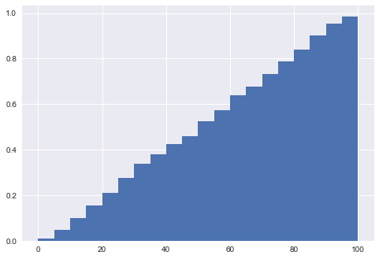


    0.99708765046293724


```python
Cs = [10**x for x in range(6)]
cross_val_scores = []
for c in Cs:
    logit = LogisticRegression(C = c)
    cv_scores = []
    for train_index, val_index in kf.split(X_train):
        logit.fit(X_train[train_index],y_train[train_index])
        preds = logit.predict_proba(X_train[val_index])
        acc = bin_accuracy(20, [pred[1] for pred in preds], y_train[val_index])
        cv_scores.append(acc)
    cv_score = cross_val_score(logit, X_train, y_train, cv = 5)
    cross_val_scores.append((np.mean(cv_scores), np.mean(cv_score), c))
cross_val_scores
```


    [(0.99626202161949207, 0.75323959280912378, 1),
     (0.99626114967646784, 0.75324068958296353, 10),
     (0.99626112668802658, 0.75324068958296353, 100),
     (0.99626133116740445, 0.75324068958296353, 1000),
     (0.99626076436317257, 0.75324068958296353, 10000),
     (0.99626094308400148, 0.75324068958296353, 100000)]


```python
logit = LogisticRegression(C = 10000)
logit.fit(X_train, y_train)
logit_test_preds = logit.predict_proba(X_test)
bin_accuracy_plot(20,[pred[1] for pred in logit_test_preds],y_test)
```


    [0.01835387323943662, 0.07165783384339777, 0.11793080505655355, 0.16442074648570043, 0.2113143343258188, 0.25096907959974757, 0.317940260216236, 0.37773462043753925, 0.42574767076748854, 0.48366083445491254, 0.5401867209096125, 0.5834384195039932, 0.6376655684797956, 0.6983086509670632, 0.7433012583271651, 0.780558789289872, 0.822808671065033, 0.8772222222222222, 0.9167494536061991, 0.9689342495832147]


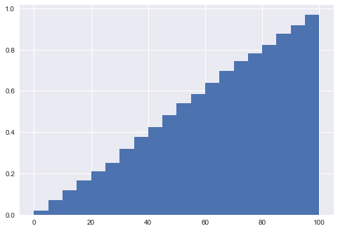


    0.99843554923254307


```python
logit_test_preds
```


    array([[ 0.52902562,  0.47097438],
           [ 0.4498386 ,  0.5501614 ],
           [ 0.55293497,  0.44706503],
           ..., 
           [ 0.3429999 ,  0.6570001 ],
           [ 0.0392451 ,  0.9607549 ],
           [ 0.96383187,  0.03616813]])


```python
lda = LinearDiscriminantAnalysis()
lda.fit(X_train, y_train)

lda_train_preds = lda.predict_proba(X_train)
lda_test_preds = lda.predict_proba(X_test)
```


    //anaconda/lib/python2.7/site-packages/sklearn/discriminant_analysis.py:387: UserWarning: Variables are collinear.
      warnings.warn("Variables are collinear.")


```python
lda.predict_proba(X_test)
```


    array([[ 0.50703028,  0.49296972],
           [ 0.45687798,  0.54312202],
           [ 0.51034247,  0.48965753],
           ..., 
           [ 0.38462568,  0.61537432],
           [ 0.10078737,  0.89921263],
           [ 0.92343455,  0.07656545]])


```python
bin_accuracy_plot(20,[pred[1] for pred in lda_test_preds],y_test)
```


    [0.004123144584936778, 0.030421714181619455, 0.06508931965032307, 0.09516279069767442, 0.14243708380178155, 0.195639932426997, 0.24950711938663747, 0.3352858481724461, 0.4021776259607173, 0.47072315748474486, 0.5346236217974142, 0.6031578947368421, 0.6698310539018504, 0.7333611144183831, 0.7816738106949617, 0.834731058415269, 0.8833215157961081, 0.9236971157842241, 0.9540479572228256, 0.9843385538153949]


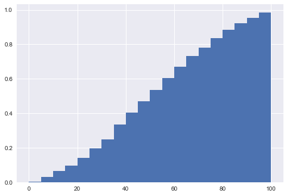


    0.96805932162481501


```python
qda = QuadraticDiscriminantAnalysis()
qda.fit(X_train, y_train)

qda_train_preds = qda.predict_proba(X_train)
qda_test_preds = qda.predict_proba(X_test)
```


    //anaconda/lib/python2.7/site-packages/sklearn/discriminant_analysis.py:695: UserWarning: Variables are collinear
      warnings.warn("Variables are collinear")


```python
bin_accuracy_plot(20,[pred[1] for pred in qda_test_preds],y_test)
```


    [0.18747745426436485, 0.4183538441180363, 0.46037006351836507, 0.4990904956798545, 0.51732256979482, 0.543660673121254, 0.5494123658661216, 0.5527016082378804, 0.5706676576241794, 0.5926345609065156, 0.5892957746478873, 0.6106099984711818, 0.619896683886019, 0.6048034934497817, 0.6285572468563865, 0.6343552750225429, 0.6328535842789925, 0.6475373300646312, 0.6724651162790698, 0.7935897215685601]


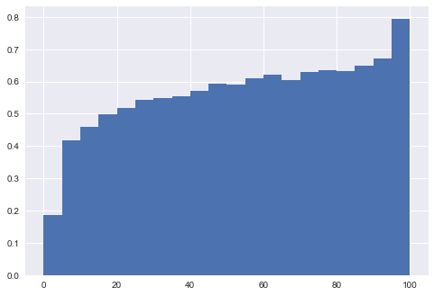


    0.48198128870807566


```python
Ks = [x for x in range(5,105,5)]
cross_val_scores = []
for k in Ks:
    knn = KNeighborsClassifier(n_neighbors = k)
    cv_scores = []
    for train_index, val_index in kf.split(X_train):
        knn.fit(X_train, y_train)
        preds = knn.predict_proba(X_train[val_index])
        acc = bin_accuracy(20, [pred[1] for pred in preds], y_train[val_index])
        cv_scores.append(acc)
    cv_score = cross_val_score(knn, X_train, y_train, cv = 5)
    cross_val_scores.append((np.mean(cv_scores), np.mean(cv_score), k))
# cross_val_scores

```


```python
knn = KNeighborsClassifier(n_neighbors = k)
knn.fit(X_train, y_train)
knn_test_preds = knn.predict_proba(X_test)
```


```python
bin_accuracy_plot(20,[pred[1] for pred in knn_test_preds],y_test)
```


    [0.0, 0.003425724073497353, 0.010376398779247202, 0.01808895509682911, 0.04454303460514641, 0.06594578129759367, 0.12211651244624007, 0.19121184088806661, 0.306621825350806, 0.45164983336301423, 0.5275818779308054, 0.6379401826356502, 0.7874869655891553, 0.8876445086705202, 0.9340471092077087, 0.9614601018675721, 0.9799579764021336, 0.9936406995230525, 0.9982030548068284, 1.0]


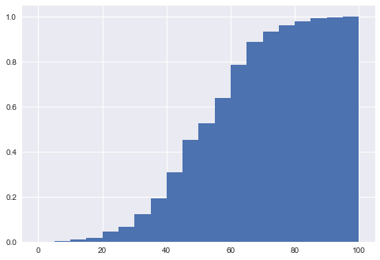


    0.75494646641255214


```python
cross_val_scores = []
trees = [2**x for x in range(7)]
for md in [1,2,5,10,None]:
    for tree in trees:
        ada=AdaBoostClassifier(base_estimator=DecisionTreeClassifier(max_depth=md),n_estimators=tree, learning_rate=.05)
        cv_scores = []
        for train_index, val_index in kf.split(X_train):
            ada.fit(X_train[train_index],y_train[train_index])
            preds = rf.predict_proba(X_train[val_index])
            acc = bin_accuracy(20, [pred[1] for pred in preds], y_train[val_index])
            cv_scores.append(acc)
        cv_score = cross_val_score(ada, X_train, y_train, cv = 5)
        cross_val_scores.append((np.mean(cv_scores), np.mean(cv_score), tree, md))
# cross_val_scores
```


```python
cross_val_scores
```


    [(0.99502557239425382, 0.73593364110666948, 1, 1),
     (0.99502557239425382, 0.73593364110666948, 2, 1),
     (0.99502557239425382, 0.73593364110666948, 4, 1),
     (0.99502557239425382, 0.73593364110666948, 8, 1),
     (0.99502557239425382, 0.73593364110666948, 16, 1),
     (0.99502557239425382, 0.73593364110666948, 32, 1),
     (0.99502557239425382, 0.73593364110666948, 64, 1),
     (0.99502557239425382, 0.73593364110666948, 1, 2),
     (0.99502557239425382, 0.73593364110666948, 2, 2),
     (0.99502557239425382, 0.73593364110666948, 4, 2),
     (0.99502557239425382, 0.73593364110666948, 8, 2)]


```python
ada = AdaBoostClassifier(base_estimator=DecisionTreeClassifier(max_depth=10),n_estimators=10, learning_rate=.05)
ada.fit(X_train,y_train)
ada_test_preds = ada.predict_proba(X_test)
bin_accuracy_plot(20,[pred[1] for pred in ada_test_preds],y_test)
```


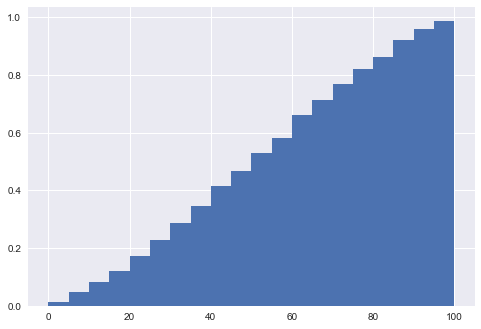


    0.98522099659212115


```python

```


```python
logit_all_preds = logit.predict_proba(X_all)
print(pd.DataFrame(logit_all_preds).describe())
plays_all['logitWP'] = [pred[1] for pred in logit_all_preds]
plays.head()
```


                      0             1
    count  1.215489e+06  1.215489e+06
    mean   4.898026e-01  5.101974e-01
    std    2.953227e-01  2.953227e-01
    min    8.408029e-09  8.439937e-09
    25%    2.453869e-01  2.744164e-01
    50%    4.880871e-01  5.119129e-01
    75%    7.255836e-01  7.546131e-01
    max    1.000000e+00  1.000000e+00


<div>
<style>
    .dataframe thead tr:only-child th {
        text-align: right;
    }

    .dataframe thead th {
        text-align: left;
    }

    .dataframe tbody tr th {
        vertical-align: top;
    }
</style>
<table border="1" class="dataframe">
  <thead>
    <tr style="text-align: right;">
      <th></th>
      <th>gameID</th>
      <th>date</th>
      <th>stadium</th>
      <th>attendance</th>
      <th>inning</th>
      <th>starting_pitcher</th>
      <th>is_starting_pitcher</th>
      <th>is_away</th>
      <th>batting_position</th>
      <th>score</th>
      <th>num_outs</th>
      <th>runners_on_base</th>
      <th>pitch_details</th>
      <th>run_out_result</th>
      <th>team_at_bat</th>
      <th>batter</th>
      <th>pitcher</th>
      <th>WEC%</th>
      <th>wWE%</th>
      <th>play_description</th>
      <th>team_won</th>
      <th>is_single</th>
      <th>is_double</th>
      <th>is_triple</th>
      <th>is_homerun</th>
      <th>is_strikeout</th>
      <th>is_groundout</th>
      <th>is_walk</th>
      <th>is_steal</th>
      <th>runner_on_first</th>
      <th>runner_on_second</th>
      <th>runner_on_third</th>
      <th>runs_in_atbat</th>
      <th>outs_in_atbat</th>
      <th>batting_team_runs</th>
      <th>fielding_team_runs</th>
      <th>pitch_count</th>
      <th>ball_count</th>
      <th>strike_count</th>
      <th>home_team_won</th>
    </tr>
  </thead>
  <tbody>
    <tr>
      <th>0</th>
      <td>1</td>
      <td>2006-09-08</td>
      <td>Angel Stadium of Anaheim</td>
      <td>42,259</td>
      <td>1</td>
      <td>Joe Saunders</td>
      <td>1</td>
      <td>1</td>
      <td>1</td>
      <td>0-0</td>
      <td>0</td>
      <td>---</td>
      <td>5,(1-2) CFBFX</td>
      <td>NaN</td>
      <td>TOR</td>
      <td>Reed Johnson</td>
      <td>Joe Saunders</td>
      <td>-6%</td>
      <td>44%</td>
      <td>Double to CF (Fly Ball to Deep CF)</td>
      <td>0</td>
      <td>False</td>
      <td>True</td>
      <td>False</td>
      <td>False</td>
      <td>False</td>
      <td>False</td>
      <td>False</td>
      <td>False</td>
      <td>0</td>
      <td>0</td>
      <td>0</td>
      <td>0</td>
      <td>0</td>
      <td>0</td>
      <td>0</td>
      <td>5</td>
      <td>1</td>
      <td>2</td>
      <td>1</td>
    </tr>
    <tr>
      <th>1</th>
      <td>1</td>
      <td>2006-09-08</td>
      <td>Angel Stadium of Anaheim</td>
      <td>42,259</td>
      <td>1</td>
      <td>Joe Saunders</td>
      <td>1</td>
      <td>1</td>
      <td>2</td>
      <td>0-0</td>
      <td>0</td>
      <td>-2-</td>
      <td>6,(3-2) FBFBBX</td>
      <td>O</td>
      <td>TOR</td>
      <td>Aaron Hill</td>
      <td>Joe Saunders</td>
      <td>4%</td>
      <td>48%</td>
      <td>Lineout: 3B</td>
      <td>0</td>
      <td>False</td>
      <td>False</td>
      <td>False</td>
      <td>False</td>
      <td>False</td>
      <td>False</td>
      <td>False</td>
      <td>False</td>
      <td>0</td>
      <td>1</td>
      <td>0</td>
      <td>0</td>
      <td>1</td>
      <td>0</td>
      <td>0</td>
      <td>6</td>
      <td>3</td>
      <td>2</td>
      <td>1</td>
    </tr>
    <tr>
      <th>2</th>
      <td>1</td>
      <td>2006-09-08</td>
      <td>Angel Stadium of Anaheim</td>
      <td>42,259</td>
      <td>1</td>
      <td>Joe Saunders</td>
      <td>1</td>
      <td>1</td>
      <td>3</td>
      <td>0-0</td>
      <td>1</td>
      <td>-2-</td>
      <td>2,(1-0) *BX</td>
      <td>RO</td>
      <td>TOR</td>
      <td>Vernon Wells</td>
      <td>Joe Saunders</td>
      <td>-4%</td>
      <td>44%</td>
      <td>Single to RF (Line Drive); Johnson Scores; out...</td>
      <td>0</td>
      <td>True</td>
      <td>False</td>
      <td>False</td>
      <td>False</td>
      <td>False</td>
      <td>False</td>
      <td>False</td>
      <td>False</td>
      <td>0</td>
      <td>1</td>
      <td>0</td>
      <td>1</td>
      <td>1</td>
      <td>0</td>
      <td>0</td>
      <td>2</td>
      <td>1</td>
      <td>0</td>
      <td>1</td>
    </tr>
    <tr>
      <th>3</th>
      <td>1</td>
      <td>2006-09-08</td>
      <td>Angel Stadium of Anaheim</td>
      <td>42,259</td>
      <td>1</td>
      <td>Joe Saunders</td>
      <td>1</td>
      <td>1</td>
      <td>4</td>
      <td>1-0</td>
      <td>2</td>
      <td>---</td>
      <td>2,(0-1) CX</td>
      <td>O</td>
      <td>TOR</td>
      <td>Troy Glaus</td>
      <td>Joe Saunders</td>
      <td>1%</td>
      <td>45%</td>
      <td>Lineout: 3B-1B</td>
      <td>0</td>
      <td>False</td>
      <td>False</td>
      <td>False</td>
      <td>False</td>
      <td>False</td>
      <td>False</td>
      <td>False</td>
      <td>False</td>
      <td>0</td>
      <td>0</td>
      <td>0</td>
      <td>0</td>
      <td>1</td>
      <td>1</td>
      <td>0</td>
      <td>2</td>
      <td>0</td>
      <td>1</td>
      <td>1</td>
    </tr>
    <tr>
      <th>4</th>
      <td>1</td>
      <td>2006-09-08</td>
      <td>Angel Stadium of Anaheim</td>
      <td>42,259</td>
      <td>1</td>
      <td>A.J. Burnett</td>
      <td>1</td>
      <td>0</td>
      <td>1</td>
      <td>0-1</td>
      <td>0</td>
      <td>---</td>
      <td>4,(1-2) BCCX</td>
      <td>NaN</td>
      <td>LAA</td>
      <td>Maicer Izturis</td>
      <td>A.J. Burnett</td>
      <td>4%</td>
      <td>49%</td>
      <td>Single to 1B (Ground Ball)</td>
      <td>1</td>
      <td>True</td>
      <td>False</td>
      <td>False</td>
      <td>False</td>
      <td>False</td>
      <td>False</td>
      <td>False</td>
      <td>False</td>
      <td>0</td>
      <td>0</td>
      <td>0</td>
      <td>0</td>
      <td>0</td>
      <td>0</td>
      <td>1</td>
      <td>4</td>
      <td>1</td>
      <td>2</td>
      <td>1</td>
    </tr>
  </tbody>
</table>
</div>


```python
wPC = [plays_all['logitWP'][i]-plays_all['logitWP'][i-1] if plays_all['is_away'][i] == plays_all['is_away'][i-1] else plays_all['logitWP'][i]-(1-plays_all['logitWP'][i-1]) for i in range(1,len(plays_all['logitWP']),1)]
wPC = [plays_all['logitWP'][i]-.50 if plays_all['gameID'][i] != plays_all['gameID'][i-1] else wPC[i-1] for i in range(1,len(wPC)+1,1)]
```


```python
wPC = [plays_all['logitWP'][0]-.50] + wPC
print(len(wPC))
print(len(plays_all['logitWP']))
```


    1215489
    1215489


```python
plays_all['wPC'] = wPC
plays_all
```


<div>
<style>
    .dataframe thead tr:only-child th {
        text-align: right;
    }

    .dataframe thead th {
        text-align: left;
    }

    .dataframe tbody tr th {
        vertical-align: top;
    }
</style>
<table border="1" class="dataframe">
  <thead>
    <tr style="text-align: right;">
      <th></th>
      <th>gameID</th>
      <th>date</th>
      <th>attendance</th>
      <th>inning</th>
      <th>is_starting_pitcher</th>
      <th>is_away</th>
      <th>batting_position</th>
      <th>num_outs</th>
      <th>team_at_bat</th>
      <th>batter</th>
      <th>pitcher</th>
      <th>WEC%</th>
      <th>wWE%</th>
      <th>team_won</th>
      <th>is_single</th>
      <th>is_double</th>
      <th>is_triple</th>
      <th>is_homerun</th>
      <th>is_strikeout</th>
      <th>is_groundout</th>
      <th>is_walk</th>
      <th>is_steal</th>
      <th>runner_on_first</th>
      <th>runner_on_second</th>
      <th>runner_on_third</th>
      <th>runs_in_atbat</th>
      <th>outs_in_atbat</th>
      <th>batting_team_runs</th>
      <th>fielding_team_runs</th>
      <th>pitch_count</th>
      <th>ball_count</th>
      <th>strike_count</th>
      <th>home_team_won</th>
      <th>run_diff</th>
      <th>run_scored</th>
      <th>logitWP</th>
      <th>wPC</th>
    </tr>
  </thead>
  <tbody>
    <tr>
      <th>0</th>
      <td>1</td>
      <td>2006-09-08</td>
      <td>42259</td>
      <td>1</td>
      <td>1</td>
      <td>1</td>
      <td>1</td>
      <td>0</td>
      <td>TOR</td>
      <td>Reed Johnson</td>
      <td>Joe Saunders</td>
      <td>-6%</td>
      <td>44%</td>
      <td>0</td>
      <td>0</td>
      <td>1</td>
      <td>0</td>
      <td>0</td>
      <td>0</td>
      <td>0</td>
      <td>0</td>
      <td>0</td>
      <td>0</td>
      <td>0</td>
      <td>0</td>
      <td>0</td>
      <td>0</td>
      <td>0</td>
      <td>0</td>
      <td>5</td>
      <td>1</td>
      <td>2</td>
      <td>1</td>
      <td>0</td>
      <td>0</td>
      <td>0.534008</td>
      <td>0.034008</td>
    </tr>
    <tr>
      <th>1</th>
      <td>1</td>
      <td>2006-09-08</td>
      <td>42259</td>
      <td>1</td>
      <td>1</td>
      <td>1</td>
      <td>2</td>
      <td>0</td>
      <td>TOR</td>
      <td>Aaron Hill</td>
      <td>Joe Saunders</td>
      <td>4%</td>
      <td>48%</td>
      <td>0</td>
      <td>0</td>
      <td>0</td>
      <td>0</td>
      <td>0</td>
      <td>0</td>
      <td>0</td>
      <td>0</td>
      <td>0</td>
      <td>0</td>
      <td>1</td>
      <td>0</td>
      <td>0</td>
      <td>1</td>
      <td>0</td>
      <td>0</td>
      <td>6</td>
      <td>3</td>
      <td>2</td>
      <td>1</td>
      <td>0</td>
      <td>0</td>
      <td>0.470974</td>
      <td>-0.063034</td>
    </tr>
    <tr>
      <th>2</th>
      <td>1</td>
      <td>2006-09-08</td>
      <td>42259</td>
      <td>1</td>
      <td>1</td>
      <td>1</td>
      <td>3</td>
      <td>1</td>
      <td>TOR</td>
      <td>Vernon Wells</td>
      <td>Joe Saunders</td>
      <td>-4%</td>
      <td>44%</td>
      <td>0</td>
      <td>1</td>
      <td>0</td>
      <td>0</td>
      <td>0</td>
      <td>0</td>
      <td>0</td>
      <td>0</td>
      <td>0</td>
      <td>0</td>
      <td>1</td>
      <td>0</td>
      <td>1</td>
      <td>1</td>
      <td>0</td>
      <td>0</td>
      <td>2</td>
      <td>1</td>
      <td>0</td>
      <td>1</td>
      <td>0</td>
      <td>0</td>
      <td>0.550161</td>
      <td>0.079187</td>
    </tr>
    <tr>
      <th>3</th>
      <td>1</td>
      <td>2006-09-08</td>
      <td>42259</td>
      <td>1</td>
      <td>1</td>
      <td>1</td>
      <td>4</td>
      <td>2</td>
      <td>TOR</td>
      <td>Troy Glaus</td>
      <td>Joe Saunders</td>
      <td>1%</td>
      <td>45%</td>
      <td>0</td>
      <td>0</td>
      <td>0</td>
      <td>0</td>
      <td>0</td>
      <td>0</td>
      <td>0</td>
      <td>0</td>
      <td>0</td>
      <td>0</td>
      <td>0</td>
      <td>0</td>
      <td>0</td>
      <td>1</td>
      <td>1</td>
      <td>0</td>
      <td>2</td>
      <td>0</td>
      <td>1</td>
      <td>1</td>
      <td>1</td>
      <td>1</td>
      <td>0.506042</td>
      <td>-0.044120</td>
    </tr>
    <tr>
      <th>4</th>
      <td>1</td>
      <td>2006-09-08</td>
      <td>42259</td>
      <td>1</td>
      <td>1</td>
      <td>0</td>
      <td>1</td>
      <td>0</td>
      <td>LAA</td>
      <td>Maicer Izturis</td>
      <td>A.J. Burnett</td>
      <td>4%</td>
      <td>49%</td>
      <td>1</td>
      <td>1</td>
      <td>0</td>
      <td>0</td>
      <td>0</td>
      <td>0</td>
      <td>0</td>
      <td>0</td>
      <td>0</td>
      <td>0</td>
      <td>0</td>
      <td>0</td>
      <td>0</td>
      <td>0</td>
      <td>0</td>
      <td>1</td>
      <td>4</td>
      <td>1</td>
      <td>2</td>
      <td>1</td>
      <td>-1</td>
      <td>1</td>
      <td>0.447065</td>
      <td>-0.046893</td>
    </tr>
    <tr>
      <th>5</th>
      <td>1</td>
      <td>2006-09-08</td>
      <td>42259</td>
      <td>1</td>
      <td>1</td>
      <td>0</td>
      <td>2</td>
      <td>0</td>
      <td>LAA</td>
      <td>Orlando Cabrera</td>
      <td>A.J. Burnett</td>
      <td>6%</td>
      <td>55%</td>
      <td>1</td>
      <td>1</td>
      <td>0</td>
      <td>0</td>
      <td>0</td>
      <td>0</td>
      <td>0</td>
      <td>0</td>
      <td>0</td>
      <td>1</td>
      <td>0</td>
      <td>0</td>
      <td>0</td>
      <td>0</td>
      <td>0</td>
      <td>1</td>
      <td>4</td>
      <td>1</td>
      <td>2</td>
      <td>1</td>
      <td>-1</td>
      <td>1</td>
      <td>0.473265</td>
      <td>0.026200</td>
    </tr>
    <tr>
      <th>6</th>
      <td>1</td>
      <td>2006-09-08</td>
      <td>42259</td>
      <td>1</td>
      <td>1</td>
      <td>0</td>
      <td>3</td>
      <td>0</td>
      <td>LAA</td>
      <td>Vladimir Guerrero</td>
      <td>A.J. Burnett</td>
      <td>-11%</td>
      <td>44%</td>
      <td>1</td>
      <td>0</td>
      <td>1</td>
      <td>0</td>
      <td>0</td>
      <td>0</td>
      <td>0</td>
      <td>0</td>
      <td>0</td>
      <td>1</td>
      <td>1</td>
      <td>0</td>
      <td>0</td>
      <td>2</td>
      <td>0</td>
      <td>1</td>
      <td>1</td>
      <td>0</td>
      <td>0</td>
      <td>1</td>
      <td>-1</td>
      <td>1</td>
      <td>0.394548</td>
      <td>-0.078716</td>
    </tr>
    <tr>
      <th>7</th>
      <td>1</td>
      <td>2006-09-08</td>
      <td>42259</td>
      <td>1</td>
      <td>1</td>
      <td>0</td>
      <td>4</td>
      <td>2</td>
      <td>LAA</td>
      <td>Garret Anderson</td>
      <td>A.J. Burnett</td>
      <td>-4%</td>
      <td>40%</td>
      <td>1</td>
      <td>0</td>
      <td>0</td>
      <td>0</td>
      <td>0</td>
      <td>0</td>
      <td>0</td>
      <td>0</td>
      <td>0</td>
      <td>0</td>
      <td>0</td>
      <td>1</td>
      <td>0</td>
      <td>1</td>
      <td>0</td>
      <td>1</td>
      <td>1</td>
      <td>0</td>
      <td>0</td>
      <td>1</td>
      <td>-1</td>
      <td>1</td>
      <td>0.318707</td>
      <td>-0.075842</td>
    </tr>
    <tr>
      <th>8</th>
      <td>1</td>
      <td>2006-09-08</td>
      <td>42259</td>
      <td>2</td>
      <td>1</td>
      <td>1</td>
      <td>5</td>
      <td>0</td>
      <td>TOR</td>
      <td>Bengie Molina</td>
      <td>Joe Saunders</td>
      <td>2%</td>
      <td>42%</td>
      <td>0</td>
      <td>0</td>
      <td>0</td>
      <td>0</td>
      <td>0</td>
      <td>0</td>
      <td>0</td>
      <td>0</td>
      <td>0</td>
      <td>0</td>
      <td>0</td>
      <td>0</td>
      <td>0</td>
      <td>1</td>
      <td>1</td>
      <td>0</td>
      <td>3</td>
      <td>0</td>
      <td>2</td>
      <td>1</td>
      <td>1</td>
      <td>1</td>
      <td>0.596783</td>
      <td>-0.084511</td>
    </tr>
    <tr>
      <th>9</th>
      <td>1</td>
      <td>2006-09-08</td>
      <td>42259</td>
      <td>2</td>
      <td>1</td>
      <td>1</td>
      <td>6</td>
      <td>1</td>
      <td>TOR</td>
      <td>Alex Rios</td>
      <td>Joe Saunders</td>
      <td>-4%</td>
      <td>39%</td>
      <td>0</td>
      <td>0</td>
      <td>1</td>
      <td>0</td>
      <td>0</td>
      <td>0</td>
      <td>0</td>
      <td>0</td>
      <td>0</td>
      <td>0</td>
      <td>0</td>
      <td>0</td>
      <td>0</td>
      <td>0</td>
      <td>1</td>
      <td>0</td>
      <td>5</td>
      <td>2</td>
      <td>2</td>
      <td>1</td>
      <td>1</td>
      <td>1</td>
      <td>0.660817</td>
      <td>0.064035</td>
    </tr>
    <tr>
      <th>10</th>
      <td>1</td>
      <td>2006-09-08</td>
      <td>42259</td>
      <td>2</td>
      <td>1</td>
      <td>1</td>
      <td>7</td>
      <td>1</td>
      <td>TOR</td>
      <td>Lyle Overbay</td>
      <td>Joe Saunders</td>
      <td>3%</td>
      <td>42%</td>
      <td>0</td>
      <td>0</td>
      <td>0</td>
      <td>0</td>
      <td>0</td>
      <td>0</td>
      <td>0</td>
      <td>0</td>
      <td>0</td>
      <td>0</td>
      <td>1</td>
      <td>0</td>
      <td>0</td>
      <td>1</td>
      <td>1</td>
      <td>0</td>
      <td>4</td>
      <td>1</td>
      <td>2</td>
      <td>1</td>
      <td>1</td>
      <td>1</td>
      <td>0.591405</td>
      <td>-0.069412</td>
    </tr>
    <tr>
      <th>11</th>
      <td>1</td>
      <td>2006-09-08</td>
      <td>42259</td>
      <td>2</td>
      <td>1</td>
      <td>1</td>
      <td>8</td>
      <td>2</td>
      <td>TOR</td>
      <td>Jason Phillips</td>
      <td>Joe Saunders</td>
      <td>3%</td>
      <td>45%</td>
      <td>0</td>
      <td>0</td>
      <td>0</td>
      <td>0</td>
      <td>0</td>
      <td>1</td>
      <td>0</td>
      <td>0</td>
      <td>0</td>
      <td>0</td>
      <td>1</td>
      <td>0</td>
      <td>0</td>
      <td>1</td>
      <td>1</td>
      <td>0</td>
      <td>3</td>
      <td>0</td>
      <td>2</td>
      <td>1</td>
      <td>1</td>
      <td>1</td>
      <td>0.536764</td>
      <td>-0.054640</td>
    </tr>
    <tr>
      <th>12</th>
      <td>1</td>
      <td>2006-09-08</td>
      <td>42259</td>
      <td>2</td>
      <td>1</td>
      <td>0</td>
      <td>5</td>
      <td>0</td>
      <td>LAA</td>
      <td>Juan Rivera</td>
      <td>A.J. Burnett</td>
      <td>-3%</td>
      <td>42%</td>
      <td>1</td>
      <td>0</td>
      <td>0</td>
      <td>0</td>
      <td>0</td>
      <td>0</td>
      <td>0</td>
      <td>0</td>
      <td>0</td>
      <td>0</td>
      <td>0</td>
      <td>0</td>
      <td>0</td>
      <td>1</td>
      <td>0</td>
      <td>1</td>
      <td>2</td>
      <td>0</td>
      <td>1</td>
      <td>1</td>
      <td>-1</td>
      <td>1</td>
      <td>0.368735</td>
      <td>-0.094500</td>
    </tr>
    <tr>
      <th>13</th>
      <td>1</td>
      <td>2006-09-08</td>
      <td>42259</td>
      <td>2</td>
      <td>1</td>
      <td>0</td>
      <td>6</td>
      <td>1</td>
      <td>LAA</td>
      <td>Howie Kendrick</td>
      <td>A.J. Burnett</td>
      <td>-2%</td>
      <td>41%</td>
      <td>1</td>
      <td>0</td>
      <td>0</td>
      <td>0</td>
      <td>0</td>
      <td>1</td>
      <td>0</td>
      <td>0</td>
      <td>0</td>
      <td>0</td>
      <td>0</td>
      <td>0</td>
      <td>0</td>
      <td>1</td>
      <td>0</td>
      <td>1</td>
      <td>3</td>
      <td>0</td>
      <td>2</td>
      <td>1</td>
      <td>-1</td>
      <td>1</td>
      <td>0.321138</td>
      <td>-0.047598</td>
    </tr>
    <tr>
      <th>14</th>
      <td>1</td>
      <td>2006-09-08</td>
      <td>42259</td>
      <td>2</td>
      <td>1</td>
      <td>0</td>
      <td>7</td>
      <td>2</td>
      <td>LAA</td>
      <td>Adam Kennedy</td>
      <td>A.J. Burnett</td>
      <td>1%</td>
      <td>42%</td>
      <td>1</td>
      <td>1</td>
      <td>0</td>
      <td>0</td>
      <td>0</td>
      <td>0</td>
      <td>0</td>
      <td>0</td>
      <td>0</td>
      <td>0</td>
      <td>0</td>
      <td>0</td>
      <td>0</td>
      <td>0</td>
      <td>0</td>
      <td>1</td>
      <td>1</td>
      <td>0</td>
      <td>0</td>
      <td>1</td>
      <td>-1</td>
      <td>1</td>
      <td>0.359731</td>
      <td>0.038594</td>
    </tr>
    <tr>
      <th>15</th>
      <td>1</td>
      <td>2006-09-08</td>
      <td>42259</td>
      <td>2</td>
      <td>1</td>
      <td>0</td>
      <td>8</td>
      <td>2</td>
      <td>LAA</td>
      <td>Mike Napoli</td>
      <td>A.J. Burnett</td>
      <td>1%</td>
      <td>43%</td>
      <td>1</td>
      <td>0</td>
      <td>0</td>
      <td>0</td>
      <td>0</td>
      <td>0</td>
      <td>0</td>
      <td>0</td>
      <td>1</td>
      <td>1</td>
      <td>0</td>
      <td>0</td>
      <td>0</td>
      <td>0</td>
      <td>0</td>
      <td>1</td>
      <td>2</td>
      <td>0</td>
      <td>1</td>
      <td>1</td>
      <td>-1</td>
      <td>1</td>
      <td>0.378685</td>
      <td>0.018954</td>
    </tr>
    <tr>
      <th>16</th>
      <td>1</td>
      <td>2006-09-08</td>
      <td>42259</td>
      <td>2</td>
      <td>1</td>
      <td>0</td>
      <td>9</td>
      <td>2</td>
      <td>LAA</td>
      <td>Mike Napoli</td>
      <td>A.J. Burnett</td>
      <td>-4%</td>
      <td>39%</td>
      <td>1</td>
      <td>0</td>
      <td>0</td>
      <td>0</td>
      <td>0</td>
      <td>1</td>
      <td>0</td>
      <td>0</td>
      <td>0</td>
      <td>0</td>
      <td>1</td>
      <td>0</td>
      <td>0</td>
      <td>1</td>
      <td>0</td>
      <td>1</td>
      <td>4</td>
      <td>1</td>
      <td>2</td>
      <td>1</td>
      <td>-1</td>
      <td>1</td>
      <td>0.315606</td>
      <td>-0.063079</td>
    </tr>
    <tr>
      <th>17</th>
      <td>1</td>
      <td>2006-09-08</td>
      <td>42259</td>
      <td>3</td>
      <td>1</td>
      <td>1</td>
      <td>9</td>
      <td>0</td>
      <td>TOR</td>
      <td>John McDonald</td>
      <td>Joe Saunders</td>
      <td>2%</td>
      <td>42%</td>
      <td>0</td>
      <td>0</td>
      <td>0</td>
      <td>0</td>
      <td>0</td>
      <td>0</td>
      <td>0</td>
      <td>0</td>
      <td>0</td>
      <td>0</td>
      <td>0</td>
      <td>0</td>
      <td>0</td>
      <td>1</td>
      <td>1</td>
      <td>0</td>
      <td>2</td>
      <td>0</td>
      <td>1</td>
      <td>1</td>
      <td>1</td>
      <td>1</td>
      <td>0.599062</td>
      <td>-0.085331</td>
    </tr>
    <tr>
      <th>18</th>
      <td>1</td>
      <td>2006-09-08</td>
      <td>42259</td>
      <td>3</td>
      <td>1</td>
      <td>1</td>
      <td>1</td>
      <td>1</td>
      <td>TOR</td>
      <td>Reed Johnson</td>
      <td>Joe Saunders</td>
      <td>2%</td>
      <td>43%</td>
      <td>0</td>
      <td>0</td>
      <td>0</td>
      <td>0</td>
      <td>0</td>
      <td>0</td>
      <td>1</td>
      <td>0</td>
      <td>0</td>
      <td>0</td>
      <td>0</td>
      <td>0</td>
      <td>0</td>
      <td>1</td>
      <td>1</td>
      <td>0</td>
      <td>3</td>
      <td>0</td>
      <td>2</td>
      <td>1</td>
      <td>1</td>
      <td>1</td>
      <td>0.567712</td>
      <td>-0.031351</td>
    </tr>
    <tr>
      <th>19</th>
      <td>1</td>
      <td>2006-09-08</td>
      <td>42259</td>
      <td>3</td>
      <td>1</td>
      <td>1</td>
      <td>2</td>
      <td>2</td>
      <td>TOR</td>
      <td>Aaron Hill</td>
      <td>Joe Saunders</td>
      <td>-1%</td>
      <td>42%</td>
      <td>0</td>
      <td>1</td>
      <td>0</td>
      <td>0</td>
      <td>0</td>
      <td>0</td>
      <td>0</td>
      <td>0</td>
      <td>0</td>
      <td>0</td>
      <td>0</td>
      <td>0</td>
      <td>0</td>
      <td>0</td>
      <td>1</td>
      <td>0</td>
      <td>6</td>
      <td>2</td>
      <td>2</td>
      <td>1</td>
      <td>1</td>
      <td>1</td>
      <td>0.602161</td>
      <td>0.034450</td>
    </tr>
    <tr>
      <th>20</th>
      <td>1</td>
      <td>2006-09-08</td>
      <td>42259</td>
      <td>3</td>
      <td>1</td>
      <td>1</td>
      <td>3</td>
      <td>2</td>
      <td>TOR</td>
      <td>Vernon Wells</td>
      <td>Joe Saunders</td>
      <td>2%</td>
      <td>44%</td>
      <td>0</td>
      <td>0</td>
      <td>0</td>
      <td>0</td>
      <td>0</td>
      <td>0</td>
      <td>1</td>
      <td>0</td>
      <td>0</td>
      <td>1</td>
      <td>0</td>
      <td>0</td>
      <td>0</td>
      <td>1</td>
      <td>1</td>
      <td>0</td>
      <td>2</td>
      <td>1</td>
      <td>0</td>
      <td>1</td>
      <td>1</td>
      <td>1</td>
      <td>0.554442</td>
      <td>-0.047719</td>
    </tr>
    <tr>
      <th>21</th>
      <td>1</td>
      <td>2006-09-08</td>
      <td>42259</td>
      <td>3</td>
      <td>1</td>
      <td>0</td>
      <td>1</td>
      <td>0</td>
      <td>LAA</td>
      <td>Chone Figgins</td>
      <td>A.J. Burnett</td>
      <td>-3%</td>
      <td>42%</td>
      <td>1</td>
      <td>0</td>
      <td>0</td>
      <td>0</td>
      <td>0</td>
      <td>0</td>
      <td>1</td>
      <td>0</td>
      <td>0</td>
      <td>0</td>
      <td>0</td>
      <td>0</td>
      <td>0</td>
      <td>1</td>
      <td>0</td>
      <td>1</td>
      <td>6</td>
      <td>3</td>
      <td>2</td>
      <td>1</td>
      <td>-1</td>
      <td>1</td>
      <td>0.392197</td>
      <td>-0.053361</td>
    </tr>
    <tr>
      <th>22</th>
      <td>1</td>
      <td>2006-09-08</td>
      <td>42259</td>
      <td>3</td>
      <td>1</td>
      <td>0</td>
      <td>2</td>
      <td>1</td>
      <td>LAA</td>
      <td>Maicer Izturis</td>
      <td>A.J. Burnett</td>
      <td>-2%</td>
      <td>40%</td>
      <td>1</td>
      <td>0</td>
      <td>0</td>
      <td>0</td>
      <td>0</td>
      <td>1</td>
      <td>0</td>
      <td>0</td>
      <td>0</td>
      <td>0</td>
      <td>0</td>
      <td>0</td>
      <td>0</td>
      <td>1</td>
      <td>0</td>
      <td>1</td>
      <td>7</td>
      <td>2</td>
      <td>2</td>
      <td>1</td>
      <td>-1</td>
      <td>1</td>
      <td>0.334677</td>
      <td>-0.057520</td>
    </tr>
    <tr>
      <th>23</th>
      <td>1</td>
      <td>2006-09-08</td>
      <td>42259</td>
      <td>3</td>
      <td>1</td>
      <td>0</td>
      <td>3</td>
      <td>2</td>
      <td>LAA</td>
      <td>Orlando Cabrera</td>
      <td>A.J. Burnett</td>
      <td>-1%</td>
      <td>38%</td>
      <td>1</td>
      <td>0</td>
      <td>0</td>
      <td>0</td>
      <td>0</td>
      <td>1</td>
      <td>0</td>
      <td>0</td>
      <td>0</td>
      <td>0</td>
      <td>0</td>
      <td>0</td>
      <td>0</td>
      <td>1</td>
      <td>0</td>
      <td>1</td>
      <td>5</td>
      <td>2</td>
      <td>2</td>
      <td>1</td>
      <td>-1</td>
      <td>1</td>
      <td>0.295656</td>
      <td>-0.039021</td>
    </tr>
    <tr>
      <th>24</th>
      <td>1</td>
      <td>2006-09-08</td>
      <td>42259</td>
      <td>4</td>
      <td>1</td>
      <td>1</td>
      <td>4</td>
      <td>0</td>
      <td>TOR</td>
      <td>Troy Glaus</td>
      <td>Joe Saunders</td>
      <td>2%</td>
      <td>41%</td>
      <td>0</td>
      <td>0</td>
      <td>0</td>
      <td>0</td>
      <td>0</td>
      <td>1</td>
      <td>0</td>
      <td>0</td>
      <td>0</td>
      <td>0</td>
      <td>0</td>
      <td>0</td>
      <td>0</td>
      <td>1</td>
      <td>1</td>
      <td>0</td>
      <td>5</td>
      <td>2</td>
      <td>2</td>
      <td>1</td>
      <td>1</td>
      <td>1</td>
      <td>0.607365</td>
      <td>-0.096979</td>
    </tr>
    <tr>
      <th>25</th>
      <td>1</td>
      <td>2006-09-08</td>
      <td>42259</td>
      <td>4</td>
      <td>1</td>
      <td>1</td>
      <td>5</td>
      <td>1</td>
      <td>TOR</td>
      <td>Bengie Molina</td>
      <td>Joe Saunders</td>
      <td>2%</td>
      <td>42%</td>
      <td>0</td>
      <td>0</td>
      <td>0</td>
      <td>0</td>
      <td>0</td>
      <td>0</td>
      <td>1</td>
      <td>0</td>
      <td>0</td>
      <td>0</td>
      <td>0</td>
      <td>0</td>
      <td>0</td>
      <td>1</td>
      <td>1</td>
      <td>0</td>
      <td>5</td>
      <td>0</td>
      <td>2</td>
      <td>1</td>
      <td>1</td>
      <td>1</td>
      <td>0.569217</td>
      <td>-0.038148</td>
    </tr>
    <tr>
      <th>26</th>
      <td>1</td>
      <td>2006-09-08</td>
      <td>42259</td>
      <td>4</td>
      <td>1</td>
      <td>1</td>
      <td>6</td>
      <td>2</td>
      <td>TOR</td>
      <td>Alex Rios</td>
      <td>Joe Saunders</td>
      <td>1%</td>
      <td>44%</td>
      <td>0</td>
      <td>0</td>
      <td>0</td>
      <td>0</td>
      <td>0</td>
      <td>0</td>
      <td>1</td>
      <td>0</td>
      <td>0</td>
      <td>0</td>
      <td>0</td>
      <td>0</td>
      <td>0</td>
      <td>1</td>
      <td>1</td>
      <td>0</td>
      <td>2</td>
      <td>0</td>
      <td>1</td>
      <td>1</td>
      <td>1</td>
      <td>1</td>
      <td>0.525238</td>
      <td>-0.043979</td>
    </tr>
    <tr>
      <th>27</th>
      <td>1</td>
      <td>2006-09-08</td>
      <td>42259</td>
      <td>4</td>
      <td>1</td>
      <td>0</td>
      <td>4</td>
      <td>0</td>
      <td>LAA</td>
      <td>Vladimir Guerrero</td>
      <td>A.J. Burnett</td>
      <td>8%</td>
      <td>51%</td>
      <td>1</td>
      <td>0</td>
      <td>1</td>
      <td>0</td>
      <td>0</td>
      <td>0</td>
      <td>0</td>
      <td>0</td>
      <td>0</td>
      <td>0</td>
      <td>0</td>
      <td>0</td>
      <td>0</td>
      <td>0</td>
      <td>0</td>
      <td>1</td>
      <td>7</td>
      <td>3</td>
      <td>2</td>
      <td>1</td>
      <td>-1</td>
      <td>1</td>
      <td>0.492677</td>
      <td>0.017915</td>
    </tr>
    <tr>
      <th>28</th>
      <td>1</td>
      <td>2006-09-08</td>
      <td>42259</td>
      <td>4</td>
      <td>1</td>
      <td>0</td>
      <td>5</td>
      <td>0</td>
      <td>LAA</td>
      <td>Garret Anderson</td>
      <td>A.J. Burnett</td>
      <td>12%</td>
      <td>63%</td>
      <td>1</td>
      <td>0</td>
      <td>1</td>
      <td>0</td>
      <td>0</td>
      <td>0</td>
      <td>0</td>
      <td>0</td>
      <td>0</td>
      <td>0</td>
      <td>1</td>
      <td>0</td>
      <td>1</td>
      <td>0</td>
      <td>0</td>
      <td>1</td>
      <td>2</td>
      <td>1</td>
      <td>0</td>
      <td>1</td>
      <td>-1</td>
      <td>1</td>
      <td>0.639879</td>
      <td>0.147202</td>
    </tr>
    <tr>
      <th>29</th>
      <td>1</td>
      <td>2006-09-08</td>
      <td>42259</td>
      <td>4</td>
      <td>1</td>
      <td>0</td>
      <td>6</td>
      <td>0</td>
      <td>LAA</td>
      <td>Juan Rivera</td>
      <td>A.J. Burnett</td>
      <td>7%</td>
      <td>70%</td>
      <td>1</td>
      <td>1</td>
      <td>0</td>
      <td>0</td>
      <td>0</td>
      <td>0</td>
      <td>0</td>
      <td>0</td>
      <td>0</td>
      <td>0</td>
      <td>1</td>
      <td>0</td>
      <td>0</td>
      <td>0</td>
      <td>1</td>
      <td>1</td>
      <td>1</td>
      <td>0</td>
      <td>0</td>
      <td>1</td>
      <td>0</td>
      <td>2</td>
      <td>0.658716</td>
      <td>0.018837</td>
    </tr>
    <tr>
      <th>...</th>
      <td>...</td>
      <td>...</td>
      <td>...</td>
      <td>...</td>
      <td>...</td>
      <td>...</td>
      <td>...</td>
      <td>...</td>
      <td>...</td>
      <td>...</td>
      <td>...</td>
      <td>...</td>
      <td>...</td>
      <td>...</td>
      <td>...</td>
      <td>...</td>
      <td>...</td>
      <td>...</td>
      <td>...</td>
      <td>...</td>
      <td>...</td>
      <td>...</td>
      <td>...</td>
      <td>...</td>
      <td>...</td>
      <td>...</td>
      <td>...</td>
      <td>...</td>
      <td>...</td>
      <td>...</td>
      <td>...</td>
      <td>...</td>
      <td>...</td>
      <td>...</td>
      <td>...</td>
      <td>...</td>
      <td>...</td>
    </tr>
    <tr>
      <th>1215459</th>
      <td>15449</td>
      <td>2015-11-01</td>
      <td>44859</td>
      <td>10</td>
      <td>0</td>
      <td>1</td>
      <td>1</td>
      <td>0</td>
      <td>KCR</td>
      <td>Kendrys Morales</td>
      <td>Jeurys Familia</td>
      <td>-6%</td>
      <td>44%</td>
      <td>0</td>
      <td>0</td>
      <td>0</td>
      <td>0</td>
      <td>0</td>
      <td>1</td>
      <td>0</td>
      <td>0</td>
      <td>0</td>
      <td>0</td>
      <td>0</td>
      <td>0</td>
      <td>0</td>
      <td>1</td>
      <td>2</td>
      <td>2</td>
      <td>3</td>
      <td>0</td>
      <td>2</td>
      <td>1</td>
      <td>0</td>
      <td>4</td>
      <td>0.423618</td>
      <td>-0.127846</td>
    </tr>
    <tr>
      <th>1215460</th>
      <td>15449</td>
      <td>2015-11-01</td>
      <td>44859</td>
      <td>10</td>
      <td>0</td>
      <td>1</td>
      <td>2</td>
      <td>1</td>
      <td>KCR</td>
      <td>Paulo Orlando</td>
      <td>Jeurys Familia</td>
      <td>-4%</td>
      <td>40%</td>
      <td>0</td>
      <td>0</td>
      <td>0</td>
      <td>0</td>
      <td>0</td>
      <td>0</td>
      <td>1</td>
      <td>0</td>
      <td>0</td>
      <td>0</td>
      <td>0</td>
      <td>0</td>
      <td>0</td>
      <td>1</td>
      <td>2</td>
      <td>2</td>
      <td>5</td>
      <td>1</td>
      <td>2</td>
      <td>1</td>
      <td>0</td>
      <td>4</td>
      <td>0.396315</td>
      <td>-0.027304</td>
    </tr>
    <tr>
      <th>1215461</th>
      <td>15449</td>
      <td>2015-11-01</td>
      <td>44859</td>
      <td>10</td>
      <td>0</td>
      <td>1</td>
      <td>3</td>
      <td>2</td>
      <td>KCR</td>
      <td>Alcides Escobar</td>
      <td>Jeurys Familia</td>
      <td>-3%</td>
      <td>37%</td>
      <td>0</td>
      <td>0</td>
      <td>0</td>
      <td>0</td>
      <td>0</td>
      <td>1</td>
      <td>0</td>
      <td>0</td>
      <td>0</td>
      <td>0</td>
      <td>0</td>
      <td>0</td>
      <td>0</td>
      <td>1</td>
      <td>2</td>
      <td>2</td>
      <td>4</td>
      <td>1</td>
      <td>2</td>
      <td>1</td>
      <td>0</td>
      <td>4</td>
      <td>0.341871</td>
      <td>-0.054444</td>
    </tr>
    <tr>
      <th>1215462</th>
      <td>15449</td>
      <td>2015-11-01</td>
      <td>44859</td>
      <td>10</td>
      <td>0</td>
      <td>0</td>
      <td>7</td>
      <td>0</td>
      <td>NYM</td>
      <td>Michael Conforto</td>
      <td>Luke Hochevar</td>
      <td>5%</td>
      <td>43%</td>
      <td>0</td>
      <td>0</td>
      <td>0</td>
      <td>0</td>
      <td>0</td>
      <td>0</td>
      <td>0</td>
      <td>0</td>
      <td>0</td>
      <td>0</td>
      <td>0</td>
      <td>0</td>
      <td>0</td>
      <td>1</td>
      <td>2</td>
      <td>2</td>
      <td>8</td>
      <td>3</td>
      <td>2</td>
      <td>0</td>
      <td>0</td>
      <td>4</td>
      <td>0.547633</td>
      <td>-0.110496</td>
    </tr>
    <tr>
      <th>1215463</th>
      <td>15449</td>
      <td>2015-11-01</td>
      <td>44859</td>
      <td>10</td>
      <td>0</td>
      <td>0</td>
      <td>8</td>
      <td>1</td>
      <td>NYM</td>
      <td>Wilmer Flores</td>
      <td>Luke Hochevar</td>
      <td>4%</td>
      <td>47%</td>
      <td>0</td>
      <td>0</td>
      <td>0</td>
      <td>0</td>
      <td>0</td>
      <td>0</td>
      <td>1</td>
      <td>0</td>
      <td>0</td>
      <td>0</td>
      <td>0</td>
      <td>0</td>
      <td>0</td>
      <td>1</td>
      <td>2</td>
      <td>2</td>
      <td>1</td>
      <td>0</td>
      <td>0</td>
      <td>0</td>
      <td>0</td>
      <td>4</td>
      <td>0.499680</td>
      <td>-0.047953</td>
    </tr>
    <tr>
      <th>1215464</th>
      <td>15449</td>
      <td>2015-11-01</td>
      <td>44859</td>
      <td>10</td>
      <td>0</td>
      <td>0</td>
      <td>9</td>
      <td>2</td>
      <td>NYM</td>
      <td>Kelly Johnson</td>
      <td>Luke Hochevar</td>
      <td>3%</td>
      <td>50%</td>
      <td>0</td>
      <td>0</td>
      <td>0</td>
      <td>0</td>
      <td>0</td>
      <td>0</td>
      <td>0</td>
      <td>0</td>
      <td>0</td>
      <td>0</td>
      <td>0</td>
      <td>0</td>
      <td>0</td>
      <td>1</td>
      <td>2</td>
      <td>2</td>
      <td>3</td>
      <td>1</td>
      <td>1</td>
      <td>0</td>
      <td>0</td>
      <td>4</td>
      <td>0.450844</td>
      <td>-0.048836</td>
    </tr>
    <tr>
      <th>1215465</th>
      <td>15449</td>
      <td>2015-11-01</td>
      <td>44859</td>
      <td>11</td>
      <td>0</td>
      <td>1</td>
      <td>4</td>
      <td>0</td>
      <td>KCR</td>
      <td>Ben Zobrist</td>
      <td>Jon Niese</td>
      <td>-6%</td>
      <td>44%</td>
      <td>0</td>
      <td>0</td>
      <td>0</td>
      <td>0</td>
      <td>0</td>
      <td>0</td>
      <td>1</td>
      <td>0</td>
      <td>0</td>
      <td>0</td>
      <td>0</td>
      <td>0</td>
      <td>0</td>
      <td>1</td>
      <td>2</td>
      <td>2</td>
      <td>1</td>
      <td>0</td>
      <td>0</td>
      <td>1</td>
      <td>0</td>
      <td>4</td>
      <td>0.440592</td>
      <td>-0.108564</td>
    </tr>
    <tr>
      <th>1215466</th>
      <td>15449</td>
      <td>2015-11-01</td>
      <td>44859</td>
      <td>11</td>
      <td>0</td>
      <td>1</td>
      <td>5</td>
      <td>1</td>
      <td>KCR</td>
      <td>Lorenzo Cain</td>
      <td>Jon Niese</td>
      <td>-4%</td>
      <td>40%</td>
      <td>0</td>
      <td>0</td>
      <td>0</td>
      <td>0</td>
      <td>0</td>
      <td>0</td>
      <td>0</td>
      <td>0</td>
      <td>0</td>
      <td>0</td>
      <td>0</td>
      <td>0</td>
      <td>0</td>
      <td>1</td>
      <td>2</td>
      <td>2</td>
      <td>2</td>
      <td>0</td>
      <td>1</td>
      <td>1</td>
      <td>0</td>
      <td>4</td>
      <td>0.389447</td>
      <td>-0.051145</td>
    </tr>
    <tr>
      <th>1215467</th>
      <td>15449</td>
      <td>2015-11-01</td>
      <td>44859</td>
      <td>11</td>
      <td>0</td>
      <td>1</td>
      <td>6</td>
      <td>2</td>
      <td>KCR</td>
      <td>Eric Hosmer</td>
      <td>Jon Niese</td>
      <td>3%</td>
      <td>43%</td>
      <td>0</td>
      <td>1</td>
      <td>0</td>
      <td>0</td>
      <td>0</td>
      <td>0</td>
      <td>0</td>
      <td>0</td>
      <td>0</td>
      <td>0</td>
      <td>0</td>
      <td>0</td>
      <td>0</td>
      <td>0</td>
      <td>2</td>
      <td>2</td>
      <td>4</td>
      <td>2</td>
      <td>1</td>
      <td>1</td>
      <td>0</td>
      <td>4</td>
      <td>0.430182</td>
      <td>0.040734</td>
    </tr>
    <tr>
      <th>1215468</th>
      <td>15449</td>
      <td>2015-11-01</td>
      <td>44859</td>
      <td>11</td>
      <td>0</td>
      <td>1</td>
      <td>7</td>
      <td>2</td>
      <td>KCR</td>
      <td>Mike Moustakas</td>
      <td>Jon Niese</td>
      <td>4%</td>
      <td>47%</td>
      <td>0</td>
      <td>0</td>
      <td>0</td>
      <td>0</td>
      <td>0</td>
      <td>0</td>
      <td>0</td>
      <td>0</td>
      <td>1</td>
      <td>1</td>
      <td>0</td>
      <td>0</td>
      <td>0</td>
      <td>0</td>
      <td>2</td>
      <td>2</td>
      <td>4</td>
      <td>1</td>
      <td>2</td>
      <td>1</td>
      <td>0</td>
      <td>4</td>
      <td>0.446553</td>
      <td>0.016371</td>
    </tr>
    <tr>
      <th>1215469</th>
      <td>15449</td>
      <td>2015-11-01</td>
      <td>44859</td>
      <td>11</td>
      <td>0</td>
      <td>1</td>
      <td>8</td>
      <td>2</td>
      <td>KCR</td>
      <td>Mike Moustakas</td>
      <td>Jon Niese</td>
      <td>-10%</td>
      <td>37%</td>
      <td>0</td>
      <td>0</td>
      <td>0</td>
      <td>0</td>
      <td>0</td>
      <td>0</td>
      <td>0</td>
      <td>0</td>
      <td>0</td>
      <td>0</td>
      <td>1</td>
      <td>0</td>
      <td>0</td>
      <td>1</td>
      <td>2</td>
      <td>2</td>
      <td>6</td>
      <td>3</td>
      <td>2</td>
      <td>1</td>
      <td>0</td>
      <td>4</td>
      <td>0.389675</td>
      <td>-0.056878</td>
    </tr>
    <tr>
      <th>1215470</th>
      <td>15449</td>
      <td>2015-11-01</td>
      <td>44859</td>
      <td>11</td>
      <td>0</td>
      <td>0</td>
      <td>1</td>
      <td>0</td>
      <td>NYM</td>
      <td>Curtis Granderson</td>
      <td>Luke Hochevar</td>
      <td>5%</td>
      <td>43%</td>
      <td>0</td>
      <td>0</td>
      <td>0</td>
      <td>0</td>
      <td>0</td>
      <td>0</td>
      <td>0</td>
      <td>0</td>
      <td>0</td>
      <td>0</td>
      <td>0</td>
      <td>0</td>
      <td>0</td>
      <td>1</td>
      <td>2</td>
      <td>2</td>
      <td>3</td>
      <td>0</td>
      <td>2</td>
      <td>0</td>
      <td>0</td>
      <td>4</td>
      <td>0.545983</td>
      <td>-0.064342</td>
    </tr>
    <tr>
      <th>1215471</th>
      <td>15449</td>
      <td>2015-11-01</td>
      <td>44859</td>
      <td>11</td>
      <td>0</td>
      <td>0</td>
      <td>2</td>
      <td>1</td>
      <td>NYM</td>
      <td>David Wright</td>
      <td>Luke Hochevar</td>
      <td>4%</td>
      <td>47%</td>
      <td>0</td>
      <td>0</td>
      <td>0</td>
      <td>0</td>
      <td>0</td>
      <td>0</td>
      <td>0</td>
      <td>0</td>
      <td>0</td>
      <td>0</td>
      <td>0</td>
      <td>0</td>
      <td>0</td>
      <td>1</td>
      <td>2</td>
      <td>2</td>
      <td>4</td>
      <td>2</td>
      <td>1</td>
      <td>0</td>
      <td>0</td>
      <td>4</td>
      <td>0.509156</td>
      <td>-0.036828</td>
    </tr>
    <tr>
      <th>1215472</th>
      <td>15449</td>
      <td>2015-11-01</td>
      <td>44859</td>
      <td>11</td>
      <td>0</td>
      <td>0</td>
      <td>3</td>
      <td>2</td>
      <td>NYM</td>
      <td>Daniel Murphy</td>
      <td>Luke Hochevar</td>
      <td>-3%</td>
      <td>44%</td>
      <td>0</td>
      <td>0</td>
      <td>0</td>
      <td>0</td>
      <td>0</td>
      <td>0</td>
      <td>0</td>
      <td>1</td>
      <td>0</td>
      <td>0</td>
      <td>0</td>
      <td>0</td>
      <td>0</td>
      <td>0</td>
      <td>2</td>
      <td>2</td>
      <td>5</td>
      <td>3</td>
      <td>1</td>
      <td>0</td>
      <td>0</td>
      <td>4</td>
      <td>0.558727</td>
      <td>0.049572</td>
    </tr>
    <tr>
      <th>1215473</th>
      <td>15449</td>
      <td>2015-11-01</td>
      <td>44859</td>
      <td>11</td>
      <td>0</td>
      <td>0</td>
      <td>4</td>
      <td>2</td>
      <td>NYM</td>
      <td>Juan Lagares</td>
      <td>Luke Hochevar</td>
      <td>6%</td>
      <td>50%</td>
      <td>0</td>
      <td>0</td>
      <td>0</td>
      <td>0</td>
      <td>0</td>
      <td>0</td>
      <td>1</td>
      <td>0</td>
      <td>0</td>
      <td>1</td>
      <td>0</td>
      <td>0</td>
      <td>0</td>
      <td>1</td>
      <td>2</td>
      <td>2</td>
      <td>2</td>
      <td>0</td>
      <td>1</td>
      <td>0</td>
      <td>0</td>
      <td>4</td>
      <td>0.489485</td>
      <td>-0.069242</td>
    </tr>
    <tr>
      <th>1215474</th>
      <td>15449</td>
      <td>2015-11-01</td>
      <td>44859</td>
      <td>12</td>
      <td>0</td>
      <td>1</td>
      <td>9</td>
      <td>0</td>
      <td>KCR</td>
      <td>Salvador Perez</td>
      <td>Addison Reed</td>
      <td>8%</td>
      <td>58%</td>
      <td>0</td>
      <td>1</td>
      <td>0</td>
      <td>0</td>
      <td>0</td>
      <td>0</td>
      <td>0</td>
      <td>0</td>
      <td>0</td>
      <td>0</td>
      <td>0</td>
      <td>0</td>
      <td>0</td>
      <td>0</td>
      <td>2</td>
      <td>2</td>
      <td>2</td>
      <td>1</td>
      <td>0</td>
      <td>1</td>
      <td>0</td>
      <td>4</td>
      <td>0.518046</td>
      <td>0.007531</td>
    </tr>
    <tr>
      <th>1215475</th>
      <td>15449</td>
      <td>2015-11-01</td>
      <td>44859</td>
      <td>12</td>
      <td>0</td>
      <td>1</td>
      <td>1</td>
      <td>0</td>
      <td>KCR</td>
      <td>Alex Gordon</td>
      <td>Addison Reed</td>
      <td>9%</td>
      <td>67%</td>
      <td>0</td>
      <td>0</td>
      <td>0</td>
      <td>0</td>
      <td>0</td>
      <td>0</td>
      <td>0</td>
      <td>0</td>
      <td>1</td>
      <td>1</td>
      <td>0</td>
      <td>0</td>
      <td>0</td>
      <td>0</td>
      <td>2</td>
      <td>2</td>
      <td>3</td>
      <td>2</td>
      <td>0</td>
      <td>1</td>
      <td>0</td>
      <td>4</td>
      <td>0.549971</td>
      <td>0.031925</td>
    </tr>
    <tr>
      <th>1215476</th>
      <td>15449</td>
      <td>2015-11-01</td>
      <td>44859</td>
      <td>12</td>
      <td>0</td>
      <td>1</td>
      <td>2</td>
      <td>0</td>
      <td>KCR</td>
      <td>Alex Gordon</td>
      <td>Addison Reed</td>
      <td>0%</td>
      <td>68%</td>
      <td>0</td>
      <td>0</td>
      <td>0</td>
      <td>0</td>
      <td>0</td>
      <td>0</td>
      <td>1</td>
      <td>0</td>
      <td>0</td>
      <td>0</td>
      <td>1</td>
      <td>0</td>
      <td>0</td>
      <td>1</td>
      <td>2</td>
      <td>2</td>
      <td>7</td>
      <td>3</td>
      <td>2</td>
      <td>1</td>
      <td>0</td>
      <td>4</td>
      <td>0.492867</td>
      <td>-0.057104</td>
    </tr>
    <tr>
      <th>1215477</th>
      <td>15449</td>
      <td>2015-11-01</td>
      <td>44859</td>
      <td>12</td>
      <td>0</td>
      <td>1</td>
      <td>3</td>
      <td>1</td>
      <td>KCR</td>
      <td>Christian Colon</td>
      <td>Addison Reed</td>
      <td>17%</td>
      <td>85%</td>
      <td>0</td>
      <td>1</td>
      <td>0</td>
      <td>0</td>
      <td>0</td>
      <td>0</td>
      <td>0</td>
      <td>0</td>
      <td>0</td>
      <td>0</td>
      <td>0</td>
      <td>1</td>
      <td>1</td>
      <td>0</td>
      <td>2</td>
      <td>2</td>
      <td>5</td>
      <td>1</td>
      <td>2</td>
      <td>1</td>
      <td>0</td>
      <td>4</td>
      <td>0.630924</td>
      <td>0.138058</td>
    </tr>
    <tr>
      <th>1215478</th>
      <td>15449</td>
      <td>2015-11-01</td>
      <td>44859</td>
      <td>12</td>
      <td>0</td>
      <td>1</td>
      <td>4</td>
      <td>1</td>
      <td>KCR</td>
      <td>Paulo Orlando</td>
      <td>Addison Reed</td>
      <td>2%</td>
      <td>87%</td>
      <td>0</td>
      <td>0</td>
      <td>0</td>
      <td>0</td>
      <td>0</td>
      <td>0</td>
      <td>0</td>
      <td>0</td>
      <td>0</td>
      <td>1</td>
      <td>0</td>
      <td>0</td>
      <td>0</td>
      <td>0</td>
      <td>3</td>
      <td>2</td>
      <td>3</td>
      <td>0</td>
      <td>2</td>
      <td>1</td>
      <td>1</td>
      <td>5</td>
      <td>0.657000</td>
      <td>0.026076</td>
    </tr>
    <tr>
      <th>1215479</th>
      <td>15449</td>
      <td>2015-11-01</td>
      <td>44859</td>
      <td>12</td>
      <td>0</td>
      <td>1</td>
      <td>5</td>
      <td>1</td>
      <td>KCR</td>
      <td>Alcides Escobar</td>
      <td>Addison Reed</td>
      <td>9%</td>
      <td>96%</td>
      <td>0</td>
      <td>0</td>
      <td>1</td>
      <td>0</td>
      <td>0</td>
      <td>0</td>
      <td>0</td>
      <td>0</td>
      <td>0</td>
      <td>1</td>
      <td>1</td>
      <td>0</td>
      <td>1</td>
      <td>0</td>
      <td>3</td>
      <td>2</td>
      <td>7</td>
      <td>2</td>
      <td>2</td>
      <td>1</td>
      <td>1</td>
      <td>5</td>
      <td>0.810224</td>
      <td>0.153224</td>
    </tr>
    <tr>
      <th>1215480</th>
      <td>15449</td>
      <td>2015-11-01</td>
      <td>44859</td>
      <td>12</td>
      <td>0</td>
      <td>1</td>
      <td>6</td>
      <td>1</td>
      <td>KCR</td>
      <td>Ben Zobrist</td>
      <td>Addison Reed</td>
      <td>0%</td>
      <td>96%</td>
      <td>0</td>
      <td>0</td>
      <td>0</td>
      <td>0</td>
      <td>0</td>
      <td>0</td>
      <td>0</td>
      <td>1</td>
      <td>0</td>
      <td>0</td>
      <td>1</td>
      <td>1</td>
      <td>0</td>
      <td>0</td>
      <td>4</td>
      <td>2</td>
      <td>4</td>
      <td>3</td>
      <td>0</td>
      <td>1</td>
      <td>2</td>
      <td>6</td>
      <td>0.839375</td>
      <td>0.029150</td>
    </tr>
    <tr>
      <th>1215481</th>
      <td>15449</td>
      <td>2015-11-01</td>
      <td>44859</td>
      <td>12</td>
      <td>0</td>
      <td>1</td>
      <td>7</td>
      <td>1</td>
      <td>KCR</td>
      <td>Lorenzo Cain</td>
      <td>Bartolo Colon</td>
      <td>4%</td>
      <td>100%</td>
      <td>0</td>
      <td>0</td>
      <td>1</td>
      <td>0</td>
      <td>0</td>
      <td>0</td>
      <td>0</td>
      <td>0</td>
      <td>0</td>
      <td>1</td>
      <td>1</td>
      <td>1</td>
      <td>3</td>
      <td>0</td>
      <td>4</td>
      <td>2</td>
      <td>2</td>
      <td>0</td>
      <td>1</td>
      <td>1</td>
      <td>2</td>
      <td>6</td>
      <td>0.961655</td>
      <td>0.122281</td>
    </tr>
    <tr>
      <th>1215482</th>
      <td>15449</td>
      <td>2015-11-01</td>
      <td>44859</td>
      <td>12</td>
      <td>0</td>
      <td>1</td>
      <td>8</td>
      <td>1</td>
      <td>KCR</td>
      <td>Eric Hosmer</td>
      <td>Bartolo Colon</td>
      <td>0%</td>
      <td>99%</td>
      <td>0</td>
      <td>0</td>
      <td>0</td>
      <td>0</td>
      <td>0</td>
      <td>0</td>
      <td>1</td>
      <td>0</td>
      <td>0</td>
      <td>0</td>
      <td>1</td>
      <td>0</td>
      <td>0</td>
      <td>1</td>
      <td>7</td>
      <td>2</td>
      <td>5</td>
      <td>1</td>
      <td>2</td>
      <td>1</td>
      <td>5</td>
      <td>9</td>
      <td>0.960755</td>
      <td>-0.000900</td>
    </tr>
    <tr>
      <th>1215483</th>
      <td>15449</td>
      <td>2015-11-01</td>
      <td>44859</td>
      <td>12</td>
      <td>0</td>
      <td>1</td>
      <td>9</td>
      <td>2</td>
      <td>KCR</td>
      <td>Mike Moustakas</td>
      <td>Bartolo Colon</td>
      <td>0%</td>
      <td>99%</td>
      <td>0</td>
      <td>0</td>
      <td>0</td>
      <td>0</td>
      <td>0</td>
      <td>0</td>
      <td>0</td>
      <td>0</td>
      <td>0</td>
      <td>0</td>
      <td>0</td>
      <td>1</td>
      <td>0</td>
      <td>1</td>
      <td>7</td>
      <td>2</td>
      <td>3</td>
      <td>1</td>
      <td>1</td>
      <td>1</td>
      <td>5</td>
      <td>9</td>
      <td>0.952238</td>
      <td>-0.008517</td>
    </tr>
    <tr>
      <th>1215484</th>
      <td>15449</td>
      <td>2015-11-01</td>
      <td>44859</td>
      <td>12</td>
      <td>0</td>
      <td>0</td>
      <td>5</td>
      <td>0</td>
      <td>NYM</td>
      <td>Lucas Duda</td>
      <td>Wade Davis</td>
      <td>0%</td>
      <td>100%</td>
      <td>0</td>
      <td>0</td>
      <td>0</td>
      <td>0</td>
      <td>0</td>
      <td>1</td>
      <td>0</td>
      <td>0</td>
      <td>0</td>
      <td>0</td>
      <td>0</td>
      <td>0</td>
      <td>0</td>
      <td>1</td>
      <td>2</td>
      <td>7</td>
      <td>4</td>
      <td>0</td>
      <td>2</td>
      <td>0</td>
      <td>-5</td>
      <td>9</td>
      <td>0.036168</td>
      <td>-0.011594</td>
    </tr>
    <tr>
      <th>1215485</th>
      <td>15449</td>
      <td>2015-11-01</td>
      <td>44859</td>
      <td>12</td>
      <td>0</td>
      <td>0</td>
      <td>6</td>
      <td>1</td>
      <td>NYM</td>
      <td>Travis d'Arnaud</td>
      <td>Wade Davis</td>
      <td>0%</td>
      <td>100%</td>
      <td>0</td>
      <td>0</td>
      <td>0</td>
      <td>0</td>
      <td>0</td>
      <td>1</td>
      <td>0</td>
      <td>0</td>
      <td>0</td>
      <td>0</td>
      <td>0</td>
      <td>0</td>
      <td>0</td>
      <td>1</td>
      <td>2</td>
      <td>7</td>
      <td>6</td>
      <td>3</td>
      <td>2</td>
      <td>0</td>
      <td>-5</td>
      <td>9</td>
      <td>0.031706</td>
      <td>-0.004462</td>
    </tr>
    <tr>
      <th>1215486</th>
      <td>15449</td>
      <td>2015-11-01</td>
      <td>44859</td>
      <td>12</td>
      <td>0</td>
      <td>0</td>
      <td>7</td>
      <td>2</td>
      <td>NYM</td>
      <td>Michael Conforto</td>
      <td>Wade Davis</td>
      <td>0%</td>
      <td>100%</td>
      <td>0</td>
      <td>1</td>
      <td>0</td>
      <td>0</td>
      <td>0</td>
      <td>0</td>
      <td>0</td>
      <td>0</td>
      <td>0</td>
      <td>0</td>
      <td>0</td>
      <td>0</td>
      <td>0</td>
      <td>0</td>
      <td>2</td>
      <td>7</td>
      <td>4</td>
      <td>1</td>
      <td>2</td>
      <td>0</td>
      <td>-5</td>
      <td>9</td>
      <td>0.036142</td>
      <td>0.004436</td>
    </tr>
    <tr>
      <th>1215487</th>
      <td>15449</td>
      <td>2015-11-01</td>
      <td>44859</td>
      <td>12</td>
      <td>0</td>
      <td>0</td>
      <td>8</td>
      <td>2</td>
      <td>NYM</td>
      <td>Wilmer Flores</td>
      <td>Wade Davis</td>
      <td>0%</td>
      <td>100%</td>
      <td>0</td>
      <td>0</td>
      <td>0</td>
      <td>0</td>
      <td>0</td>
      <td>0</td>
      <td>0</td>
      <td>0</td>
      <td>0</td>
      <td>1</td>
      <td>0</td>
      <td>0</td>
      <td>0</td>
      <td>0</td>
      <td>2</td>
      <td>7</td>
      <td>3</td>
      <td>0</td>
      <td>2</td>
      <td>0</td>
      <td>-5</td>
      <td>9</td>
      <td>0.038014</td>
      <td>0.001872</td>
    </tr>
    <tr>
      <th>1215488</th>
      <td>15449</td>
      <td>2015-11-01</td>
      <td>44859</td>
      <td>12</td>
      <td>0</td>
      <td>0</td>
      <td>9</td>
      <td>2</td>
      <td>NYM</td>
      <td>Wilmer Flores</td>
      <td>Wade Davis</td>
      <td>0%</td>
      <td>100%</td>
      <td>0</td>
      <td>0</td>
      <td>0</td>
      <td>0</td>
      <td>0</td>
      <td>1</td>
      <td>0</td>
      <td>0</td>
      <td>0</td>
      <td>0</td>
      <td>1</td>
      <td>0</td>
      <td>0</td>
      <td>1</td>
      <td>2</td>
      <td>7</td>
      <td>6</td>
      <td>1</td>
      <td>2</td>
      <td>0</td>
      <td>-5</td>
      <td>9</td>
      <td>0.029621</td>
      <td>-0.008393</td>
    </tr>
  </tbody>
</table>
<p>1215489 rows × 37 columns</p>
</div>


```python
plays_all['outs_left'] = [(9 - plays_all['inning'][i]) * 6 + plays_all['is_away'][i] * 3 + 3 - plays_all['num_outs'][i] if plays_all['inning'][i] <= 9 else plays_all['is_away'][i] * 3 + 3 - plays_all['num_outs'][i] for i in range(len(plays_all['is_away']))]
```


```python
plays_all['wPCAbs'] = abs(plays_all['wPC'])
plays_all['rdAbs'] = abs(plays_all['run_diff'])
```


```python
plays_all.head()
```


<div>
<style>
    .dataframe thead tr:only-child th {
        text-align: right;
    }

    .dataframe thead th {
        text-align: left;
    }

    .dataframe tbody tr th {
        vertical-align: top;
    }
</style>
<table border="1" class="dataframe">
  <thead>
    <tr style="text-align: right;">
      <th></th>
      <th>gameID</th>
      <th>date</th>
      <th>attendance</th>
      <th>inning</th>
      <th>is_starting_pitcher</th>
      <th>is_away</th>
      <th>batting_position</th>
      <th>num_outs</th>
      <th>team_at_bat</th>
      <th>batter</th>
      <th>pitcher</th>
      <th>WEC%</th>
      <th>wWE%</th>
      <th>team_won</th>
      <th>is_single</th>
      <th>is_double</th>
      <th>is_triple</th>
      <th>is_homerun</th>
      <th>is_strikeout</th>
      <th>is_groundout</th>
      <th>is_walk</th>
      <th>is_steal</th>
      <th>runner_on_first</th>
      <th>runner_on_second</th>
      <th>runner_on_third</th>
      <th>runs_in_atbat</th>
      <th>outs_in_atbat</th>
      <th>batting_team_runs</th>
      <th>fielding_team_runs</th>
      <th>pitch_count</th>
      <th>ball_count</th>
      <th>strike_count</th>
      <th>home_team_won</th>
      <th>run_diff</th>
      <th>run_scored</th>
      <th>logitWP</th>
      <th>wPC</th>
      <th>outs_left</th>
      <th>wPCAbs</th>
      <th>rdAbs</th>
    </tr>
  </thead>
  <tbody>
    <tr>
      <th>0</th>
      <td>1</td>
      <td>2006-09-08</td>
      <td>42259</td>
      <td>1</td>
      <td>1</td>
      <td>1</td>
      <td>1</td>
      <td>0</td>
      <td>TOR</td>
      <td>Reed Johnson</td>
      <td>Joe Saunders</td>
      <td>-6%</td>
      <td>44%</td>
      <td>0</td>
      <td>0</td>
      <td>1</td>
      <td>0</td>
      <td>0</td>
      <td>0</td>
      <td>0</td>
      <td>0</td>
      <td>0</td>
      <td>0</td>
      <td>0</td>
      <td>0</td>
      <td>0</td>
      <td>0</td>
      <td>0</td>
      <td>0</td>
      <td>5</td>
      <td>1</td>
      <td>2</td>
      <td>1</td>
      <td>0</td>
      <td>0</td>
      <td>0.534008</td>
      <td>0.034008</td>
      <td>54</td>
      <td>0.034008</td>
      <td>0</td>
    </tr>
    <tr>
      <th>1</th>
      <td>1</td>
      <td>2006-09-08</td>
      <td>42259</td>
      <td>1</td>
      <td>1</td>
      <td>1</td>
      <td>2</td>
      <td>0</td>
      <td>TOR</td>
      <td>Aaron Hill</td>
      <td>Joe Saunders</td>
      <td>4%</td>
      <td>48%</td>
      <td>0</td>
      <td>0</td>
      <td>0</td>
      <td>0</td>
      <td>0</td>
      <td>0</td>
      <td>0</td>
      <td>0</td>
      <td>0</td>
      <td>0</td>
      <td>1</td>
      <td>0</td>
      <td>0</td>
      <td>1</td>
      <td>0</td>
      <td>0</td>
      <td>6</td>
      <td>3</td>
      <td>2</td>
      <td>1</td>
      <td>0</td>
      <td>0</td>
      <td>0.470974</td>
      <td>-0.063034</td>
      <td>54</td>
      <td>0.063034</td>
      <td>0</td>
    </tr>
    <tr>
      <th>2</th>
      <td>1</td>
      <td>2006-09-08</td>
      <td>42259</td>
      <td>1</td>
      <td>1</td>
      <td>1</td>
      <td>3</td>
      <td>1</td>
      <td>TOR</td>
      <td>Vernon Wells</td>
      <td>Joe Saunders</td>
      <td>-4%</td>
      <td>44%</td>
      <td>0</td>
      <td>1</td>
      <td>0</td>
      <td>0</td>
      <td>0</td>
      <td>0</td>
      <td>0</td>
      <td>0</td>
      <td>0</td>
      <td>0</td>
      <td>1</td>
      <td>0</td>
      <td>1</td>
      <td>1</td>
      <td>0</td>
      <td>0</td>
      <td>2</td>
      <td>1</td>
      <td>0</td>
      <td>1</td>
      <td>0</td>
      <td>0</td>
      <td>0.550161</td>
      <td>0.079187</td>
      <td>53</td>
      <td>0.079187</td>
      <td>0</td>
    </tr>
    <tr>
      <th>3</th>
      <td>1</td>
      <td>2006-09-08</td>
      <td>42259</td>
      <td>1</td>
      <td>1</td>
      <td>1</td>
      <td>4</td>
      <td>2</td>
      <td>TOR</td>
      <td>Troy Glaus</td>
      <td>Joe Saunders</td>
      <td>1%</td>
      <td>45%</td>
      <td>0</td>
      <td>0</td>
      <td>0</td>
      <td>0</td>
      <td>0</td>
      <td>0</td>
      <td>0</td>
      <td>0</td>
      <td>0</td>
      <td>0</td>
      <td>0</td>
      <td>0</td>
      <td>0</td>
      <td>1</td>
      <td>1</td>
      <td>0</td>
      <td>2</td>
      <td>0</td>
      <td>1</td>
      <td>1</td>
      <td>1</td>
      <td>1</td>
      <td>0.506042</td>
      <td>-0.044120</td>
      <td>52</td>
      <td>0.044120</td>
      <td>1</td>
    </tr>
    <tr>
      <th>4</th>
      <td>1</td>
      <td>2006-09-08</td>
      <td>42259</td>
      <td>1</td>
      <td>1</td>
      <td>0</td>
      <td>1</td>
      <td>0</td>
      <td>LAA</td>
      <td>Maicer Izturis</td>
      <td>A.J. Burnett</td>
      <td>4%</td>
      <td>49%</td>
      <td>1</td>
      <td>1</td>
      <td>0</td>
      <td>0</td>
      <td>0</td>
      <td>0</td>
      <td>0</td>
      <td>0</td>
      <td>0</td>
      <td>0</td>
      <td>0</td>
      <td>0</td>
      <td>0</td>
      <td>0</td>
      <td>0</td>
      <td>1</td>
      <td>4</td>
      <td>1</td>
      <td>2</td>
      <td>1</td>
      <td>-1</td>
      <td>1</td>
      <td>0.447065</td>
      <td>-0.046893</td>
      <td>51</td>
      <td>0.046893</td>
      <td>1</td>
    </tr>
  </tbody>
</table>
</div>


```python
lev_Train = plays_all[["wPCAbs",'outs_left','rdAbs']][msk]
lev_Test = plays_all[["wPCAbs",'outs_left','rdAbs']][~msk]
lev_Train['runsXouts'] = lev_Train['rdAbs'] / lev_Train['outs_left']
lev_Test['runsXouts'] = lev_Test['rdAbs'] / lev_Test['outs_left']
lev_Train['inv_rd'] = 1 / (lev_Train['rdAbs'] + 1)
lev_Test['inv_rd'] = 1 / (lev_Test['rdAbs'] + 1)
lev_Train['inv_outs'] = 1 / (lev_Train['outs_left'] + 1)
lev_Test['inv_outs'] = 1 / (lev_Test['outs_left'] + 1)
```


```python
linLevReg = OLS(100*lev_Train["wPCAbs"], lev_Train[['outs_left','rdAbs','runsXouts','inv_rd', 'inv_outs']],interaction = True)
results = linLevReg.fit()
print(metrics.r2_score(100*lev_Test["wPCAbs"],results.predict(lev_Test[['outs_left','rdAbs','runsXouts','inv_rd', 'inv_outs']])))
results.summary()
```


    0.169498718114


<table class="simpletable">
<caption>OLS Regression Results</caption>
<tr>
  <th>Dep. Variable:</th>         <td>wPCAbs</td>      <th>  R-squared:         </th>  <td>   0.587</td>  
</tr>
<tr>
  <th>Model:</th>                   <td>OLS</td>       <th>  Adj. R-squared:    </th>  <td>   0.587</td>  
</tr>
<tr>
  <th>Method:</th>             <td>Least Squares</td>  <th>  F-statistic:       </th>  <td>2.596e+05</td> 
</tr>
<tr>
  <th>Date:</th>             <td>Thu, 07 Dec 2017</td> <th>  Prob (F-statistic):</th>   <td>  0.00</td>   
</tr>
<tr>
  <th>Time:</th>                 <td>21:25:41</td>     <th>  Log-Likelihood:    </th> <td>-2.4322e+06</td>
</tr>
<tr>
  <th>No. Observations:</th>      <td>911767</td>      <th>  AIC:               </th>  <td>4.864e+06</td> 
</tr>
<tr>
  <th>Df Residuals:</th>          <td>911762</td>      <th>  BIC:               </th>  <td>4.864e+06</td> 
</tr>
<tr>
  <th>Df Model:</th>              <td>     5</td>      <th>                     </th>      <td> </td>     
</tr>
<tr>
  <th>Covariance Type:</th>      <td>nonrobust</td>    <th>                     </th>      <td> </td>     
</tr>
</table>
<table class="simpletable">
<tr>
      <td></td>         <th>coef</th>     <th>std err</th>      <th>t</th>      <th>P>|t|</th>  <th>[0.025</th>    <th>0.975]</th>  
</tr>
<tr>
  <th>outs_left</th> <td>    0.0536</td> <td>    0.000</td> <td>  186.724</td> <td> 0.000</td> <td>    0.053</td> <td>    0.054</td>
</tr>
<tr>
  <th>rdAbs</th>     <td>   -0.1357</td> <td>    0.002</td> <td>  -70.086</td> <td> 0.000</td> <td>   -0.140</td> <td>   -0.132</td>
</tr>
<tr>
  <th>runsXouts</th> <td>   -0.7073</td> <td>    0.010</td> <td>  -70.221</td> <td> 0.000</td> <td>   -0.727</td> <td>   -0.688</td>
</tr>
<tr>
  <th>inv_rd</th>    <td>    3.8046</td> <td>    0.016</td> <td>  243.468</td> <td> 0.000</td> <td>    3.774</td> <td>    3.835</td>
</tr>
<tr>
  <th>inv_outs</th>  <td>   11.2782</td> <td>    0.071</td> <td>  159.857</td> <td> 0.000</td> <td>   11.140</td> <td>   11.416</td>
</tr>
</table>
<table class="simpletable">
<tr>
  <th>Omnibus:</th>       <td>685202.968</td> <th>  Durbin-Watson:     </th>   <td>   1.865</td>  
</tr>
<tr>
  <th>Prob(Omnibus):</th>   <td> 0.000</td>   <th>  Jarque-Bera (JB):  </th> <td>17270995.201</td>
</tr>
<tr>
  <th>Skew:</th>            <td> 3.415</td>   <th>  Prob(JB):          </th>   <td>    0.00</td>  
</tr>
<tr>
  <th>Kurtosis:</th>        <td>23.198</td>   <th>  Cond. No.          </th>   <td>    622.</td>  
</tr>
</table>


```python
plays_all['LevDif']=[10 if plays_all['run_diff'][i]>10.1 else plays_all['run_diff'][i]for i in range(len(plays_all['run_diff']))]
plays_all['LevDif']=[-10 if plays_all['run_diff'][i]<-10.1 else plays_all['LevDif'][i]for i in range(len(plays_all['run_diff']))]
```


```python
# this takes a long time - dont run again, info is already in a csv we saved

# levind={}
# for outs in range(1,55,1):
#     for runs in range(-10,11,1):
#         relprob=[plays_all['wPCAbs'][i] for i in range(len(plays_all['LevDif'])) if (plays_all['LevDif'][i]==runs and plays_all['outs_left'][i]==outs)]
#         stateavg=np.average(relprob)
#         levind[(outs,runs)]=stateavg
```


```python
levinds = pd.read_csv("Leverage Index.csv")
levinds.columns = ["Outs, Runs", "LevInd"]
levinds["Outs, Runs"][0]
levinds["Outs"] = [int(sit.split('(')[1].split(',')[0]) if isinstance(sit,str) else None for sit in levinds['Outs, Runs']]
levinds["Runs"] = [int(sit.split('(')[1].split(',')[1].split(')')[0]) if isinstance(sit,str) else None for sit in levinds['Outs, Runs']]
finallevdict = {}
for i in range(len(levinds)):
    if not math.isnan(levinds["LevInd"][i]):
        finallevdict[(levinds["Outs"][i], levinds["Runs"][i])] = levinds["LevInd"][i]
    else:
        finallevdict[(levinds["Outs"][i], levinds["Runs"][i])] = 0
plays_all["LevInd"] = [finallevdict[(plays_all["outs_left"][i], plays_all["LevDif"][i])] for i in range(len(plays_all["LevDif"]))]
```


```python
finallevdict
```


    {(7, 3): 0.019737228041987881,
     (17, -1): 0.049806286517710657,
     (47, 8): 0.0010686413839363577,
     (48, 5): 0.0076008076771594043,
     (42, 10): 0.00030796733681658366,
     (16, 9): 0.00059829548727201992,
     (24, 5): 0.0070411754095054862,
     (31, -7): 0.003067558670082988,
     (19, 4): 0.011300752736717462,
     (23, -2): 0.038694023176726051,
     (39, 7): 0.0014299664191385921,
     (42, -8): 0.0016438965763707436,
     (18, -3): 0.026026471790747949,
     (44, 4): 0.009799025995502423,
     (20, 6): 0.0024970716234241071,
     (17, -6): 0.0037769796007552548,
     (45, 9): 0.0005219660246430502,
     (8, 5): 0.0050312862136949145,
     (32, 2): 0.02812716920527077,
     (53, -7): 0,
     (9, 0): 0.057288634919536577,
     (33, 3): 0.01492043290721316,
     (39, -8): 0.001801694723643025,
     (46, -2): 0.030497406215075119,
     (36, 8): 0.0011376519648431446,
     (10, 7): 0.0022882455047615142,
     (29, -6): 0.0034128781837215942,
     (21, -5): 0.01270398733707657,
     (25, 0): 0.05749101059122956,
     (33, 1): 0.041184294641739949,
     (22, -5): 0.0065504235148218575,
     (14, 1): 0.04417312079526603,
     (38, 2): 0.029741939322676901,
     (51, 3): 0.01375951235485052,
     (15, 4): 0.0089844394338852336,
     (52, -9): 0,
     (12, -10): 0.00027898486467316811,
     (50, 1): 0.050029078629922917,
     (14, -10): 0.00042282150858141568,
     (3, 2): 0,
     (27, 1): 0.039947104910807885,
     (27, -9): 0.00080919007664186462,
     (4, 5): 0.0088513934436798766,
     (28, 10): 0.0003556288320540592,
     (27, 5): 0.0047821473719927851,
     (38, 3): 0.017613048037996699,
     (23, -9): 0.00045665531952469504,
     (9, -9): 0.00077161681390373426,
     (26, 7): 0.0014190993026946615,
     (16, 0): 0.057322035112809297,
     (36, 4): 0.012380988817837215,
     (53, -10): 0,
     (45, -2): 0.050954035689801648,
     (44, 3): 0.017558745928620743,
     (18, 10): 0.00027985688826174621,
     (46, 9): 0.00050526076360643557,
     (45, 2): 0.028200921186896277,
     (24, -1): 0.052922032227630124,
     (54, 3): 0.019457322760687595,
     (16, -1): 0.048596602715414397,
     (26, -6): 0.0064568871576278844,
     (20, -2): 0.046655110129188056,
     (9, 9): 0.00032974223041979804,
     (5, -8): 0.00075391471998182281,
     (23, 9): 0.00053893264652478813,
     (27, -8): 0.0018548574066711149,
     (4, -7): 0.0017786521424162781,
     (3, -6): 0.0068714852205519856,
     (14, 8): 0.00067238471677959243,
     (38, 5): 0.0052136560244057965,
     (12, 8): 0.0010049568769108976,
     (40, 0): 0.056122743313999336,
     (15, -8): 0.002055553299688474,
     (32, -10): 0.00031528204906414013,
     (38, -4): 0.020821111124754189,
     (14, -7): 0.0030903119399731016,
     (47, 9): 0.00068132872360680624,
     (35, -7): 0.0017503013831020374,
     (33, -8): 0.0019795057602834897,
     (11, -10): 0.00021193131012766842,
     (25, -7): 0.0026152682711166127,
     (21, 6): 0.002398392924977049,
     (29, 7): 0.0021884298556867818,
     (10, -5): 0.0068649517350438784,
     (36, -10): 0.00027487111689959779,
     (51, -1): 0.058994962775646691,
     (5, 1): 0.052038775747953937,
     (9, -8): 0.0015294272427640115,
     (53, 7): 0.002703922896260591,
     (16, 7): 0.002400456558347891,
     (32, -4): 0.020925421754879759,
     (8, -7): 0.0026250757122102696,
     (45, -9): 0.0011591433556317904,
     (17, 6): 0.004243260523978669,
     (41, 1): 0.053084439226176602,
     (51, 5): 0.0038397171903065499,
     (44, -6): 0.004860100044366357,
     (18, 5): 0.0071961552620457342,
     (22, -10): 0.00021810252681795324,
     (37, 0): 0.056258131581106437,
     (29, -1): 0.050596352630204483,
     (21, 8): 0.0006398698001607166,
     (40, -6): 0.0028880804916096023,
     (19, -8): 0.0013125420173899615,
     (31, 4): 0.011002754668622505,
     (39, 5): 0.0049144147281967145,
     (22, 7): 0.0024921881408757961,
     (46, 0): 0.054764493562062436,
     (23, 6): 0.0042630763129708777,
     (7, -3): 0.028578787210000074,
     (46, -1): 0.045838039457218815,
     (10, 9): 0.00058905292022880089,
     (54, -2): 0,
     (30, -5): 0.0080842086561696662,
     (47, 2): 0.038195664241699234,
     (42, -1): 0.053797476509432049,
     (11, 4): 0.014230950733602548,
     (35, 3): 0.024307383521112544,
     (37, -1): 0.0559849432886321,
     (50, -8): 0.00096586977784737544,
     (12, 7): 0.0018732417977753038,
     (2, -2): 0.043558150639492768,
     (29, -4): 0.013523155306800349,
     (15, 10): 0.00016083044990896232,
     (21, -3): 0.034860037374302932,
     (13, 6): 0.003069948022013054,
     (13, -2): 0.043178380543860174,
     (30, -6): 0.00419202056595882,
     (38, -9): 0.00075925485124821027,
     (24, 2): 0.035729471572316283,
     (24, -9): 0.00063331924996133573,
     (1, 0): 0.054884920707815567,
     (25, 3): 0.019833467699499646,
     (2, 7): 0,
     (5, 10): 0.00025762999453677324,
     (35, -10): 0.00027258275099064158,
     (6, 1): 0.052856988226033678,
     (30, 2): 0.034344942654133313,
     (36, -2): 0.039255604122412996,
     (7, 4): 0.011162057271731916,
     (28, -3): 0.022402520299053409,
     (47, 1): 0.051905486438642928,
     (20, -4): 0.01937060464157957,
     (42, 1): 0.052155795117899563,
     (34, 8): 0.0012957426104166425,
     (19, 1): 0.047276068014521035,
     (38, 4): 0.0098528246080460194,
     (51, 8): 0,
     (7, -6): 0.0049426220323086746,
     (8, 0): 0.055737642976081782,
     (36, 1): 0.050089438509156578,
     (34, -3): 0.02111201859657573,
     (26, -4): 0.020804849371285832,
     (35, 8): 0.001020823098738753,
     (53, -1): 0,
     (33, 8): 0.00072518089249674911,
     (10, -2): 0.032381430670534686,
     (2, -7): 0.0029003738086264227,
     (1, -2): 0.041096961373074219,
     (24, 9): 0.00053887245196012267,
     (21, -1): 0.057666754268677387,
     (38, 9): 0.00031080204093843927,
     (13, -8): 0.0013890960428591447,
     (48, -10): 0,
     (12, -7): 0.0024385038223967001,
     (50, 4): 0.0089303681757692249,
     (41, -7): 0.0023462817500435828,
     (33, -6): 0.0061557231346413355,
     (11, -6): 0.0036042833203967679,
     (25, -5): 0.010333061895414296,
     (30, 5): 0.0071609589399079607,
     (40, 5): 0.0086180823297717542,
     (10, -9): 0.00038937516074787927,
     (23, -8): 0.0011680115563708318,
     (42, 8): 0.0011889072257064302,
     (22, -7): 0.0015792018968341242,
     (52, -10): 0,
     (19, 6): 0.0033269958948224801,
     (43, 5): 0.0063042044582133812,
     (17, 10): 0.00027484513171761345,
     (47, 4): 0.014812346664447459,
     (52, 7): 0.0031340984217781078,
     (18, -5): 0.0086976977980945773,
     (44, 6): 0.0028234898933665016,
     (39, -5): 0.012304432220934127,
     (41, 9): 0.00054884050794426183,
     (39, -4): 0.021144565783530019,
     (17, -8): 0.00095742979527176715,
     (31, -3): 0.029885642462375499,
     (8, 7): 0.0013089283824317345,
     (6, -10): 0.00030032525730286374,
     (16, -7): 0.0015990475821273831,
     (9, 6): 0.0024761228824697421,
     (5, -3): 0.020410345282612451,
     (36, 10): 0.00030304373650197336,
     (10, 5): 0.0087594628241949059,
     (4, -4): 0.010763230309737562,
     (52, -7): 0,
     (1, -9): 0.00057931699989096513,
     (11, 8): 0.0010060188431438599,
     (3, -9): 0.00082897540999624022,
     (37, 6): 0.0030352371811857371,
     (14, 7): 0.001362285853922866,
     (38, 0): 0.053481598319944465,
     (37, -3): 0.033081866919756203,
     (29, -2): 0.036301245452070349,
     (15, 6): 0.0024718703157181675,
     (15, -3): 0.034871968445024978,
     (26, 10): 0.00017689836762116388,
     (38, -5): 0.0095536740951840376,
     (3, 4): 0,
     (27, 3): 0.015451157577233072,
     (52, 8): 0.0012739755530304375,
     (47, -1): 0.049158677752813566,
     (4, 7): 0.0022999478371492211,
     (10, -1): 0.045532521612129485,
     (48, -2): 0.040301295441802769,
     (31, 9): 0.00045217819678012694,
     (5, 6): 0.0038520024421930077,
     (29, 9): 0.00056329158906785227,
     (43, 3): 0.019978938153963309,
     (16, 2): 0.041133879949158465,
     (52, -1): 0,
     (44, -3): 0.030482506881898751,
     (45, -4): 0.0227010437480985,
     (17, 3): 0.024866839982017986,
     (3, -2): 0.050570177658695134,
     (20, 8): 0.00069979142830102069,
     (34, -6): 0.0035786632719818829,
     (18, 8): 0.0010203623745325431,
     (45, 0): 0.058961262649721791,
     (22, 2): 0.042071073799575816,
     (51, 0): 0.058231572699623202,
     (28, 4): 0.016503090474067242,
     (28, -10): 0.00020237648719770502,
     (4, -5): 0.005833673744940239,
     (30, -10): 0.00027611389675288113,
     (52, -8): 0,
     (11, 1): 0.051724951421645057,
     (3, -4): 0.021208445001424683,
     (51, -3): 0.036163987469357436,
     (53, 1): 0.058281611704648816,
     (12, 10): 0.00024863225166249741,
     (39, -9): 0.00081968218748093482,
     (15, -6): 0.0064719519119371821,
     (25, -9): 0.00065812042591025638,
     (26, -10): 0.00038670084121918396,
     (28, -2): 0.034595974164341278,
     (53, -4): 0,
     (48, 10): 0.00037697318370758887,
     (51, 7): 0,
     (53, -9): 0,
     (10, -7): 0.0018476443718831816,
     (2, 10): 0,
     (47, 0): 0.05497432511986676,
     (41, -5): 0.0086050489369292882,
     (9, -1): 0.058524205275472599,
     (53, 5): 0.0070062055731377618,
     (46, 8): 0.0013721737731814743,
     (32, -2): 0.04628007375766173,
     (8, -5): 0.0096804773419676554,
     (54, 10): 0,
     (17, 4): 0.014235167276395726,
     (7, 9): 0.00040844210098465842,
     (18, 3): 0.022880921688697632,
     (42, 4): 0.013267630120263342,
     (36, -1): 0.053643575597227683,
     (19, -6): 0.0048456373424452777,
     (43, 9): 0.00042086044564258621,
     (47, -4): 0.013276349372227695,
     (16, -9): 0.00052689141743036147,
     (46, 6): 0.0046148408183161226,
     (47, -3): 0.023290663306164715,
     (23, 0): 0.057361361026353239,
     (47, 7): 0.0027470260852713035,
     (40, -10): 0.00014082384746021159,
     (54, -4): 0,
     (30, -7): 0.002018357862015437,
     (6, -6): 0.0043126323452255455,
     (11, 6): 0.0041001244640696509,
     (35, 5): 0.0077200769461556575,
     (34, -1): 0.048092102370026452,
     (12, 1): 0.053448253797286183,
     (2, -4): 0.018685307268978824,
     (49, -3): 0.028950384764809694,
     (13, 4): 0.010891805034872559,
     (1, -5): 0.0093612515720341918,
     (39, -3): 0.033975132978523136,
     (54, -1): 0,
     (24, 4): 0.0131801666582723,
     (24, -7): 0.0022521282208754377,
     (45, -1): 0.060262105017305924,
     (50, 10): 0,
     (1, 6): 0,
     (13, -3): 0.027513934032976799,
     (42, 0): 0.060496508312413447,
     (2, 5): 0,
     (12, -4): 0.014907747424169931,
     (5, 8): 0.0009854980760238539,
     (35, -8): 0.0014992668946521275,
     (6, 7): 0.0019485591838014707,
     (30, 0): 0.056476682767829897,
     (7, 6): 0.0030457999245210878,
     (23, -3): 0.024535273377539333,
     (33, 4): 0.0084296101541936688,
     (46, -5): 0.0071543135086299513,
     (40, 4): 0.016089189914007485,
     (52, -4): 0,
     (19, -1): 0.057921390580602597,
     (33, -7): 0.003491436440094644,
     (22, 5): 0.0088472189747265152,
     (42, -3): 0.024129913902214733,
     (18, -2): 0.039212119260673951,
     (44, 9): 0.00029335237869084683,
     (41, -6): 0.0038369824623788735,
     (54, -9): 0,
     (8, 2): 0.029490955773617763,
     (6, -3): 0.025704861474603408,
     (35, 10): 0.0002590683814056371,
     (9, 3): 0.017763374112898661,
     (41, 5): 0.0077259350763904449,
     (2, -9): 0.00088800029209206723,
     (4, -9): 0.0003660312192912412,
     (42, -2): 0.03911975360756164,
     (49, -10): 0.00024741482057716958,
     (29, 0): 0.056326024341282074,
     (1, -4): 0.017084894929452702,
     (37, 1): 0.047816058616928017,
     (53, 8): 0.0009197185261947961,
     (14, 2): 0.029788957324844531,
     (13, -10): 0.00034241829823350401,
     (49, 5): 0.0063430943695790823,
     (15, -10): 0.00039619574275363161,
     (12, -5): 0.0082601954348077988,
     (50, 2): 0.031824814342156865,
     (3, 1): 0,
     (11, -4): 0.013318125971579263,
     (24, -2): 0.03992544888995047,
     (37, -7): 0.003362692121549252,
     (54, 4): 0.010325514546514595,
     (40, 8): 0.0014065458185309855,
     (39, 2): 0.027428248950752937,
     (23, -6): 0.0039777480944370317,
     (16, -2): 0.034923913018997776,
     (28, -5): 0.0057314080674344048,
     (51, -9): 0.00067376874552659341,
     (54, 8): 0,
     (19, 8): 0.00080655086050175769,
     (36, 0): 0.057133237254170126,
     (17, 8): 0.0010371838701378156,
     (18, -7): 0.0022202955628158045,
     (44, 0): 0.053627346748489867,
     (17, -2): 0.036251373119280249,
     (32, 5): 0.0051775736172774405,
     (41, -3): 0.022700008300598984,
     (8, 9): 0.00035466987334407127,
     (32, 6): 0.0027508868045798291,
     (16, -5): 0.0068332822031095895,
     (32, 10): 0.00019345790906470601,
     (9, 4): 0.00929470388783229,
     (5, -5): 0.0065114544623068142,
     (43, -4): 0.016569261818826619,
     (21, 10): 0.00016144769392140157,
     (6, -1): 0.05473613577079884,
     (10, 3): 0.027145566009031851,
     (4, -2): 0.03152042440137149,
     (37, 9): 0.00046709640272039432,
     (11, 10): 0.00026780173135353217,
     (3, -7): 0.0032968964972136697,
     (47, -5): 0.0066561679470963885,
     (14, 5): 0.0052553343157448751,
     (38, 6): 0.0027093872979289642,
     (26, -9): 0.00066437693710570493,
     (15, 0): 0.055428305832825361,
     (33, -1): 0.057159185103796084,
     (25, 2): 0.031737598707125697,
     (26, 8): 0.00069462327290788673,
     (38, -7): 0.0037374598338476531,
     (14, -6): 0.0056988102055399179,
     (20, -5): 0.011248467217718518,
     (3, 6): 0,
     (26, 0): 0.054517728993173975,
     (1, 10): 0,
     (34, 3): 0.025665299676302787,
     (42, 2): 0.037774510431133064,
     (4, 1): 0.053819510570784206,
     (10, -4): 0.011924723549961887,
     (52, 6): 0.0044872303311277615,
     (29, 6): 0.0040459688293734142,
     (5, 4): 0.014037960577715943,
     (9, -5): 0.011938691178662378,
     (16, 4): 0.016450013445580537,
     (32, -7): 0.0031532473572816718,
     (8, -10): 0.0004005848208185692,
     (45, -6): 0.0066431016492398713,
     (17, 1): 0.052090906826475804,
     (53, -3): 0,
     (20, 10): 0.00020016663815474492,
     (18, 6): 0.0036132804203401689,
     (28, 3): 0.027024250845392284,
     (39, 4): 0.0087682909369332599,
     (17, -9): 0.00038511455516473839,
     (43, -8): 0.0010573612560034666,
     (19, -9): 0.00081879276279429229,
     (52, 0): 0.056523790194967102,
     (22, 0): 0.056330417861445228,
     (39, 1): 0.04080256902297906,
     (34, -5): 0.0066144889527487219,
     (23, 5): 0.0077944995529300202,
     (10, 10): 0.00027960725937209885,
     (54, -5): 0,
     (46, 10): 0.00032940260620348266,
     (33, 2): 0.025765764523116196,
     (11, 3): 0.024250104508466382,
     (3, -1): 0.058537128308435472,
     (53, 10): 0,
     (50, -3): 0.030678703398161075,
     (12, 4): 0.013415630304496185,
     (25, -4): 0.019229251516596001,
     (15, 9): 0.0003007125305762667,
     (49, -6): 0.0034237285943598127,
     (13, 9): 0.00037314036415937187,
     (37, 3): 0.019787735562513162,
     (48, -5): 0.0080924314364059328,
     (14, -3): 0.031432945440493763,
     (21, -10): 0.00036954907972962849,
     (20, 4): 0.009795764672283205,
     (23, -1): 0.051892922934890166,
     (1, 3): 0,
     (49, 9): 0.00043246091763886931,
     (4, 8): 0.001142648972420525,
     (2, 8): 0,
     (41, 3): 0.024517527220787788,
     (9, -4): 0.021341698125723858,
     (53, 3): 0.025029705961722326,
     (6, 2): 0.037747826028408163,
     (8, -3): 0.030221505798767607,
     (31, -6): 0.00674880487857305,
     (31, 3): 0.019167640463914937,
     (51, 10): 0,
     (39, 0): 0.054438524563498562,
     (41, -9): 0.00036556956490506223,
     (44, -10): 0.00023301549130558358,
     (18, 1): 0.050321108081036084,
     (38, 8): 0.00073059417532192288,
     (51, 1): 0.046627152316838144,
     (19, -4): 0.017773758916916352,
     (49, -9): 0.00022115603542637822,
     (46, 4): 0.016449797275620296,
     (26, 2): 0.029333600492328006,
     (23, 2): 0.038667462734438052,
     (7, -7): 0.0024658967391444891,
     (47, -8): 0.00055335758472122108,
     (6, -8): 0.0011112029813879971,
     (25, 5): 0.0059675955458115366,
     (33, 6): 0.0023548302268143789,
     (5, -9): 0.00050008558100596723,
     (12, 3): 0.023239251699666282,
     (2, -6): 0.0059706941832832362,
     (49, -1): 0.056819641368759007,
     (48, 8): 0.00095212736326700923,
     (13, 2): 0.03335704179467424,
     (1, -7): 0.0024291661563636802,
     (24, 6): 0.0038111215450735859,
     (24, -5): 0.008540381984994504,
     (38, 10): 0.00020024529429265827,
     (1, 4): 0,
     (13, -5): 0.0095231071030895311,
     (49, 2): 0.032680720614799319,
     (2, 3): 0,
     (12, -2): 0.042696257326148672,
     (50, 9): 0,
     (28, -6): 0.0032289445337176001,
     (20, -7): 0.0033331000697019129,
     (35, -6): 0.0043462328693513082,
     (11, -7): 0.0018651135723209194,
     (6, 5): 0.0069308863809207722,
     (17, 9): 0.00048463753809473213,
     (52, -6): 0,
     (7, 0): 0.057329314036035091,
     (31, 7): 0.0017441920158745993,
     (46, -7): 0.0014450040621061511,
     (16, 8): 0.001241127480458283,
     (32, -1): 0.056792543697067453,
     (43, -10): 0.00020000367461033667,
     (19, 5): 0.0059260015231172615,
     (43, 0): 0.05521335199931704,
     (34, -10): 0.00020225291873207519,
     (42, -5): 0.0072014992378260497,
     (18, -4): 0.015507088471280897,
     (20, 2): 0.030050385488215932,
     (28, 1): 0.053912112740284686,
     (7, -10): 0.00032128754860267584,
     (17, -5): 0.0078292184072169257,
     (45, 10): 7.9313826149562949e-05,
     (8, 4): 0.0098725257622377695,
     (32, 1): 0.0442250626351013,
     (53, -6): 0,
     (9, 1): 0.044675444543369053,
     (10, 6): 0.0047091048574157855,
     (39, 3): 0.015858196783211494,
     (51, -8): 0.0011873742984977243,
     (14, 0): 0.056155780414281091,
     (37, 2): 0.032905698079909174,
     (33, -3): 0.035193703345887478,
     (25, -2): 0.043665409140323887,
     (25, 8): 0.00087174462633267998,
     (15, 5): 0.0050194364592242103,
     (39, 8): 0.00079899848843682558,
     (29, 4): 0.014383800502822178,
     (37, 5): 0.0059124566042520468,
     (50, 0): 0.056491430365837723,
     (33, 5): 0.0047396320073532956,
     (3, 3): 0,
     (11, -1): 0.049221857355764634,
     (30, 9): 0.00054279366304549076,
     (4, 4): 0.01581479009694324,
     (28, 9): 0.00064196955654882801,
     (46, 2): 0.043227162141061599,
     (47, -6): 0.0027602471190324922,
     (22, -3): 0.022653321882839018,
     (37, 7): 0.0016119167663747179,
     (43, 7): 0.0016331532401945115,
     (31, -8): 0.0012537180925398619,
     (19, 10): 0.00020445096041601092,
     (31, 1): 0.047343464207570657,
     (15, -1): 0.059617622478961227,
     (22, 8): 0.0012319213348375654,
     (18, -9): 0.00055980763336655327,
     (44, 2): 0.029068772373530938,
     (20, -9): 0.00075647212631496099,
     (17, -4): 0.013316970129260074,
     (41, -1): 0.050440816163592361,
     (16, -3): 0.021552058704257308,
     (53, 9): 0.00030715219009724848,
     (32, -5): 0.011524449506579071,
     (20, 7): 0.0012879785308924892,
     (9, 10): 0.00017651915000007858,
     (5, -7): 0.0019765216301390011,
     (31, -10): 0.00022580674886225118,
     (20, -1): 0.057682308613048384,
     (37, -8): 0.0014209807832738575,
     (10, 1): 0.055066454646817663,
     (4, -8): 0.00073882982886106527,
     (21, -6): 0.0065578512639288562,
     (25, 7): 0.0015729789667634649,
     (27, -4): 0.020537068414750725,
     (3, -5): 0.011862657655593587,
     (22, -8): 0.0010864810629391717,
     (36, -5): 0.0083048325444395645,
     (26, -7): 0.0029699884275998872,
     (15, 2): 0.028633051225545218,
     (15, -7): 0.003410443106486609,
     (28, 6): 0.0047931739787324956,
     (14, -8): 0.0015507806304378578,
     (51, -4): 0.021676131022510224,
     (3, 8): 0,
     (11, -9): 0.00047378473239669932,
     (1, 8): 0,
     (27, -10): 0.00050922814115780942,
     (4, 3): 0.027115007526947017,
     (10, -6): 0.0030722852054829593,
     (52, 5): 0.0093587511114005817,
     (36, -7): 0.002720345707632953,
     (28, -8): 0.0011602962163990175,
     (5, 2): 0.03870232790285532,
     (9, -7): 0.0033412123555995161,
     (12, -1): 0.05471891995392917,
     (34, 4): 0.016299547508507289,
     (16, 6): 0.0047575714852342655,
     (6, 9): 0.000435253703866285,
     (8, -8): 0.0014446905869315947,
     (45, -8): 0.0020679975175709321,
     (17, 7): 0.0020601587716923839,
     (41, 2): 0.038936327905788048,
     (44, -7): 0.0029557972348472033,
     (18, 4): 0.013489441988946286,
     (21, 9): 0.00032573437248636732,
     (43, -6): 0.0046825483736107603,
     (19, -7): 0.0031324468378056769,
     (22, -1): 0.048335737625661165,
     (22, 6): 0.0047122356179153954,
     (42, -9): 0.00094015534888607772,
     (26, -5): 0.012501273593877557,
     (20, 0): 0.055546231125229946,
     (23, 7): 0.0021945631402367511,
     (36, 6): 0.0037498808862293522,
     (10, 8): 0.0011593359256219648,
     (40, 3): 0.027708856756819417,
     (27, 9): 0.00033828118448627316,
     (11, 5): 0.0076409482334591486,
     (35, 0): 0.057662273678313163,
     (50, -5): 0.011309308645466459,
     (12, 6): 0.0037286014531621382,
     (37, -6): 0.004672042729295011,
     (49, 7): 0.0018732361343188398,
     (49, -8): 0.00081205082615637728,
     (13, 7): 0.001600362865049139,
     (32, -9): 0.00057659643177578935,
     (38, -10): 0.0003694884264214574,
     (24, 1): 0.049274161071286932,
     (24, -10): 0.00027163299681679421,
     (40, -5): 0.0065114000119549688,
     (30, 6): 0.0039265518358882097,
     (1, 1): 0,
     (21, 5): 0.0047862408747950495,
     (4, 10): 0.00028493810900427678,
     (25, -8): 0.0021783892322921558,
     (2, 6): 0,
     (52, 2): 0.042293128376344781,
     (33, -9): 0.00070918575488161781,
     (35, -9): 0.00032058511761478788,
     (6, 0): 0.057940065757650837,
     (7, 5): 0.0057890453770630844,
     (31, -1): 0.055559731394316261,
     (54, -8): 0,
     (22, -9): 0.00042885567201432181,
     (39, -7): 0.0034201128698190136,
     (31, -2): 0.045338561103157711,
     (19, -2): 0.04601369671397524,
     (32, -6): 0.008091680211257557,
     (29, -7): 0.001969621824815792,
     (40, -7): 0.0014966578800729054,
     (22, 10): 0.00029383726684660452,
     (7, -5): 0.0098284775003578927,
     (44, -1): 0.055624605108088782,
     (30, -3): 0.025769987830358387,
     (6, -2): 0.04161392810174902,
     (47, 5): 0.0075937020425471957,
     (35, 9): 0.00061625659062855543,
     (33, 9): 0.00034069287070988855,
     (45, -7): 0.0041917295657102173,
     (2, -8): 0.0015210886511922571,
     (29, -5): 0.0070326061237007149,
     (21, -4): 0.022276388145587463,
     (13, 0): 0.057296137997816764,
     (25, 1): 0.046511060750991484,
     (5, -2): 0.034973087975342904,
     (22, -6): 0.0043392474169674771,
     (24, -3): 0.026678645756603826,
     (38, -1): 0.054843231079630052,
     (13, -7): 0.002585231363219647,
     (49, 0): 0.057978543089266837,
     (36, -3): 0.025902719408413519,
     (2, 1): 0,
     (12, -8): 0.0010592340826061613,
     (50, 7): 0.0013583321272875686,
     (35, -4): 0.013982036072850371,
     (11, -5): 0.0071232724380651969,
     (30, 4): 0.012545188178157826,
     (54, 1): 0.054869680221143705,
     (10, -10): 0.00017871474854390802,
     (52, 3): 0.02721461973702928,
     (7, 2): 0.032465975319025175,
     (23, -7): 0.0021448535550603644,
     (20, -3): 0.032006610908702653,
     (26, 6): 0.0026339018317627408,
     (16, 10): 0.00032507822099337819,
     (19, 7): 0.0016508667721096635,
     (43, 2): 0.032940909144564566,
     (21, -9): 0.00079407089342335637,
     (51, -10): 0.00030048043393955681,
     (42, -7): 0.0021138620159001048,
     (18, -6): 0.0047314669552196344,
     (44, 5): 0.0049944131049049992,
     (41, -2): 0.036682775841417541,
     (17, -7): 0.0022396559494659717,
     (45, 8): 0.00097912827696072791,
     (34, 1): 0.05412360889416086,
     (8, 6): 0.0024914116142369727,
     (32, 3): 0.01693851416416766,
     (16, -8): 0.00082470841433478182,
     (26, -3): 0.032321980035863125,
     (53, -8): 0,
     (9, 7): 0.0012367171560274789,
     (5, -1): 0.049708666123425296,
     (34, 6): 0.0050382252494301045,
     (2, -1): 0.05370644434173779,
     (36, 9): 0.00055387220192241061,
     (10, 4): 0.01630203279036312,
     (34, 9): 0.00063032995403123292,
     (40, -4): 0.013113989939546064,
     (51, -6): 0.006929534594523272,
     (11, 9): 0.00051203102483725023,
     (21, 1): 0.041818284559819126,
     (48, -9): 0.00062589479091871333,
     (14, 6): 0.0026945090426027016,
     (32, 4): 0.0095251806992142259,
     (15, 7): 0.0013549024741791392,
     (39, 10): 0.00014292415759159516,
     (12, -9): 0.00052915538043208895,
     (38, -6): 0.0048216315113696201,
     (14, -9): 0.00075298642748301977,
     (41, -8): 0.00068609712151632401,
     (3, 5): 0,
     (27, 0): 0.0531337673554685,
     (25, -6): 0.0059182066244661217,
     (21, 7): 0.0012604822750458568,
     (4, 6): 0.0046362912356671107,
     (52, 10): 0.00017414930757445046,
     (23, -10): 0.00030098632627078865,
     (5, 7): 0.0020400603854581274,
     (9, -10): 0.0004401703424257538,
     (27, 6): 0.0023638890375248041,
     (16, 1): 0.053619707043308935,
     (45, -3): 0.03500290291268298,
     (43, -3): 0.026456786304413643,
     (44, -4): 0.02028840243967913,
     (41, 8): 0.0011171094337991019,
     (48, -6): 0.0049815459643951423,
     (31, -4): 0.018213960615325868,
     (31, 5): 0.0057853555208414436,
     (9, 8): 0.00065277738286746332,
     (23, 8): 0.0010248377053416189,
     (35, 7): 0.0021610969935047905,
     (54, -3): 0,
     (4, -6): 0.0033090844381597627,
     (27, -2): 0.047713547791722606,
     (3, -3): 0.034703531650200098,
     (40, -2): 0.033776581789646716,
     (47, 10): 0.00032433041800965511,
     (14, 9): 0.00035429048908027991,
     (50, -2): 0.047697725058404111,
     (12, 9): 0.00046244218426515519,
     (37, -4): 0.020345597449015131,
     (29, -3): 0.02339415361908433,
     (15, -5): 0.01281032990917602,
     (29, 1): 0.052382200135521612,
     (38, -3): 0.03297011662803824,
     (14, -1): 0.057235310344836324,
     (48, 9): 0.00024866515699190067,
     (3, 10): 0,
     (51, 4): 0.0074855492169165049,
     (46, -4): 0.010359457602820407,
     (34, -9): 0.00076471492694266314,
     (10, -8): 0.00075455550315394783,
     (36, -9): 0.00057096000043120197,
     (5, 0): 0.055381926424142559,
     (29, 3): 0.024319402606868799,
     (53, 6): 0.0046563383115325215,
     (31, 6): 0.0030763047172897864,
     (32, -3): 0.034143112276465236,
     (8, -6): 0.0054008486033742279,
     (19, 3): 0.020093606136485087,
     (45, -10): 0.00042061959789739089,
     (17, 5): 0.0076960854013957457,
     (41, 0): 0.055487921159132529,
     (28, -4): 0.01298369569402401,
     (44, -5): 0.011607291625424884,
     (18, 2): 0.036660806678993837,
     (42, 7): 0.0018129757713922575,
     (28, 7): 0.0025627568124092746,
     (19, -5): 0.010599992162709199,
     (16, -10): 0.00018043547851317098,
     (46, 1): 0.053716186689217169,
     (26, 4): 0.0091551978999992196,
     (23, 1): 0.051907781334278064,
     (7, -4): 0.016747915616473187,
     (33, -10): 0.00044236375840440691,
     (50, -6): 0.0060381464225868721,
     (30, -8): 0.0011453326720737679,
     (34, -4): 0.012338117703416021,
     (11, 7): 0.0020289501771699877,
     (35, 2): 0.038293533063877186,
     (18, -1): 0.053269444520359491,
     (53, 0): 0.056744681305670501,
     (50, -7): 0.0038218414769498259,
     (12, 0): 0.059902470865294384,
     (36, 5): 0.0071165366774936798,
     (26, -1): 0.057238647837381924,
     (33, 0): 0.053054938217872674,
     (49, -2): 0.043495509124118287,
     (13, 5): 0.0059757638312521889,
     (46, -10): 0,
     (24, 3): 0.022611188584142003,
     (24, -8): 0.0013316328589746064,
     (34, 7): 0.0025385159214702364,
     (1, 7): 0,
     (13, -1): 0.056759113594443585,
     (2, 4): 0,
     (32, 8): 0.00074633229586829291,
     (5, 9): 0.00051890571620634787,
     (33, -5): 0.011970469125100899,
     (48, 3): 0.02288548695329972,
     (6, 6): 0.0036240932391387415,
     (30, 3): 0.021865566354553171,
     (29, 10): 0.00027141003823941574,
     (7, 7): 0.0015045031197283936,
     (47, -7): 0.0018844383262863887,
     (46, -6): 0.002614991233141007,
     (42, 6): 0.0036038849978951961,
     (40, 2): 0.042572297740307491,
     (19, 0): 0.057840824227250363,
     (42, -4): 0.013709452553362957,
     (44, 8): 0.00071508595518735571,
     (41, 10): 0.00022625938042653002,
     (37, -5): 0.0090945854526325084,
     (40, -9): 0.00053205595721449682,
     (54, -10): 0,
     (8, 1): 0.044736927864099184,
     (6, -4): 0.015309861720081253,
     (37, -10): 0.00023155672488521279,
     (39, -2): 0.046445097066171566,
     (2, -10): 0.00035901079266078862,
     (4, -10): 0.00022850000038202343,
     (48, 1): 0.053377585847372636,
     (48, -7): 0.0017821613747781484,
     (1, -3): 0.025999496952134413,
     (36, 7): 0.0020238162187486077,
     (24, 10): 0.00023420259153328349,
     (48, 7): 0.0014278077879739922,
     (37, -2): 0.043607840410490636,
     (13, -9): 0.00070346356048214017,
     (49, 6): 0.0035594401194306929,
     (15, -9): 0.00091410399273425991,
     (12, -6): 0.0046826322874630932,
     (50, 5): 0.0052828024867841022,
     (35, 1): 0.051603089314911914,
     (35, -2): 0.03852762254426325,
     (11, -3): 0.02214295313005029,
     (30, 10): 0.00026807473971396568,
     (54, 7): 6.6964415173287328e-05,
     (40, -8): 0.0015225452324309635,
     (23, -5): 0.0076235239468877983,
     (51, -5): 0.013534195902667388,
     (42, 9): 0.00059478699073060978,
     (22, -2): 0.03549321267587114,
     (52, -3): 0,
     (19, 9): 0.00040037948075097405,
     (43, 4): 0.011276416168395463,
     (11, -2): 0.035429199581965172,
     (18, -8): 0.001072809493696853,
     (44, 7): 0.0013463982203776393,
     (47, -9): 0.00031384635395065666,
     (41, -4): 0.012465031338824534,
     (21, 3): 0.016034937333700192,
     (45, 6): 0.0027721306473389518,
     (53, -2): 0,
     (8, 8): 0.00063893146830798486,
     (6, -9): 0.00056955064680532278,
     (16, -6): 0.003417597152865332,
     (9, 5): 0.0049284374791274278,
     (5, -4): 0.011643619356826056,
     (52, -5): 0,
     (10, 2): 0.041185186661658164,
     (4, -3): 0.018939476355199613,
     (36, -4): 0.014677316460431356,
     (34, -2): 0.034192337673783067,
     (1, -10): 0.0003271638228397822,
     (27, -5): 0.01232943776718228,
     (3, -10): 0.00045444874192143134,
     (45, 1): 0.044196362578356116,
     (14, 4): 0.0096857405347660665,
     (38, 1): 0.044360488922285168,
     (25, -1): 0.056920912696819766,
     (51, -2): 0.049493941589049718,
     (15, 1): 0.043429061681273751,
     (15, -4): 0.022957384420281016,
     (38, -8): 0.0013351326029708991,
     (26, -2): 0.046945523558284415,
     (43, 10): 0.00016578974447506442,
     (3, 7): 0,
     (27, 2): 0.025357326828199432,
     (37, -9): 0.0007946422973595231,
     (4, 0): 0.055610821327924713,
     (28, 5): 0.0089751965246845661,
     (40, 9): 0.00056047757793471482,
     (36, 3): 0.02233915537899956,
     (31, 8): 0.00086307685121858537,
     (5, 5): 0.0077185427842610347,
     (29, 8): 0.0011077733460034846,
     (8, -2): 0.044261842657224798,
     (25, -10): 0.00025069244560129404,
     (16, 3): 0.027455206253424742,
     (6, 10): 0.00021383539863814973,
     (21, -8): 0.0017908856498676262,
     (45, -5): 0.012741031464573126,
     (17, 2): 0.038310593504655863,
     (20, 9): 0.00033057646375199727,
     (44, -2): 0.044817786799004534,
     (18, 9): 0.0004992965005737568,
     (43, -7): 0.0031074753982164851,
     (22, 3): 0.027395567138005925,
     (25, 10): 0.00022037292885717031,
     (21, 2): 0.027020687508047425,
     (41, 4): 0.014679702358566048,
     (23, 10): 0.00026658944805642466,
     (28, -9): 0.00050157477514485766,
     (54, -6): 0,
     (30, -9): 0.00053383675273189731,
     (46, -3): 0.019313964718649101,
     (11, 0): 0.057069238304236762,
     (48, 4): 0.013121930167872092,
     (35, -1): 0.052215364069931852,
     (39, -10): 0.00046514697994334158,
     (49, -5): 0.0090478695608481874,
     (13, 10): 0.00020721485215525315,
     (14, -4): 0.018017550208600019,
     (26, 1): 0.043783589734094484,
     (51, 6): 0.00045233094938301749,
     (34, 0): 0.056345261189723786,
     (49, 10): 0.0005386847778658943,
     (46, -9): 0.00029394093195803372,
     (27, 10): 0.00015042585476755544,
     (52, 1): 0.058131858822521677,
     (48, 6): 0.0039579319009670176,
     (40, 10): 0.00026508108010665852,
     (50, -10): 0.00031517605165985171,
     (9, -3): 0.037783658568462886,
     (53, 4): 0.014767393362112803,
     (39, -1): 0.055488340912252139,
     (40, 7): 0.0024725995022674115,
     (8, -4): 0.01855565471082668,
     (40, -1): 0.048490932752688017,
     (32, -8): 0.001513445573998374,
     (50, -4): 0.017223875052448854,
     (7, 8): 0.00076657627360690139,
     (18, 0): 0.057782261775448748,
     (42, 5): 0.0071763507625721623,
     (47, 3): 0.023901962700271784,
     (27, -1): 0.054715304981342722,
     (43, -2): 0.042601272503043783,
     (19, -3): 0.030671397193758151,
     (43, 8): 0.0009491130296851477,
     (33, 7): 0.0013509763120525336,
     (40, -3): 0.02142565230295097,
     (36, -8): 0.0013311999901354753,
     (23, 3): 0.024669462513429764,
     (7, -2): 0.043545067773113989,
     (47, 6): 0.0043645745252601023,
     (30, -2): 0.037682455361261226,
     (6, -5): 0.0078079413720268144,
     (35, 4): 0.013878404371398131,
     (52, 9): 0.0010491606516565954,
     (45, 5): 0.0043848336826289918,
     (12, 2): 0.038361134904129325,
     (2, -3): 0.02978115728877025,
     (50, -1): 0.05722798348619116,
     (21, 0): 0.053577810194047282,
     (49, -4): 0.021246117949309931,
     (13, 3): 0.020243680342255831,
     (1, -6): 0.0052399095968727605,
     (1, -1): 0.053853428981519694,
     (45, 3): 0.016212822244231959,
     (9, -2): 0.049098315680536582,
     (24, -6): 0.0048892349420358774,
     (34, -8): 0.00079862284064532714,
     (1, 5): 0,
     (13, -4): 0.016711048275241731,
     (49, 3): 0.019062762132739039,
     (2, 2): 0,
     (12, -3): 0.027320637581467563,
     (50, 8): 0.00064713068381927474,
     (36, -6): 0.0043592654064812325,
     (35, -5): 0.0071270258653857105,
     (6, 4): 0.013094665921334523,
     (30, 1): 0.047549758854447829,
     (54, 2): 0.033647782874258389,
     (31, 2): 0.031700438097411701,
     (7, 1): 0.04573597829391933,
     (23, -4): 0.014096522716410688,
     (41, -10): 0.00016412207382805624,
     (46, -8): 0.001529313303758076,
     (46, 7): 0.0025545881833609267,
     (43, -9): 0.00049598273647255423,
     (19, 2): 0.031844970653216072,
     (43, 1): 0.04621683784742351,
     (42, -6): 0.0046748823159124576,
     (20, 5): 0.0050541817148356347,
     (44, 10): 0.00018460477904874706,
     (7, -9): 0.00068035350722055632,
     (28, -1): 0.049070800135316575,
     (29, -10): 0.00020343241372459129,
     (8, 3): 0.017261335328526646,
     (32, 0): 0.055514012457824821,
     (25, 4): 0.011053750123553256,
     (30, -4): 0.014099481459624898,
     (9, 2): 0.030165246430675093,
     (41, 6): 0.0041140915622065455,
     (14, -2): 0.044610187558076095,
     (52, -2): 0,
     (34, 10): 0.00034012250120035221,
     (51, -7): 0.0032506982576691818,
     (48, 2): 0.038029600864918717,
     (46, 3): 0.02706813577746045,
     (14, 3): 0.017829607488850305,
     (53, -5): 0,
     (25, 9): 0.00038512055563504467,
     (49, 4): 0.010169039217689576,
     (39, 9): 0.00042946299114499629,
     (47, -2): 0.035597975202749078,
     (50, 3): 0.018489615339165249,
     (20, 3): 0.0174393149269821,
     (20, -6): 0.0053718329558173385,
     (3, 0): 0.052272623799928856,
     (26, 3): 0.017454688178950892,
     (34, 2): 0.041551420687232339,
     (40, 1): 0.05506353153448855,
     (30, 8): 0.00089547856067357387,
     (54, 5): 0.0064707894882839881,
     ...}


```python
plays_all["LevIndXwPC"] = plays_all["LevInd"] * plays_all["wPC"]
```


```python
plays_all.head()
```


<div>
<style>
    .dataframe thead tr:only-child th {
        text-align: right;
    }

    .dataframe thead th {
        text-align: left;
    }

    .dataframe tbody tr th {
        vertical-align: top;
    }
</style>
<table border="1" class="dataframe">
  <thead>
    <tr style="text-align: right;">
      <th></th>
      <th>gameID</th>
      <th>date</th>
      <th>attendance</th>
      <th>inning</th>
      <th>is_starting_pitcher</th>
      <th>is_away</th>
      <th>batting_position</th>
      <th>num_outs</th>
      <th>team_at_bat</th>
      <th>batter</th>
      <th>pitcher</th>
      <th>WEC%</th>
      <th>wWE%</th>
      <th>team_won</th>
      <th>is_single</th>
      <th>is_double</th>
      <th>is_triple</th>
      <th>is_homerun</th>
      <th>is_strikeout</th>
      <th>is_groundout</th>
      <th>is_walk</th>
      <th>is_steal</th>
      <th>runner_on_first</th>
      <th>runner_on_second</th>
      <th>runner_on_third</th>
      <th>runs_in_atbat</th>
      <th>outs_in_atbat</th>
      <th>batting_team_runs</th>
      <th>fielding_team_runs</th>
      <th>pitch_count</th>
      <th>ball_count</th>
      <th>strike_count</th>
      <th>home_team_won</th>
      <th>run_diff</th>
      <th>run_scored</th>
      <th>logitWP</th>
      <th>wPC</th>
      <th>outs_left</th>
      <th>wPCAbs</th>
      <th>rdAbs</th>
      <th>LevDif</th>
      <th>LevInd</th>
      <th>LevIndXwPC</th>
    </tr>
  </thead>
  <tbody>
    <tr>
      <th>0</th>
      <td>1</td>
      <td>2006-09-08</td>
      <td>42259</td>
      <td>1</td>
      <td>1</td>
      <td>1</td>
      <td>1</td>
      <td>0</td>
      <td>TOR</td>
      <td>Reed Johnson</td>
      <td>Joe Saunders</td>
      <td>-6%</td>
      <td>44%</td>
      <td>0</td>
      <td>0</td>
      <td>1</td>
      <td>0</td>
      <td>0</td>
      <td>0</td>
      <td>0</td>
      <td>0</td>
      <td>0</td>
      <td>0</td>
      <td>0</td>
      <td>0</td>
      <td>0</td>
      <td>0</td>
      <td>0</td>
      <td>0</td>
      <td>5</td>
      <td>1</td>
      <td>2</td>
      <td>1</td>
      <td>0</td>
      <td>0</td>
      <td>0.534008</td>
      <td>0.034008</td>
      <td>54</td>
      <td>0.034008</td>
      <td>0</td>
      <td>0</td>
      <td>0.055366</td>
      <td>0.001883</td>
    </tr>
    <tr>
      <th>1</th>
      <td>1</td>
      <td>2006-09-08</td>
      <td>42259</td>
      <td>1</td>
      <td>1</td>
      <td>1</td>
      <td>2</td>
      <td>0</td>
      <td>TOR</td>
      <td>Aaron Hill</td>
      <td>Joe Saunders</td>
      <td>4%</td>
      <td>48%</td>
      <td>0</td>
      <td>0</td>
      <td>0</td>
      <td>0</td>
      <td>0</td>
      <td>0</td>
      <td>0</td>
      <td>0</td>
      <td>0</td>
      <td>0</td>
      <td>1</td>
      <td>0</td>
      <td>0</td>
      <td>1</td>
      <td>0</td>
      <td>0</td>
      <td>6</td>
      <td>3</td>
      <td>2</td>
      <td>1</td>
      <td>0</td>
      <td>0</td>
      <td>0.470974</td>
      <td>-0.063034</td>
      <td>54</td>
      <td>0.063034</td>
      <td>0</td>
      <td>0</td>
      <td>0.055366</td>
      <td>-0.003490</td>
    </tr>
    <tr>
      <th>2</th>
      <td>1</td>
      <td>2006-09-08</td>
      <td>42259</td>
      <td>1</td>
      <td>1</td>
      <td>1</td>
      <td>3</td>
      <td>1</td>
      <td>TOR</td>
      <td>Vernon Wells</td>
      <td>Joe Saunders</td>
      <td>-4%</td>
      <td>44%</td>
      <td>0</td>
      <td>1</td>
      <td>0</td>
      <td>0</td>
      <td>0</td>
      <td>0</td>
      <td>0</td>
      <td>0</td>
      <td>0</td>
      <td>0</td>
      <td>1</td>
      <td>0</td>
      <td>1</td>
      <td>1</td>
      <td>0</td>
      <td>0</td>
      <td>2</td>
      <td>1</td>
      <td>0</td>
      <td>1</td>
      <td>0</td>
      <td>0</td>
      <td>0.550161</td>
      <td>0.079187</td>
      <td>53</td>
      <td>0.079187</td>
      <td>0</td>
      <td>0</td>
      <td>0.056745</td>
      <td>0.004493</td>
    </tr>
    <tr>
      <th>3</th>
      <td>1</td>
      <td>2006-09-08</td>
      <td>42259</td>
      <td>1</td>
      <td>1</td>
      <td>1</td>
      <td>4</td>
      <td>2</td>
      <td>TOR</td>
      <td>Troy Glaus</td>
      <td>Joe Saunders</td>
      <td>1%</td>
      <td>45%</td>
      <td>0</td>
      <td>0</td>
      <td>0</td>
      <td>0</td>
      <td>0</td>
      <td>0</td>
      <td>0</td>
      <td>0</td>
      <td>0</td>
      <td>0</td>
      <td>0</td>
      <td>0</td>
      <td>0</td>
      <td>1</td>
      <td>1</td>
      <td>0</td>
      <td>2</td>
      <td>0</td>
      <td>1</td>
      <td>1</td>
      <td>1</td>
      <td>1</td>
      <td>0.506042</td>
      <td>-0.044120</td>
      <td>52</td>
      <td>0.044120</td>
      <td>1</td>
      <td>1</td>
      <td>0.058132</td>
      <td>-0.002565</td>
    </tr>
    <tr>
      <th>4</th>
      <td>1</td>
      <td>2006-09-08</td>
      <td>42259</td>
      <td>1</td>
      <td>1</td>
      <td>0</td>
      <td>1</td>
      <td>0</td>
      <td>LAA</td>
      <td>Maicer Izturis</td>
      <td>A.J. Burnett</td>
      <td>4%</td>
      <td>49%</td>
      <td>1</td>
      <td>1</td>
      <td>0</td>
      <td>0</td>
      <td>0</td>
      <td>0</td>
      <td>0</td>
      <td>0</td>
      <td>0</td>
      <td>0</td>
      <td>0</td>
      <td>0</td>
      <td>0</td>
      <td>0</td>
      <td>0</td>
      <td>1</td>
      <td>4</td>
      <td>1</td>
      <td>2</td>
      <td>1</td>
      <td>-1</td>
      <td>1</td>
      <td>0.447065</td>
      <td>-0.046893</td>
      <td>51</td>
      <td>0.046893</td>
      <td>1</td>
      <td>-1</td>
      <td>0.058995</td>
      <td>-0.002766</td>
    </tr>
  </tbody>
</table>
</div>


```python
batter_clutch_sum = pd.DataFrame((plays_all.groupby('batter')['LevIndXwPC'].sum()))
batter_clutch_sum["ABs"] = (plays_all.groupby('batter')['LevIndXwPC'].count())
batter_clutch_mean = pd.DataFrame((plays_all.groupby('batter')['LevIndXwPC'].mean()))
batter_clutch_mean["ABs"] = (plays_all.groupby('batter')['LevIndXwPC'].count())
pitcher_clutch_mean = pd.DataFrame((plays_all.groupby('pitcher')['LevIndXwPC'].mean()))
pitcher_clutch_mean["PitchABs"] = (plays_all.groupby('pitcher')['LevIndXwPC'].count())
pitcher_clutch_sum = pd.DataFrame((plays_all.groupby('pitcher')['LevIndXwPC'].sum()))
pitcher_clutch_sum["PitchABs"] = (plays_all.groupby('pitcher')['LevIndXwPC'].count())
pitcher_clutch_sum.sort_values("LevIndXwPC")
```


<div>
<style>
    .dataframe thead tr:only-child th {
        text-align: right;
    }

    .dataframe thead th {
        text-align: left;
    }

    .dataframe tbody tr th {
        vertical-align: top;
    }
</style>
<table border="1" class="dataframe">
  <thead>
    <tr style="text-align: right;">
      <th></th>
      <th>LevIndXwPC</th>
      <th>PitchABs</th>
    </tr>
    <tr>
      <th>pitcher</th>
      <th></th>
      <th></th>
    </tr>
  </thead>
  <tbody>
    <tr>
      <th>Clayton Kershaw</th>
      <td>-4.203734</td>
      <td>4187</td>
    </tr>
    <tr>
      <th>Zack Greinke</th>
      <td>-3.470004</td>
      <td>4757</td>
    </tr>
    <tr>
      <th>Madison Bumgarner</th>
      <td>-3.369916</td>
      <td>4239</td>
    </tr>
    <tr>
      <th>Max Scherzer</th>
      <td>-3.041837</td>
      <td>4595</td>
    </tr>
    <tr>
      <th>Jon Lester</th>
      <td>-3.034650</td>
      <td>5195</td>
    </tr>
    <tr>
      <th>John Lackey</th>
      <td>-2.950085</td>
      <td>5500</td>
    </tr>
    <tr>
      <th>Adam Wainwright</th>
      <td>-2.845882</td>
      <td>4713</td>
    </tr>
    <tr>
      <th>Cole Hamels</th>
      <td>-2.802086</td>
      <td>5375</td>
    </tr>
    <tr>
      <th>Justin Verlander</th>
      <td>-2.707712</td>
      <td>5529</td>
    </tr>
    <tr>
      <th>Johnny Cueto</th>
      <td>-2.474761</td>
      <td>3947</td>
    </tr>
    <tr>
      <th>Chris Sale</th>
      <td>-2.467790</td>
      <td>4258</td>
    </tr>
    <tr>
      <th>Felix Hernandez</th>
      <td>-2.411383</td>
      <td>4797</td>
    </tr>
    <tr>
      <th>Jake Arrieta</th>
      <td>-2.323863</td>
      <td>3647</td>
    </tr>
    <tr>
      <th>Lance Lynn</th>
      <td>-2.174056</td>
      <td>3435</td>
    </tr>
    <tr>
      <th>Jake Peavy</th>
      <td>-2.106833</td>
      <td>3836</td>
    </tr>
    <tr>
      <th>Jacob deGrom</th>
      <td>-2.016120</td>
      <td>2920</td>
    </tr>
    <tr>
      <th>Jeff Samardzija</th>
      <td>-1.977577</td>
      <td>4521</td>
    </tr>
    <tr>
      <th>Jered Weaver</th>
      <td>-1.947790</td>
      <td>4287</td>
    </tr>
    <tr>
      <th>Corey Kluber</th>
      <td>-1.946474</td>
      <td>4323</td>
    </tr>
    <tr>
      <th>Stephen Strasburg</th>
      <td>-1.934970</td>
      <td>3539</td>
    </tr>
    <tr>
      <th>David Price</th>
      <td>-1.891919</td>
      <td>4152</td>
    </tr>
    <tr>
      <th>Ervin Santana</th>
      <td>-1.884022</td>
      <td>4772</td>
    </tr>
    <tr>
      <th>Mike Leake</th>
      <td>-1.860147</td>
      <td>4121</td>
    </tr>
    <tr>
      <th>Gio Gonzalez</th>
      <td>-1.843780</td>
      <td>3954</td>
    </tr>
    <tr>
      <th>Julio Teheran</th>
      <td>-1.841432</td>
      <td>4216</td>
    </tr>
    <tr>
      <th>Matt Cain</th>
      <td>-1.800252</td>
      <td>3588</td>
    </tr>
    <tr>
      <th>Carlos Martinez</th>
      <td>-1.785389</td>
      <td>3096</td>
    </tr>
    <tr>
      <th>Marco Estrada</th>
      <td>-1.779200</td>
      <td>3629</td>
    </tr>
    <tr>
      <th>Kyle Hendricks</th>
      <td>-1.725249</td>
      <td>2594</td>
    </tr>
    <tr>
      <th>Tim Hudson</th>
      <td>-1.682908</td>
      <td>3184</td>
    </tr>
    <tr>
      <th>...</th>
      <td>...</td>
      <td>...</td>
    </tr>
    <tr>
      <th>Joe Jimenez</th>
      <td>0.046670</td>
      <td>104</td>
    </tr>
    <tr>
      <th>Adam Wilk</th>
      <td>0.046903</td>
      <td>89</td>
    </tr>
    <tr>
      <th>Brandon Duckworth</th>
      <td>0.047595</td>
      <td>221</td>
    </tr>
    <tr>
      <th>Dan Meyer</th>
      <td>0.049030</td>
      <td>83</td>
    </tr>
    <tr>
      <th>Jorge Julio</th>
      <td>0.049302</td>
      <td>365</td>
    </tr>
    <tr>
      <th>Tyler Glasnow</th>
      <td>0.049769</td>
      <td>443</td>
    </tr>
    <tr>
      <th>Sidney Ponson</th>
      <td>0.049839</td>
      <td>184</td>
    </tr>
    <tr>
      <th>Robert Whalen</th>
      <td>0.050416</td>
      <td>150</td>
    </tr>
    <tr>
      <th>Dylan Covey</th>
      <td>0.050483</td>
      <td>329</td>
    </tr>
    <tr>
      <th>Christopher Flexen</th>
      <td>0.051537</td>
      <td>237</td>
    </tr>
    <tr>
      <th>Victor Santos</th>
      <td>0.056520</td>
      <td>296</td>
    </tr>
    <tr>
      <th>Rookie Davis</th>
      <td>0.056601</td>
      <td>130</td>
    </tr>
    <tr>
      <th>Caleb Cotham</th>
      <td>0.056624</td>
      <td>170</td>
    </tr>
    <tr>
      <th>Felipe Paulino</th>
      <td>0.056752</td>
      <td>195</td>
    </tr>
    <tr>
      <th>Garrett Olson</th>
      <td>0.059218</td>
      <td>171</td>
    </tr>
    <tr>
      <th>Dontrelle Willis</th>
      <td>0.060237</td>
      <td>1124</td>
    </tr>
    <tr>
      <th>Greg Aquino</th>
      <td>0.063329</td>
      <td>115</td>
    </tr>
    <tr>
      <th>Victor Zambrano</th>
      <td>0.064660</td>
      <td>130</td>
    </tr>
    <tr>
      <th>Johnny Hellweg</th>
      <td>0.068038</td>
      <td>169</td>
    </tr>
    <tr>
      <th>Byung-Hyun Kim</th>
      <td>0.068869</td>
      <td>698</td>
    </tr>
    <tr>
      <th>Jae Weong Seo</th>
      <td>0.071345</td>
      <td>374</td>
    </tr>
    <tr>
      <th>Chris Beck</th>
      <td>0.072308</td>
      <td>460</td>
    </tr>
    <tr>
      <th>Kyle Davies</th>
      <td>0.072453</td>
      <td>743</td>
    </tr>
    <tr>
      <th>Scott Elarton</th>
      <td>0.072760</td>
      <td>189</td>
    </tr>
    <tr>
      <th>Willie Eyre</th>
      <td>0.076532</td>
      <td>347</td>
    </tr>
    <tr>
      <th>Radhames Liz</th>
      <td>0.081086</td>
      <td>237</td>
    </tr>
    <tr>
      <th>Phil Dumatrait</th>
      <td>0.090922</td>
      <td>172</td>
    </tr>
    <tr>
      <th>Cody Reed</th>
      <td>0.094567</td>
      <td>326</td>
    </tr>
    <tr>
      <th>Casey Fossum</th>
      <td>0.114507</td>
      <td>373</td>
    </tr>
    <tr>
      <th>Shawn Camp</th>
      <td>0.127232</td>
      <td>390</td>
    </tr>
  </tbody>
</table>
<p>1920 rows × 2 columns</p>
</div>


```python
batter_clutch_sum.sort_values("LevIndXwPC", ascending=False)
```


<div>
<style>
    .dataframe thead tr:only-child th {
        text-align: right;
    }

    .dataframe thead th {
        text-align: left;
    }

    .dataframe tbody tr th {
        vertical-align: top;
    }
</style>
<table border="1" class="dataframe">
  <thead>
    <tr style="text-align: right;">
      <th></th>
      <th>LevIndXwPC</th>
      <th>ABs</th>
    </tr>
    <tr>
      <th>batter</th>
      <th></th>
      <th></th>
    </tr>
  </thead>
  <tbody>
    <tr>
      <th>Paul Goldschmidt</th>
      <td>0.502293</td>
      <td>3411</td>
    </tr>
    <tr>
      <th>Giancarlo Stanton</th>
      <td>0.454635</td>
      <td>2737</td>
    </tr>
    <tr>
      <th>Mike Trout</th>
      <td>0.451892</td>
      <td>3398</td>
    </tr>
    <tr>
      <th>Joey Votto</th>
      <td>0.398170</td>
      <td>3381</td>
    </tr>
    <tr>
      <th>Miguel Cabrera</th>
      <td>0.359185</td>
      <td>4106</td>
    </tr>
    <tr>
      <th>David Ortiz</th>
      <td>0.342667</td>
      <td>3568</td>
    </tr>
    <tr>
      <th>Magglio Ordonez</th>
      <td>0.221910</td>
      <td>956</td>
    </tr>
    <tr>
      <th>Barry Bonds</th>
      <td>0.169637</td>
      <td>554</td>
    </tr>
    <tr>
      <th>Chipper Jones</th>
      <td>0.165632</td>
      <td>755</td>
    </tr>
    <tr>
      <th>Jack Cust</th>
      <td>0.160062</td>
      <td>603</td>
    </tr>
    <tr>
      <th>Pat Burrell</th>
      <td>0.143159</td>
      <td>804</td>
    </tr>
    <tr>
      <th>Jim Thome</th>
      <td>0.125593</td>
      <td>727</td>
    </tr>
    <tr>
      <th>Vladimir Guerrero</th>
      <td>0.105845</td>
      <td>885</td>
    </tr>
    <tr>
      <th>Carlos Pena</th>
      <td>0.092945</td>
      <td>1150</td>
    </tr>
    <tr>
      <th>Rhys Hoskins</th>
      <td>0.083589</td>
      <td>217</td>
    </tr>
    <tr>
      <th>Josh Donaldson</th>
      <td>0.063170</td>
      <td>3490</td>
    </tr>
    <tr>
      <th>Aaron Boone</th>
      <td>0.060508</td>
      <td>264</td>
    </tr>
    <tr>
      <th>Justin Bour</th>
      <td>0.056271</td>
      <td>1312</td>
    </tr>
    <tr>
      <th>Lance Berkman</th>
      <td>0.055421</td>
      <td>1196</td>
    </tr>
    <tr>
      <th>Frank Thomas</th>
      <td>0.055335</td>
      <td>838</td>
    </tr>
    <tr>
      <th>Nick Johnson</th>
      <td>0.047578</td>
      <td>154</td>
    </tr>
    <tr>
      <th>Carlos Guillen</th>
      <td>0.046550</td>
      <td>883</td>
    </tr>
    <tr>
      <th>Daryle Ward</th>
      <td>0.036213</td>
      <td>180</td>
    </tr>
    <tr>
      <th>Nick Delmonico</th>
      <td>0.036033</td>
      <td>174</td>
    </tr>
    <tr>
      <th>J.R. Towles</th>
      <td>0.028920</td>
      <td>106</td>
    </tr>
    <tr>
      <th>Jorge Cantu</th>
      <td>0.027594</td>
      <td>287</td>
    </tr>
    <tr>
      <th>Slade Heathcott</th>
      <td>0.025047</td>
      <td>31</td>
    </tr>
    <tr>
      <th>Brad Hawpe</th>
      <td>0.024427</td>
      <td>846</td>
    </tr>
    <tr>
      <th>Jeff Fiorentino</th>
      <td>0.023066</td>
      <td>46</td>
    </tr>
    <tr>
      <th>Ken Griffey</th>
      <td>0.022685</td>
      <td>745</td>
    </tr>
    <tr>
      <th>...</th>
      <td>...</td>
      <td>...</td>
    </tr>
    <tr>
      <th>Leonys Martin</th>
      <td>-1.202073</td>
      <td>2192</td>
    </tr>
    <tr>
      <th>Hunter Pence</th>
      <td>-1.219598</td>
      <td>3368</td>
    </tr>
    <tr>
      <th>Carlos Gomez</th>
      <td>-1.222471</td>
      <td>2929</td>
    </tr>
    <tr>
      <th>Chase Utley</th>
      <td>-1.223643</td>
      <td>3575</td>
    </tr>
    <tr>
      <th>Jhonny Peralta</th>
      <td>-1.223824</td>
      <td>3104</td>
    </tr>
    <tr>
      <th>Billy Hamilton</th>
      <td>-1.232414</td>
      <td>2224</td>
    </tr>
    <tr>
      <th>Dee Gordon</th>
      <td>-1.234954</td>
      <td>2500</td>
    </tr>
    <tr>
      <th>Kevin Pillar</th>
      <td>-1.236726</td>
      <td>2208</td>
    </tr>
    <tr>
      <th>Curtis Granderson</th>
      <td>-1.251087</td>
      <td>3769</td>
    </tr>
    <tr>
      <th>Howie Kendrick</th>
      <td>-1.274086</td>
      <td>3169</td>
    </tr>
    <tr>
      <th>Jason Heyward</th>
      <td>-1.277509</td>
      <td>2922</td>
    </tr>
    <tr>
      <th>Dustin Pedroia</th>
      <td>-1.279787</td>
      <td>3986</td>
    </tr>
    <tr>
      <th>Adeiny Hechavarria</th>
      <td>-1.305433</td>
      <td>2615</td>
    </tr>
    <tr>
      <th>Brandon Crawford</th>
      <td>-1.316259</td>
      <td>3051</td>
    </tr>
    <tr>
      <th>Yadier Molina</th>
      <td>-1.319844</td>
      <td>3410</td>
    </tr>
    <tr>
      <th>Dexter Fowler</th>
      <td>-1.340330</td>
      <td>2934</td>
    </tr>
    <tr>
      <th>Jean Segura</th>
      <td>-1.354222</td>
      <td>3115</td>
    </tr>
    <tr>
      <th>Brandon Phillips</th>
      <td>-1.406559</td>
      <td>4009</td>
    </tr>
    <tr>
      <th>Andrelton Simmons</th>
      <td>-1.421821</td>
      <td>3045</td>
    </tr>
    <tr>
      <th>Jimmy Rollins</th>
      <td>-1.483642</td>
      <td>3068</td>
    </tr>
    <tr>
      <th>Ben Revere</th>
      <td>-1.492654</td>
      <td>2375</td>
    </tr>
    <tr>
      <th>Matt Carpenter</th>
      <td>-1.495970</td>
      <td>3485</td>
    </tr>
    <tr>
      <th>Erick Aybar</th>
      <td>-1.497945</td>
      <td>3064</td>
    </tr>
    <tr>
      <th>Starlin Castro</th>
      <td>-1.508196</td>
      <td>3057</td>
    </tr>
    <tr>
      <th>Jacoby Ellsbury</th>
      <td>-1.548452</td>
      <td>3183</td>
    </tr>
    <tr>
      <th>Ian Kinsler</th>
      <td>-1.663723</td>
      <td>4266</td>
    </tr>
    <tr>
      <th>Denard Span</th>
      <td>-1.742310</td>
      <td>2913</td>
    </tr>
    <tr>
      <th>Alcides Escobar</th>
      <td>-1.916368</td>
      <td>3493</td>
    </tr>
    <tr>
      <th>Brett Gardner</th>
      <td>-1.947993</td>
      <td>3351</td>
    </tr>
    <tr>
      <th>Jose Reyes</th>
      <td>-1.970229</td>
      <td>3521</td>
    </tr>
  </tbody>
</table>
<p>2563 rows × 2 columns</p>
</div>


```python
pitcher_clutch_mean.sort_values("LevIndXwPC")[pitcher_clutch_mean["PitchABs"] > 500]
```


    /anaconda/lib/python2.7/site-packages/ipykernel_launcher.py:1: UserWarning: Boolean Series key will be reindexed to match DataFrame index.
      """Entry point for launching an IPython kernel.


<div>
<style>
    .dataframe thead tr:only-child th {
        text-align: right;
    }

    .dataframe thead th {
        text-align: left;
    }

    .dataframe tbody tr th {
        vertical-align: top;
    }
</style>
<table border="1" class="dataframe">
  <thead>
    <tr style="text-align: right;">
      <th></th>
      <th>LevIndXwPC</th>
      <th>PitchABs</th>
    </tr>
    <tr>
      <th>pitcher</th>
      <th></th>
      <th></th>
    </tr>
  </thead>
  <tbody>
    <tr>
      <th>Clayton Kershaw</th>
      <td>-0.001004</td>
      <td>4187</td>
    </tr>
    <tr>
      <th>Kenley Jansen</th>
      <td>-0.000815</td>
      <td>1438</td>
    </tr>
    <tr>
      <th>Madison Bumgarner</th>
      <td>-0.000795</td>
      <td>4239</td>
    </tr>
    <tr>
      <th>Zack Greinke</th>
      <td>-0.000729</td>
      <td>4757</td>
    </tr>
    <tr>
      <th>Orlando Hernandez</th>
      <td>-0.000728</td>
      <td>741</td>
    </tr>
    <tr>
      <th>Koji Uehara</th>
      <td>-0.000714</td>
      <td>1111</td>
    </tr>
    <tr>
      <th>Parker Bridwell</th>
      <td>-0.000700</td>
      <td>518</td>
    </tr>
    <tr>
      <th>Craig Kimbrel</th>
      <td>-0.000699</td>
      <td>1311</td>
    </tr>
    <tr>
      <th>Hyun-Jin Ryu</th>
      <td>-0.000694</td>
      <td>2064</td>
    </tr>
    <tr>
      <th>Jacob deGrom</th>
      <td>-0.000690</td>
      <td>2920</td>
    </tr>
    <tr>
      <th>Dellin Betances</th>
      <td>-0.000685</td>
      <td>1370</td>
    </tr>
    <tr>
      <th>Kyle Hendricks</th>
      <td>-0.000665</td>
      <td>2594</td>
    </tr>
    <tr>
      <th>Max Scherzer</th>
      <td>-0.000662</td>
      <td>4595</td>
    </tr>
    <tr>
      <th>Ryan Buchter</th>
      <td>-0.000660</td>
      <td>534</td>
    </tr>
    <tr>
      <th>Derek Lowe</th>
      <td>-0.000639</td>
      <td>1168</td>
    </tr>
    <tr>
      <th>Jake Arrieta</th>
      <td>-0.000637</td>
      <td>3647</td>
    </tr>
    <tr>
      <th>Lance Lynn</th>
      <td>-0.000633</td>
      <td>3435</td>
    </tr>
    <tr>
      <th>Johnny Cueto</th>
      <td>-0.000627</td>
      <td>3947</td>
    </tr>
    <tr>
      <th>Roger Clemens</th>
      <td>-0.000618</td>
      <td>548</td>
    </tr>
    <tr>
      <th>Sergio Romo</th>
      <td>-0.000614</td>
      <td>1131</td>
    </tr>
    <tr>
      <th>Ben Sheets</th>
      <td>-0.000611</td>
      <td>863</td>
    </tr>
    <tr>
      <th>Andrew Miller</th>
      <td>-0.000609</td>
      <td>1754</td>
    </tr>
    <tr>
      <th>Hiroki Kuroda</th>
      <td>-0.000608</td>
      <td>1799</td>
    </tr>
    <tr>
      <th>Jose Fernandez</th>
      <td>-0.000606</td>
      <td>1926</td>
    </tr>
    <tr>
      <th>David Robertson</th>
      <td>-0.000605</td>
      <td>1371</td>
    </tr>
    <tr>
      <th>Adam Wainwright</th>
      <td>-0.000604</td>
      <td>4713</td>
    </tr>
    <tr>
      <th>Mark Melancon</th>
      <td>-0.000602</td>
      <td>1328</td>
    </tr>
    <tr>
      <th>Noah Syndergaard</th>
      <td>-0.000589</td>
      <td>1674</td>
    </tr>
    <tr>
      <th>Masahiro Tanaka</th>
      <td>-0.000588</td>
      <td>2780</td>
    </tr>
    <tr>
      <th>Rich Hill</th>
      <td>-0.000588</td>
      <td>2479</td>
    </tr>
    <tr>
      <th>...</th>
      <td>...</td>
      <td>...</td>
    </tr>
    <tr>
      <th>Andrew Albers</th>
      <td>-0.000084</td>
      <td>531</td>
    </tr>
    <tr>
      <th>Josh Smith</th>
      <td>-0.000079</td>
      <td>594</td>
    </tr>
    <tr>
      <th>Wesley Wright</th>
      <td>-0.000078</td>
      <td>520</td>
    </tr>
    <tr>
      <th>Luis Mendoza</th>
      <td>-0.000078</td>
      <td>557</td>
    </tr>
    <tr>
      <th>Anthony Bass</th>
      <td>-0.000077</td>
      <td>633</td>
    </tr>
    <tr>
      <th>Matt Morris</th>
      <td>-0.000076</td>
      <td>1128</td>
    </tr>
    <tr>
      <th>Sean O'Sullivan</th>
      <td>-0.000075</td>
      <td>621</td>
    </tr>
    <tr>
      <th>Tony Armas</th>
      <td>-0.000075</td>
      <td>579</td>
    </tr>
    <tr>
      <th>Andy Sonnanstine</th>
      <td>-0.000073</td>
      <td>664</td>
    </tr>
    <tr>
      <th>Brandon League</th>
      <td>-0.000073</td>
      <td>679</td>
    </tr>
    <tr>
      <th>Odalis Perez</th>
      <td>-0.000070</td>
      <td>890</td>
    </tr>
    <tr>
      <th>Daniel Cabrera</th>
      <td>-0.000070</td>
      <td>1212</td>
    </tr>
    <tr>
      <th>Michael Tonkin</th>
      <td>-0.000065</td>
      <td>684</td>
    </tr>
    <tr>
      <th>Tyler Wilson</th>
      <td>-0.000065</td>
      <td>652</td>
    </tr>
    <tr>
      <th>Eric O'Flaherty</th>
      <td>-0.000051</td>
      <td>854</td>
    </tr>
    <tr>
      <th>Buck Farmer</th>
      <td>-0.000029</td>
      <td>593</td>
    </tr>
    <tr>
      <th>Mike Maroth</th>
      <td>-0.000027</td>
      <td>587</td>
    </tr>
    <tr>
      <th>Jose Contreras</th>
      <td>-0.000024</td>
      <td>1110</td>
    </tr>
    <tr>
      <th>Phil Coke</th>
      <td>-0.000020</td>
      <td>554</td>
    </tr>
    <tr>
      <th>Vicente Padilla</th>
      <td>-0.000019</td>
      <td>816</td>
    </tr>
    <tr>
      <th>Scott Olsen</th>
      <td>-0.000018</td>
      <td>1098</td>
    </tr>
    <tr>
      <th>Kameron Loe</th>
      <td>-0.000017</td>
      <td>770</td>
    </tr>
    <tr>
      <th>David Hale</th>
      <td>-0.000014</td>
      <td>832</td>
    </tr>
    <tr>
      <th>Allen Webster</th>
      <td>-0.000012</td>
      <td>567</td>
    </tr>
    <tr>
      <th>Ramon Ortiz</th>
      <td>0.000048</td>
      <td>714</td>
    </tr>
    <tr>
      <th>Andre Rienzo</th>
      <td>0.000049</td>
      <td>669</td>
    </tr>
    <tr>
      <th>Dontrelle Willis</th>
      <td>0.000054</td>
      <td>1124</td>
    </tr>
    <tr>
      <th>Erik Johnson</th>
      <td>0.000056</td>
      <td>560</td>
    </tr>
    <tr>
      <th>Kyle Davies</th>
      <td>0.000098</td>
      <td>743</td>
    </tr>
    <tr>
      <th>Byung-Hyun Kim</th>
      <td>0.000099</td>
      <td>698</td>
    </tr>
  </tbody>
</table>
<p>680 rows × 2 columns</p>
</div>


```python
batter_clutch_mean.sort_values("LevIndXwPC", ascending=False)[batter_clutch_mean["ABs"] > 500]
```


    /anaconda/lib/python2.7/site-packages/ipykernel_launcher.py:1: UserWarning: Boolean Series key will be reindexed to match DataFrame index.
      """Entry point for launching an IPython kernel.


<div>
<style>
    .dataframe thead tr:only-child th {
        text-align: right;
    }

    .dataframe thead th {
        text-align: left;
    }

    .dataframe tbody tr th {
        vertical-align: top;
    }
</style>
<table border="1" class="dataframe">
  <thead>
    <tr style="text-align: right;">
      <th></th>
      <th>LevIndXwPC</th>
      <th>ABs</th>
    </tr>
    <tr>
      <th>batter</th>
      <th></th>
      <th></th>
    </tr>
  </thead>
  <tbody>
    <tr>
      <th>Barry Bonds</th>
      <td>0.000306</td>
      <td>554</td>
    </tr>
    <tr>
      <th>Jack Cust</th>
      <td>0.000265</td>
      <td>603</td>
    </tr>
    <tr>
      <th>Magglio Ordonez</th>
      <td>0.000232</td>
      <td>956</td>
    </tr>
    <tr>
      <th>Chipper Jones</th>
      <td>0.000219</td>
      <td>755</td>
    </tr>
    <tr>
      <th>Pat Burrell</th>
      <td>0.000178</td>
      <td>804</td>
    </tr>
    <tr>
      <th>Jim Thome</th>
      <td>0.000173</td>
      <td>727</td>
    </tr>
    <tr>
      <th>Giancarlo Stanton</th>
      <td>0.000166</td>
      <td>2737</td>
    </tr>
    <tr>
      <th>Paul Goldschmidt</th>
      <td>0.000147</td>
      <td>3411</td>
    </tr>
    <tr>
      <th>Mike Trout</th>
      <td>0.000133</td>
      <td>3398</td>
    </tr>
    <tr>
      <th>Vladimir Guerrero</th>
      <td>0.000120</td>
      <td>885</td>
    </tr>
    <tr>
      <th>Joey Votto</th>
      <td>0.000118</td>
      <td>3381</td>
    </tr>
    <tr>
      <th>David Ortiz</th>
      <td>0.000096</td>
      <td>3568</td>
    </tr>
    <tr>
      <th>Miguel Cabrera</th>
      <td>0.000087</td>
      <td>4106</td>
    </tr>
    <tr>
      <th>Carlos Pena</th>
      <td>0.000081</td>
      <td>1150</td>
    </tr>
    <tr>
      <th>Frank Thomas</th>
      <td>0.000066</td>
      <td>838</td>
    </tr>
    <tr>
      <th>Carlos Guillen</th>
      <td>0.000053</td>
      <td>883</td>
    </tr>
    <tr>
      <th>Lance Berkman</th>
      <td>0.000046</td>
      <td>1196</td>
    </tr>
    <tr>
      <th>Justin Bour</th>
      <td>0.000043</td>
      <td>1312</td>
    </tr>
    <tr>
      <th>Ken Griffey</th>
      <td>0.000030</td>
      <td>745</td>
    </tr>
    <tr>
      <th>Brad Hawpe</th>
      <td>0.000029</td>
      <td>846</td>
    </tr>
    <tr>
      <th>Josh Donaldson</th>
      <td>0.000018</td>
      <td>3490</td>
    </tr>
    <tr>
      <th>Conor Jackson</th>
      <td>0.000013</td>
      <td>696</td>
    </tr>
    <tr>
      <th>Jose Abreu</th>
      <td>0.000006</td>
      <td>2749</td>
    </tr>
    <tr>
      <th>Andrew McCutchen</th>
      <td>0.000004</td>
      <td>3518</td>
    </tr>
    <tr>
      <th>Carlos Correa</th>
      <td>-0.000005</td>
      <td>1701</td>
    </tr>
    <tr>
      <th>Nolan Arenado</th>
      <td>-0.000008</td>
      <td>3130</td>
    </tr>
    <tr>
      <th>Freddie Freeman</th>
      <td>-0.000010</td>
      <td>3151</td>
    </tr>
    <tr>
      <th>Michael Brantley</th>
      <td>-0.000012</td>
      <td>2385</td>
    </tr>
    <tr>
      <th>Cody Bellinger</th>
      <td>-0.000016</td>
      <td>562</td>
    </tr>
    <tr>
      <th>Bryce Harper</th>
      <td>-0.000017</td>
      <td>2803</td>
    </tr>
    <tr>
      <th>...</th>
      <td>...</td>
      <td>...</td>
    </tr>
    <tr>
      <th>Billy Hamilton</th>
      <td>-0.000554</td>
      <td>2224</td>
    </tr>
    <tr>
      <th>Tyler Saladino</th>
      <td>-0.000554</td>
      <td>885</td>
    </tr>
    <tr>
      <th>Jose Reyes</th>
      <td>-0.000560</td>
      <td>3521</td>
    </tr>
    <tr>
      <th>Kevin Pillar</th>
      <td>-0.000560</td>
      <td>2208</td>
    </tr>
    <tr>
      <th>Jose Molina</th>
      <td>-0.000560</td>
      <td>864</td>
    </tr>
    <tr>
      <th>Juan Lagares</th>
      <td>-0.000575</td>
      <td>1855</td>
    </tr>
    <tr>
      <th>Will Middlebrooks</th>
      <td>-0.000577</td>
      <td>990</td>
    </tr>
    <tr>
      <th>Aaron Miles</th>
      <td>-0.000578</td>
      <td>599</td>
    </tr>
    <tr>
      <th>Clint Barmes</th>
      <td>-0.000579</td>
      <td>834</td>
    </tr>
    <tr>
      <th>Brett Gardner</th>
      <td>-0.000581</td>
      <td>3351</td>
    </tr>
    <tr>
      <th>Endy Chavez</th>
      <td>-0.000583</td>
      <td>852</td>
    </tr>
    <tr>
      <th>Peter Bourjos</th>
      <td>-0.000585</td>
      <td>1346</td>
    </tr>
    <tr>
      <th>Brendan Ryan</th>
      <td>-0.000586</td>
      <td>805</td>
    </tr>
    <tr>
      <th>Julio Lugo</th>
      <td>-0.000591</td>
      <td>851</td>
    </tr>
    <tr>
      <th>Denard Span</th>
      <td>-0.000598</td>
      <td>2913</td>
    </tr>
    <tr>
      <th>Emilio Bonifacio</th>
      <td>-0.000600</td>
      <td>1109</td>
    </tr>
    <tr>
      <th>Chris Heisey</th>
      <td>-0.000609</td>
      <td>884</td>
    </tr>
    <tr>
      <th>Craig Biggio</th>
      <td>-0.000618</td>
      <td>648</td>
    </tr>
    <tr>
      <th>J.B. Shuck</th>
      <td>-0.000618</td>
      <td>1029</td>
    </tr>
    <tr>
      <th>Darwin Barney</th>
      <td>-0.000618</td>
      <td>1562</td>
    </tr>
    <tr>
      <th>Pete Kozma</th>
      <td>-0.000627</td>
      <td>713</td>
    </tr>
    <tr>
      <th>Ben Revere</th>
      <td>-0.000628</td>
      <td>2375</td>
    </tr>
    <tr>
      <th>Juan Pierre</th>
      <td>-0.000634</td>
      <td>1242</td>
    </tr>
    <tr>
      <th>Willy Taveras</th>
      <td>-0.000658</td>
      <td>595</td>
    </tr>
    <tr>
      <th>David Eckstein</th>
      <td>-0.000658</td>
      <td>694</td>
    </tr>
    <tr>
      <th>Junior Lake</th>
      <td>-0.000663</td>
      <td>732</td>
    </tr>
    <tr>
      <th>Johnny Damon</th>
      <td>-0.000673</td>
      <td>834</td>
    </tr>
    <tr>
      <th>Joaquin Arias</th>
      <td>-0.000709</td>
      <td>526</td>
    </tr>
    <tr>
      <th>Rafael Furcal</th>
      <td>-0.000744</td>
      <td>909</td>
    </tr>
    <tr>
      <th>Dave Roberts</th>
      <td>-0.000810</td>
      <td>588</td>
    </tr>
  </tbody>
</table>
<p>668 rows × 2 columns</p>
</div>


```python
plt.hist(batter_clutch_sum['LevIndXwPC'], bins=25)
plt.title('Histogram of Sum Clutch Scores for Batters')
plt.xlabel('Clutchness Scores')
plt.ylabel('Number of Batters')
plt.show()
```


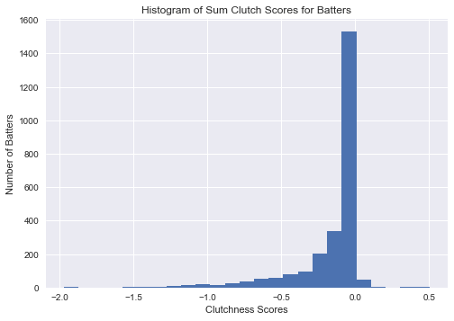


```python
plt.hist(pitcher_clutch_sum['LevIndXwPC'], bins=25)
plt.title('Histogram of Sum Clutch Scores for Pitchers')
plt.xlabel('Clutchness Scores')
plt.ylabel('Number of Pitchers')
plt.show()
```


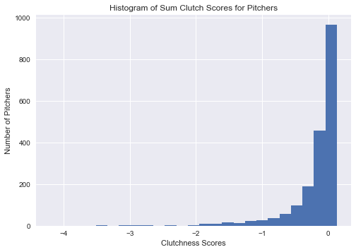


```python
plt.hist(batter_clutch_mean['LevIndXwPC'], bins=25)
plt.title('Histogram of Mean Clutch Scores for Batters')
plt.xlabel('Clutchness Scores')
plt.ylabel('Number of Batters')
plt.show()
```


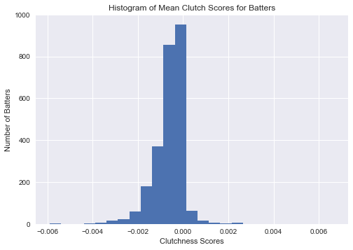


```python
plt.hist(pitcher_clutch_mean['LevIndXwPC'], bins=25)
plt.title('Histogram of Mean Clutch Scores for Pitchers')
plt.xlabel('Clutchness Scores')
plt.ylabel('Number of Pitchers')
plt.show()
```


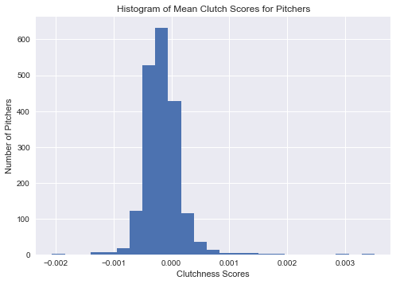


```python
batter_clutch_mean = batter_clutch_mean.sort_values("LevIndXwPC", ascending=False)[batter_clutch_mean["ABs"] > 500]
pitcher_clutch_mean = pitcher_clutch_mean.sort_values("LevIndXwPC")[pitcher_clutch_mean["PitchABs"] > 500]
batter_clutch_sum = batter_clutch_sum.sort_values("LevIndXwPC", ascending=False)
pitcher_clutch_sum = pitcher_clutch_sum.sort_values("LevIndXwPC", ascending=False)

best_worst_batters_mean = pd.concat([batter_clutch_mean['LevIndXwPC'][:5], batter_clutch_mean['LevIndXwPC'][-5:]])
best_worst_batters_sum = pd.concat([batter_clutch_sum['LevIndXwPC'][:5], batter_clutch_sum['LevIndXwPC'][-5:]])
best_worst_pitchers_mean = pd.concat([pitcher_clutch_mean['LevIndXwPC'][:5], pitcher_clutch_mean['LevIndXwPC'][-5:]])
best_worst_pitchers_sum = pd.concat([pitcher_clutch_sum['LevIndXwPC'][:5], pitcher_clutch_sum['LevIndXwPC'][-5:]])
```


    /anaconda/lib/python2.7/site-packages/ipykernel_launcher.py:2: UserWarning: Boolean Series key will be reindexed to match DataFrame index.
      


```python
import sys  

reload(sys)  
sys.setdefaultencoding('utf8')
```


```python
fig, ax = plt.subplots()
ax.bar(range(len(best_worst_batters_mean)), best_worst_batters_mean, tick_label=list(best_worst_batters_mean.index))
for tick in ax.get_xticklabels():
    tick.set_rotation(45)
plt.title('Best and Worst Batters (Mean Clutch)')
plt.ylabel('Mean Clutchness Scores')
plt.show()
```


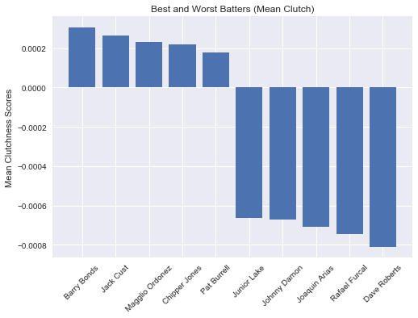


```python
fig, ax = plt.subplots()
ax.bar(range(len(best_worst_batters_sum)), best_worst_batters_sum, tick_label=list(best_worst_batters_sum.index))
for tick in ax.get_xticklabels():
    tick.set_rotation(45)
plt.title('Best and Worst Batters (Sum Clutch)')
plt.ylabel('Sum Clutchness Scores')
plt.show()
```


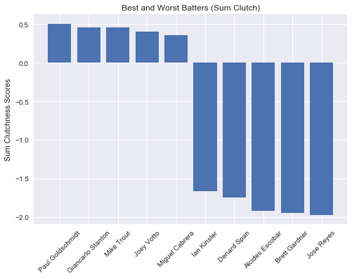


```python
fig, ax = plt.subplots()
ax.bar(range(len(best_worst_pitchers_mean)), best_worst_pitchers_mean, tick_label=list(best_worst_pitchers_mean.index))
for tick in ax.get_xticklabels():
    tick.set_rotation(45)
plt.title('Best and Worst Pitchers (Mean Clutch)')
plt.ylabel('Mean Clutchness Scores')
plt.show()
```


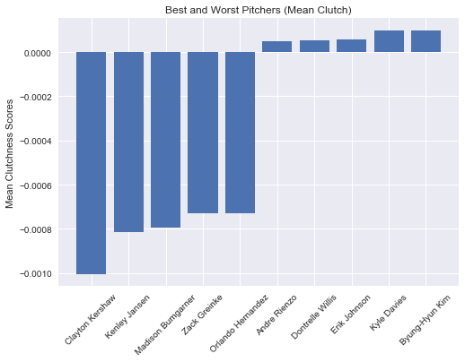


```python
fig, ax = plt.subplots()
ax.bar(range(len(best_worst_pitchers_sum)), best_worst_pitchers_sum, tick_label=list(best_worst_pitchers_sum.index))
for tick in ax.get_xticklabels():
    tick.set_rotation(45)
plt.title('Best and Worst Pitchers (Sum Clutch)')
plt.ylabel('Sum Clutchness Scores')
plt.show()
```


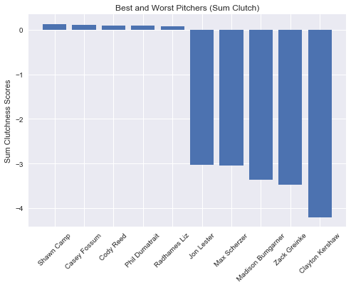


```python

```

